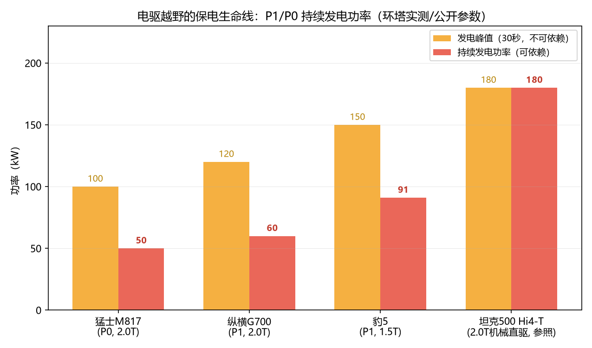
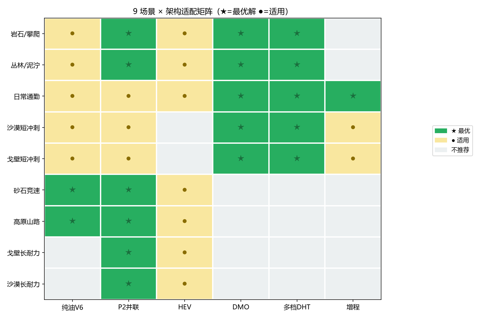

# 3400 公里之后，谁还在？——从 2026 环塔看越野车的架构、重量与动力边界

> 数据源：2026 环塔拉力赛 T2 量产组赛事结果 + 参赛平台公开参数；分析时间 2026 年 7-8 月。
> 本文是"圈速从哪来"系列的越野篇。后一篇是赛道篇（纽北回归与 U9X 功率反推），再后是派克峰篇（4300 米上的爬坡功率税）。
> 本文以一套"9 场景 × 7 指标"的越野车打分体系为骨架（CAAMTB 行业标准 + 环塔实战验证），每个章节对应体系的一个组件。

---

## 一、9 个赛段，一场混动路线的实弹演习

2026 环塔拉力赛是混动技术路线在中国顶级越野赛事中的第一次大规模实战检验。T2 量产组同时站着六种动力方案：3.0T V6 + P2 并联（坦克 700 PHEV）、2.0T + P2 并联（坦克 300 PHEV）、1 度电 HEV（坦克 700 HEV）、P1+P3+P4 混联电驱（捷途纵横 G700/F700）、前后独立电机（东风猛士 M817）、3.0T V6 纯油（长城火炮）——外加一台解耦电四驱（坦克 500 Hi4-Z）在 SS5 留下了注脚。

九个赛段的最终结果，把一条实验室里测不出来的规律钉在了戈壁上：**T2 大组总成绩第一是 251 号坦克 700 Hi4-T（尼古拉斯），全程零罚时、零退赛**——他不是每个赛段最快的，但他每个赛段都在。紧咬在后面的对照组是 T2.1 燃油组冠军火炮 V6（257 号）：短轴纯油皮卡没有混动系统的死重，V6 持续功率零跌落，**SS2/SS3/SS8 三个赛段单赛段最快，SS3（469km 戈壁长耐力）比总冠军快 18 分 40 秒**。前 8 个赛段火炮与 251 号互有胜负，累计只落后约 17 分钟；但从 SS9 起莫名落后——SS10 慢 32 分钟、SS12 慢 52 分钟，后 4 个赛段累计落后 1 小时 30 分，最终全程差距 1 小时 47 分。**落后原因无公开解释（机械、体力、战术均有可能）。混动的满态功率优势在最后四个赛段兑现成胜势，但纯油的轻量化在最长的一个赛段咬赢了所有人。**（数据：环塔赛段成绩表）

而全场最戏剧性的一组数字出现在最难的 SS9（354km 纯沙漠）：PHEV 以 55.4km/h 完赛，同赛段电驱车平均速度跌到 **42-49km/h**——断崖式掉速。这不是调校差异，是物理。

## 二、骨架：一套 9 场景 × 7 指标的打分体系

在讲故事之前，先把量尺亮出来。行业标准 CAAMTB 原版有 6 个一级指标，工程里扩成了 7 个——新增"竞技强化及安全系统"，专门容纳赛事级防护与改装装备（防滚架、散热防护、液压千斤顶这些在原版里无处安放）。同时把原 5 个场景按"地形内嵌强度"拆成 9 个（沙漠分冲刺/耐力、戈壁分冲刺/耐力、新增高原山路），因为"沙漠 100km 冲刺"和"沙漠 350km 耐力"对混动系统是完全不同的考验。

七个一级指标：

| 一级指标 | 说明 |
|---|---|
| 动力传动及四驱系统 | 含新增的动力响应性、持续功率/保电能力、热管理 |
| 通过性几何参数 | 接近角/离去角/纵向通过角/离地间隙/转弯半径，新增**轴距** |
| 车身总体及结构 | 车身尺寸级别、结构类型、涉水深度、侧倾稳定角 |
| 悬架系统 | 行程、结构、刚度、阻尼、横向稳定控制 |
| 越野配置及辅助功能 | 绞盘/涉水喉/陡坡缓降/地形模式等 11 项 |
| 舒适性及可靠性 | 主观评价为主 |
| **竞技强化及安全系统** ★ | 竞技场景 +500 附加分，民用仅展示 |

新增的第 7 个指标按 10 项二级打分：**散热系统防护(80)、防滚架(80)、底盘护板(60)、前后杠/接近角优化(60)、车身结构强度冗余(50)、备用油箱/应急水箱(50)、中央充放气系统(40)、刹车冷却气道(30)、液压千斤顶(30)、车载气泵(20)**。

分值里藏着体系的判断：散热防护与防滚架并列全场最高 80 分——前者对应本文第五节（散热是硬死因），前后杠/接近角优化 60 分对应第四节（SS9 前杠撞地的教训）。**这套分值的每一分都有环塔的退赛或完赛记录背书**，下面逐章展开。

## 三、SOC 三状态：为什么越野车有两副面孔

理解环塔结果只需要一个模型。把动力电池的剩余电量（SOC）分成三种状态：

- **满功率（SOC > 20%）**：系统能输出的最大功率。电驱车在这里是全场最快的车；
- **中间态（亏电但发电未限功率）**：电池见底，但发电机还能以峰值功率发电，驱动电机由发电功率支撑；
- **最弱态（亏电且限功率）**：发电/电驱系统因发热限功率至额定值，整车功率由持续发电功率或发动机额定功率决定。

**核心定律：越野车的弱态可持续功率，不由满态峰值功率决定，由"亏电后还有多少机械直驱功率"决定。**

把各架构的满态/弱态功率摆在一起，断崖的形状一目了然：

| 架构 | 满态 | 弱态 | 跌落比 |
|---|---|---|---|
| 纯油 V6 | ~190kW | ~190kW | **零跌落** |
| P2 并联 V6 | ~300kW | ~190kW | 1.6:1（掉增量不掉根基） |
| HEV 浅充浅放 | ~200kW | ~190kW | 1.05:1 |
| 单档 DMO | ~300kW | ~100kW | **3:1** |
| 多档 DHT | ~300kW | ~60-80kW | **4:1** |
| 功率分流+3DHT | ~635kW | ~100kW | **6:1** |
| 增程式 | ~300kW | ~60kW | **5:1** |
| T1+ 增程（奥迪） | ~288kW | ~220kW | 1.3:1（赛车级，民用不可复制） |

规律简单得近乎无聊：**有机械直驱根基的架构（纯油、P2、HEV），亏电只是"掉增量"；没有机械直驱的架构（DMO、DHT、增程），亏电是"全线坍塌"——整个系统退化成一台小发电机。** 满态账面功率越高，坍塌落差越大。奥迪 RS Q e-tron 是唯一的例外：288kW 满态只跌到 220kW，但那是 2100kg 碳纤维车体 + 220kW 持续发电 + 达喀尔级散热的组合，民用不可复制。

P2 的上限不高——电机夹在变速箱里做不大，短冲刺爆发力不如独立大电机；但它的下限是发动机直驱，**掉增量不掉根基**。DMO/DHT/增程的上限高——独立大电机满态爆发惊人；但下限是 P1 发电功率，掉得干干净净。这就是环塔全部结果的底层解释。

## 四、四类赛段，四种答案

**1. 超长距离戈壁（SS3，469km）：机械四驱的主场。**

核心考验是持续输出、高速热管理、长轴距稳定性。本赛段单赛段最快的是**火炮 V6（257 号，4:38:13）**——纯油短轴皮卡，V6 持续功率零跌落、没有混动死重，在最长的一个赛段赢了所有混动车。坦克 700 PHEV 的 252 号以 100.0km/h 紧随其后（4:41:29）——3.0T V6 独立驱动，无保电焦虑；前后双叉臂在高速搓板路上贴地性最优；3000mm 长轴距加持直线稳定。坦克 300 PHEV（262 号，后整体桥）94.3km/h 组别第四，同样出色。电驱车在此赛段没有掉速——高速戈壁对电机持续高功率需求低，发动机维持高效发电即可。

**2. 短距离冲刺（SS4，91km）：满电电驱的甜点。**

核心考验是瞬间加速和低速弯道响应。猛士 M817（273 号）以 **78.8km/h 夺冠**——满电状态下电机瞬时峰值扭矩是核心优势。而 3.1 吨的坦克 700 PHEV 在频繁加减速中惯性阻力更大，处于劣势。**冲刺场景，电驱赢了。**

**3. 复合地形"魔鬼赛段"（SS5，281km）：散热淘汰赛。**

全赛程淘汰率最高的赛段。253 号坦克 700 PHEV 因**水箱受损**退赛；255 号坦克 500 Hi4-Z（解耦电四驱）因**保电和散热**退赛；多台捷途纵横和猛士 M817 遭遇高额罚时——电驱系统在复杂高负荷工况下的可靠性短板集中暴露。

**4. 超长纯沙漠（SS9，354km）：HEV 反超，电驱断崖。**

全场最难的赛段。结果出人意料：**坦克 700 HEV（261 号）以 58.9km/h 夺冠**，反超所有 PHEV 和电驱对手。1 度电的小电池配合"浅充浅放"策略，在频繁加减速的沙丘中实现了能量高效循环。坦克 700 PHEV（251 号）55.4km/h 紧随其后——终点前 1 公里因撞击水箱受损损失大量时间，此前建立的领先优势足以说明其长距离沙漠速度能力。

电驱车在此赛段**断崖式掉速**：猛士 M817 和纵横 G700 平均速度跌至 42-49km/h。"小排量发动机 + 大电机 + 重车身"在持续高功率输出下，保电和散热急剧恶化。三台车的 P1/P0 持续发电能力说明了一切：

豹 5（未参赛，参照）P1 持续 91kW 已是电驱阵营最强；纵横 G700 只有 60kW、猛士 M817 只有 50kW——**近 3 吨车重在松软沙漠里，靠 50-60kW 的持续电力蠕行，这就是 42-49km/h 的物理来源。** 作为对照，坦克 500 Hi4-T 的 2.0T 机械直驱是 180kW。发电还要交两次转换税（机械→电→机械，能耗比直驱高近 50%），三重热源（发动机+发电机+驱动电机）在低速沙地里散热困难，风道积沙板结还有热管理系统崩溃的风险。

## 五、底盘三件套：悬架、四驱、车体几何——以及谁更耐久

动力回答"能跑多快"，底盘回答"能不能活着跑完"。环塔把三件事分开验证了。

**悬架：贴地性与强度的兑换。** 四种悬架形式在赛段里的分工非常清晰：

| 悬架 | 贴地性 | 强度 | 环塔验证 |
|---|---|---|---|
| 前后双叉臂独立 | ★★★★★ | ★★★ | 坦克 700 / 豹 5 / 捷途纵横 / 猛士：高速戈壁/连续沙丘贴地最优，但部件复杂、受损风险略高 |
| 前双叉臂+后整体桥 | ★★★★ | ★★★★ | 坦克 300 / 火炮 V6：后桥坚固抗冲击，SS9 沙丘贴地性受限 |
| 前后整体桥 | ★ | ★★★★★ | BJ212 构型：极限强度最高，但 600km 赛段 = 1200km 体感（2026 环塔 T2 无此构型参赛车） |
| 前双叉臂+后多连杆 | ★★★ | ★★ | BJ60 等承载式硬派：民用 SUV 主流，行程和强度两头不占 |

全独立悬架有技术补行程的路（卫士 6D 液压互联模拟整体桥扭曲能力），但达喀尔冠军卫士 OCTA 赛车反而拆掉 6D 换回纯被动金属弹簧+氮气减震——两周连续冲击下，简单可靠优先于全能。**悬架匹配的不是"最先进"，是"最不易失效"。**

**四驱：机械锁止是可靠性基石。** 全赛程最硬的一条数据：采用机械四驱的 Hi4-T 和火炮 V6，**未出现任何传动系统故障**；电四驱多车型在 SS5 复杂赛段过热或故障。限滑方式的对比同样清晰：机械锁零延迟、无限持续、不发热、不依赖电量；电子限滑毫秒级响应、操作门槛低，但持续高负荷会热衰减——精确地说，比亚迪 iTAC 复用电机旋变传感器（感知精度约为传统轮速传感器 300 倍）做轴间扭矩分配的部分没有热衰减问题，但同轴左右轮的轮间限滑仍需制动介入，持续脱困依然会发热。卫士 OCTA 达喀尔版的改法是最明确的注脚：原厂电控后锁，赛用全部换成纯机械限滑差速器。

**车体几何：轴距与接近角各管一段。** 轴距 3000mm 的坦克 700 在 SS3 高速戈壁直线稳定性最好，短轴火炮在沙漠里更灵活——轴距的取舍是高速稳定 vs 低速灵活。接近角的教训与散热事故同源：坦克官方队保留量产前杠不缩短，接近角不足，SS9 终点前 1 公里前杠撞地——两次事故（SS5 飞跳、SS9 撞地）的暴露面都在"没切的前杠"和"外露的副散热器"这两处。民间队和卫士 OCTA 都切了。

**稳定性与耐久性：可靠性是越野赛事的第一竞争力。** 最终 T2.E 组总冠军尼古拉斯（251 号）全程**零罚时、零退赛**，亚军马海龙（262 号）同样如此。他们的速度不是最快的，但每个赛段稳定发挥，累积出无法被逆转的领先优势。对照一个耐人寻味的事实：官方队通过材料替换、线束精简极致减重，民间队因资源限制重 300kg+——结果官方队两次散热事故，民间队全赛程无事故完赛。赛用 ECU 的"飞跳模式"（腾空时限制车轮转速，保护半轴）也是耐久性工程的一部分：坦克 700 全赛程传动系统零故障，不只是运气。

## 六、散热：越野赛事的"非1即0"

赛段表现之外，环塔给出了一条更硬的教训：**散热失效是越野赛事的硬死因——非 1 即 0，不存在"部分完赛"。** 它区别于性能衰减类问题（亏电掉速是渐变，能熬完赛），散热挂掉就是退赛，无论你前面领先多少。

四个案例，两条死因线：

| 案例 | 死因类型 | 结果 |
|---|---|---|
| 坦克 700 官方队（保留量产多散热器+无防护） | 物理损伤 | 2 次事故：SS5 退赛、SS9 终点前水箱受损 |
| 豹 5 勘路车（2025 前史） | 热链路堵塞 | 电池冷却风道沙尘板结，锁速 20km/h，正赛前退赛 |
| 坦克 700 民间队（切副散热器+主散热器上抬） | — | 无事故 |
| 卫士 OCTA 达喀尔（单一大散热器+防沙过滤器） | — | 达喀尔冠军 |

坦克官方队的教训最典型：为了"达喀尔标准"的极致减重，保留量产多散热器布局且不切前杠——两侧副散热器外露在前杠最外侧，SS5 飞跳撞击退赛一次，SS9 终点前 1 公里前杠撞地又受损一次，从领先 1 小时变成落后 22 分钟。民间队做了相反的选择：切掉两侧暴露的副散热器、主散热器上抬集中防护、增加后散热器（巴哈风格）——全赛程无事故。

民间队还有一个反向的教训同样值得记下：他们的有效改装集中在散热——**对症下药的部分（切副散热器、主散热器上抬）就无故障**；但对官方硬件（典型的是悬架）并不了解，做了过度加强，其实无意义——**官方硬件的强度和耐久性经过工程验证，民间加码是冗余**。民间能看见的是暴露面（散热、防护），看不见的是官方硬件的设计裕度；对着看得见的地方改装有效，对着看不见的地方加码浪费。（来源：B 站视频 BV1W1JG6fEVX，坦克民间车队改装分析）

**散热防护的问题不在散热器多少，在改装方案。** 而且散热能力和散热防护存在工程权衡：多散热器分散布局提升散热能力但增加暴露面；集中布局防护好但依赖强力风扇。卫士 OCTA 用"单一大散热器 + 防沙过滤器"拿到了达喀尔冠军，是这个权衡的正面解。

电驱车还要面对额外的热源叠加：发动机 + P1 + P3 + P4 + 电池，五重热源。2025 年环塔还有一个更早的前史：豹 5 以勘路车身份参与库木塔格赛段勘路，电池散热告警（BMS 故障码，锁速 20km/h），技术组拆解确认**电池冷却风道被细沙板结堵塞**，随后提交退赛申请，正赛未出现在发车台。（来源为论坛帖子附图，未经官方证实，仅作旁证。）

## 七、HEV 浅充浅放：达喀尔的隐藏答案？

SS9 的冠军不是任何一辆"混动旗舰"，而是一台 **1 度电的 HEV**。

坦克 700 HEV 的策略叫浅充浅放：电量低时靠发动机直驱，刹车时高效回收，出弯时电机辅助。它不需要大电池——不需要保电，因为随时有 V6 直驱兜底；不需要充电，因为电池永远在浅循环里保持健康窗口。

对照奥迪 RS Q e-tron：220kW 持续发电 + 2100kg 碳纤维车体，是把"增程亏电下限"做到了赛车级。民用做不到这个数字，但 HEV 用另一个方向回答了同一个问题——**既然亏电是增程的死穴，那就把电池做小到"永远不会深亏"，把 V6 直驱做大到"永远兜得住"。** 1 度电不是妥协，是策略：电池小 → 重量轻 → 沙丘里每一公斤都是速度。

这条路线在环塔只有一次验证，样本量远远不够。但如果 2027 达喀尔 T2 组再有 HEV 参赛并重复这个结果，"小电池 + 大排量直驱"就会从隐藏答案变成明牌。

## 八、九种场景，一张适配矩阵，一套三状态权重

九个场景的来源与隐含强度：

| 场景 | 来源 | 隐含强度 | 竞技附加分 |
|---|---|---|---|
| 岩石/攀爬 | CAAMTB 原攀爬 | 低速间歇 | — |
| 丛林/泥泞 | CAAMTB 原丛林 | 中低速间歇 | — |
| 日常通勤 | CAAMTB 原日常 | 低强度 | — |
| 沙漠短冲刺 | 沙漠拆分 | 冲刺 <100km | +500 |
| 沙漠长耐力 | 沙漠拆分 | 耐力 >350km | +500 |
| 戈壁短冲刺 | 戈壁拆分 | 冲刺 <100km | +500 |
| 戈壁长耐力 | 环塔 SS3 对应 | 高速巡航+耐力 | +500 |
| 砂石竞速 | 原长途穿越+砂石并入 | 中等负载综合 | — |
| 高原山路 | 新增 | 中高持续(3000m+) | +500 |

每个场景的架构适配：

最后一层是三状态权重——**打分时每个场景该看重"满态"还是"弱态"，由里程决定：里程越长，弱态权重越大。**

| 场景 | 满态 | 中间态 | 弱态 | 逻辑 |
|---|---|---|---|---|
| 岩石/攀爬、丛林、通勤 | 100% | 0% | 0% | 间歇工况，直接取最强状态 |
| 沙漠/戈壁短冲刺 | 90% | 10% | 0% | <100km 满态碾压 |
| 戈壁长耐力 | 50% | 40% | 10% | 300-500km 高速巡航 |
| 砂石竞速 | 40% | 40% | 20% | 中等负载综合 |
| 高原山路 | 30% | 30% | 40% | 高海拔双杀 |
| **沙漠长耐力** | **20%** | **30%** | **50%** | **>350km 弱态主导** |

这也解释了为什么同一辆车在不同榜单上评价截然相反：攀爬榜上电驱满态无敌（满态权重 100%），沙漠耐力榜上电驱垫底（弱态权重 50%）——**不是车变了，是量尺的场景变了。**

浓缩成六条核心规律：

1. **冲刺/间歇/低速/铺装 → 电驱主导（5 场景）**：攀爬的电子限滑毫秒级响应、短冲刺的满电爆发、通勤的纯电舒适——电驱的上限在这些场景尽情发挥；
2. **耐力/长距/持续 → P2 V6 唯一解（2 场景）**：沙漠长耐力和戈壁长耐力，亏电不掉底是硬门槛，电驱的断崖掉速在这里没有任何回旋余地；
3. **中间地带 → 看距离和发动机排量（2 场景）**：砂石竞速和高原山路，可靠性权重最高，机械四驱不依赖电量；
4. **不存在一种架构统治所有场景。** P2 上限不高下限高（适合拉力赛），电驱上限高下限低（适合日常）——你在环塔看到的每一个结果，都是这句话的一个具体案例；
5. **电子限滑在攀爬是优势（间歇工况 + 小白友好），在拉力赛是短板（持续发热 + 依赖电量）；**
6. **散热系统防护是赛事第一死因**——防护本质是改装方案问题（切不切副散热器、缩不缩短前杠），不是散热器数量问题。

## 九、尾声：2027 达喀尔，一场更大的考试

长城已确认 2027 年参加达喀尔拉力赛，T2 组用车是环塔冠军坦克 700 Hi4-T（3.0T V6 + P2 并联）——这是对"P2 并联 = 当前极限越野最优解"最高级别的背书。同场媒体还盛传 T1+ 原型组将使用 4.0T V8（GF 架构），但**官方截至 2026 年 7 月未公布达喀尔参赛组别与动力总成**，V8 已确认的赛事首秀是 2027 环塔 T1+ 组而非达喀尔——此说仅作媒体推测，不作结论依据。

**但环塔冠军不等于达喀尔门票——三个隐患在环塔已经给出过警告：**

1. **散热方案未改。** 官方队在环塔就有两次水箱事故（SS5 飞跳撞击退赛、SS9 终点前 1 公里前杠撞地），暴露面始终是"外露的副散热器 + 没切的前杠"。达喀尔两周赛程的飞跳和撞击密度比环塔更高，这套方案不改，重演是大概率事件。卫士 OCTA 达喀尔版的答案是单一大散热器 + 防沙过滤器 + 缩短前杠——民间队已经先抄了一半，官方队还没抄。
2. **悬架存在架构代差。** 环塔赛车用的是 K-MAN 单活塞可调阻尼（外部液压缓冲块 + 限位带），而达喀尔冠军卫士 OCTA 用 Bilstein Black Hawk 位敏分区阻尼（JCO/RCO 液压缓冲内置，无外部易损件，飞跳"无底感"）。环塔 9 个赛段验证了 K-MAN 的可靠性，但达喀尔的连续飞跳对阻尼器是另一个量级的考验——"环塔够用，达喀尔可能就是短板"。
3. **3 吨车重是全程账单。** 8000km 赛程里，混动系统的死重每一公里都在向悬架、轮胎、油耗收账。火炮 V6 在环塔证明了轻量化的价值（短轴纯油单赛段反超），达喀尔的距离会把这张账单放大十倍。

**最后一个元结论：规则约束下的整体架构，比动力架构更接近胜负手。** 把环塔的火炮、达喀尔的卫士 OCTA、T1+ 的原型车、巴哈的 Trophy Truck 摆在一起看：只要规则允许，**轻量 + 大轴距 + 大轮距 + 大悬架行程 + 马力**的组合就是答案——T1+ 把轴距拉到 3 米级、轮距加宽、行程 350mm+，巴哈把行程做到 1 米级。环塔 T2 的量产规则把五要素压进量产车骨架，动力架构的分歧才被放大：混动买功率（251 号满态爆发），纯油买轻量（257 号零跌落）。**动力架构只是五要素之一，规则先决定你还能动哪几个要素。** 这也是本文用 7 个一级指标而不是只讲动力的原因——胜负从来不是发动机的独角戏。

留给未来的命题有三个：

1. **电驱越野如何突破保电瓶颈？** 需要更大功率的专用发电机（>80kW 持续）或更高热效率的发动机平台——这正是"完美电驱越野"推演的主题；
2. **机械锁止的优势能否被电控复制？** 电子差速锁在持续高负荷下的热衰减有待突破；
3. **HEV 能否成为达喀尔主流？** 一个赛段的反超只是信号，需要更多里程验证。

## 边界声明

1. 赛事数据来自 2026 环塔公开结果与参赛平台参数，功率数值为账面值/工程估算；
2. 满态/弱态功率与跌落比来自工程分析（环塔实战 + SOC 三状态模型），DHT/增程的弱态数值取区间中值；
3. 豹 5 勘路退赛细节来源为论坛帖子附图，**未经官方证实**，仅作旁证；
4. 2027 达喀尔 T1+ 侧（V8 动力）为媒体推测，官方未确认；
5. "HEV 隐藏答案"基于单赛段样本，属方向性观察而非定律。

---

*系列导航：后篇《2977 马力的真相：纽北圈速回归与 U9X 实测功率反推》（赛道篇）；再后《4300 米上，马力是软通货——派克峰的爬坡功率税》（派克峰篇）。*
