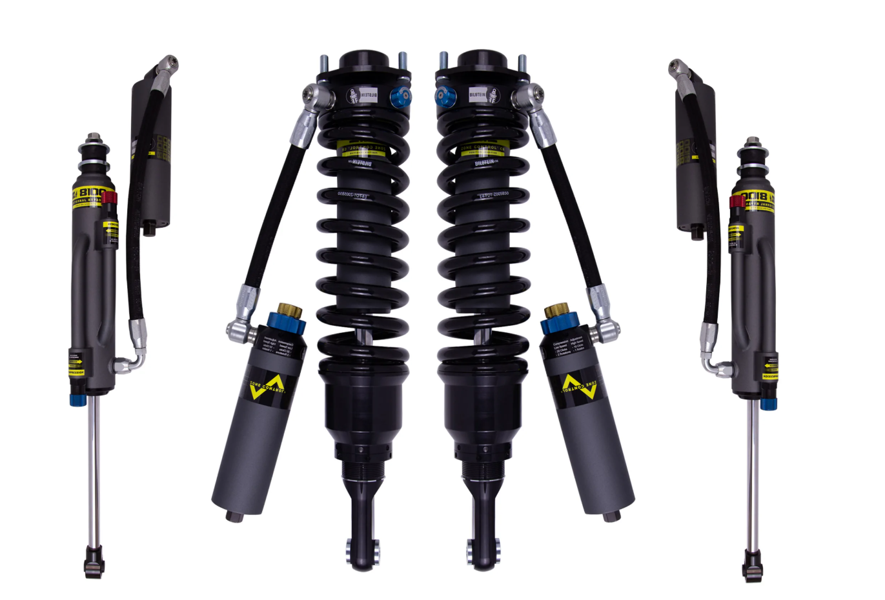
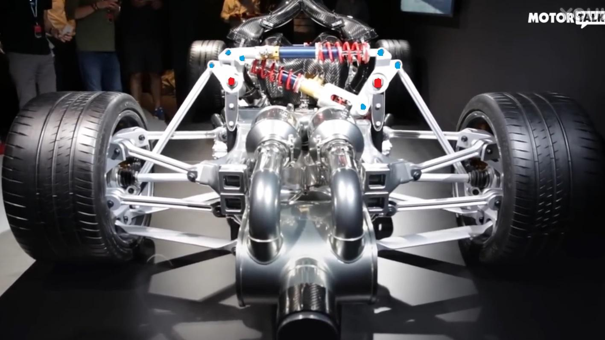
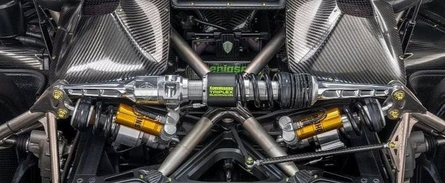
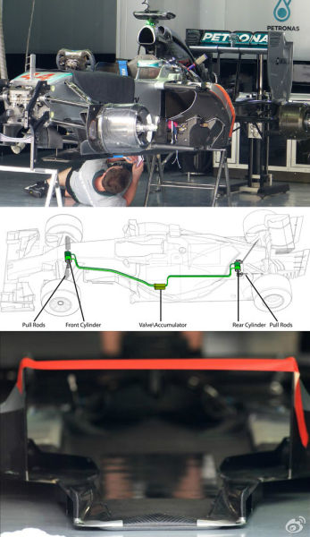
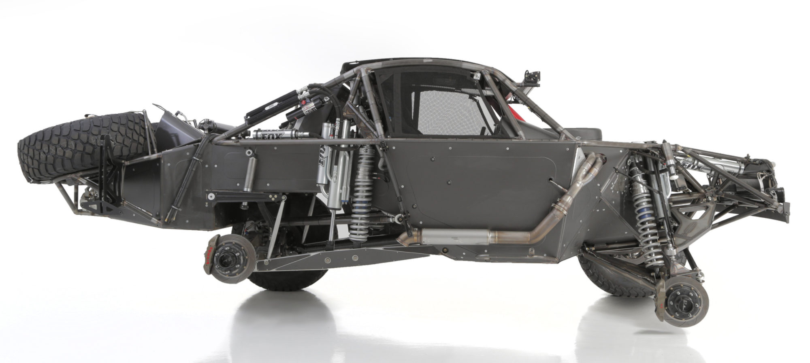

# 悬架选型铁三角：规则 × 场景强度 × 故障容忍度

> 本文是《参数与激情：从技术祛魅到需求自知》系列越野篇（篇1）的姊妹篇。篇1 §五用一节的篇幅讲了悬架四形式在环塔的分工（贴地性与强度的兑换），本文是它的完整展开——从巴哈到达喀尔到 F1 的五条悬架路线，提炼一个可以套用到任何"选悬架"问题的框架。
> 信源分级见文末边界声明：官方宣传、官方口径、工程采访、试驾报道、视频访谈，五类信源的引用强度不同。

---

## 一、达喀尔冠军的"降级"：拆掉量产最高形态

卫士 OCTA 量产版搭载 **6D Dynamics 半主动液压互联悬架**——空气弹簧 + 高压自适应阻尼器 + 左右前后全联通管路网，系统压力最高 725 psi，ECU 实时调节；压力越高等效防倾杆越粗，越野时可瞬间断开互联释放独立运动，还有一项工程采访披露的能力：检测到四轮全拉伸（车辆腾空）时**预加载着陆阻尼**（信源：R&T 对 OCTA 工程师的采访、EVO India 试驾报道——注意 JLR 官方新闻稿只提"俯仰+侧倾控制"，不提这项）。这是当前量产液压互联的最高形态。

而它的达喀尔冠军版 D7X-R，把整套 6D **全部拆除**，换成了 **Bilstein Black Hawk 纯被动位敏阻尼**——三活塞五分区，零电子元件；"被动"指分区切换靠行程位置触发、无需任何电子控制，阻尼本身是**四向可调**的（高低速压缩双速、JCO、回弹，Bilstein 官方披露口径）。

这不是降级。这是同一种车型在**"全能民用"和"不死完赛"**两种约束条件下的各自最优解。两周连续高强度冲击下，液压系统的密封和管路耐久性不如金属弹簧 + 机械结构简单可靠——**在"全能"和"不死"之间，拉力赛选后者**。这一拆，就是本文整个框架的引子：选悬架不是选"最先进"，是选"最匹配约束"。

## 二、铁三角：三个问题问任何一套悬架

把五条悬架路线横着看一遍，会收敛出三个决定性的变量，构成选型铁三角：

| 角 | 问题 | 典型变量 |
|---|---|---|
| **规则约束** | 规则允许什么、禁止什么？ | FIA T2 运动学锁定（摆臂安装点必须与量产一致）、限行程；F1 禁 FRIC；巴哈几乎无约束 |
| **场景强度** | 要承受多强的持续冲击？ | 达喀尔两周连续飞跳 vs F1 5cm 行程的精确控制 vs 民用铺装路面 |
| **故障容忍度** | 坏了能不能承受？ | 拉力赛退赛 = 全年归零（零容忍）vs 民用可拖车维修（高容忍） |

三个角各自拉满，会拉出三种完全不同的车（见第六节的三条线）。本文接下来每个案例，都可以用这三个问题复盘：**它为什么长成这样，是因为哪个角在主导。**

## 三、同一种"被动位敏"，两种实现

被拆上达喀尔的那套 Bilstein Black Hawk，和巴哈 Trophy Truck 的 Bypass Shock，本质是同一种哲学的两条实现路径——**位敏阻尼：行程位置就是信号**。

- **Bilstein ZoneControl CR（集成路线）**：阻尼器内部三独立活塞（主活塞 + JCO 压缩截止 + RCO 回弹截止），行程位置触发不同节流通道，三压缩区 + 两回弹区 = 五个独立调校域。JCO 替代外部液压缓冲块（飞跳无底感），RCO 替代外部限位带（回弹不弹射），**全内置无外部易损件**。**四向可调**（高低速压缩双速、JCO 内部缓冲块、回弹）+ 螺纹弹簧座调车高（Bilstein 官方披露口径）；但分区位置出厂固定（内部活塞定死），可调的是各分区内的阻尼力——"被动"指**分区切换被动**（靠行程位置触发，无需电子），不是"阻尼不可调"。代表：卫士 OCTA 达喀尔赛车。
- **Bypass Shock（外部路线）**：筒体外壁加装可调旁通阀 + 外部管路，活塞越过阀门时油液走不同路径。每个阀独立可调，赛道边就能重标定。代表：Baja 1000 Trophy Truck。代价：外部管线体积巨大，不适合 FIA 规则受限的赛事。


- **对照基准：坦克 700 环塔赛车的 K-MAN**：单活塞可调减震，回弹 1-8 档可调，外部液压缓冲块 + 限位带承担极限冲击——在环塔级别验证了可靠性，但没有位敏分区，达喀尔级别的持续飞跳可能暴露差距。

三者的差异正好用铁三角解释：Bypass 的可调性服务于巴哈的**无规则自由**；Bilstein 的全内置服务于 FIA 的**规则约束**（外部易损件不允许）与**零容忍故障**；K-MAN 是环塔强度的**务实中间层**。

一个反直觉的推论值得单独记录——**被动位敏的"泛用性悖论"**：这种看似为飞跳"量身定制"的阻尼，反而比需要"场景识别→策略匹配"链路的主动系统更普适。因为所有极端越野工况都收敛于"悬架行程被推向极限"这个子集，位置就是信号、物理即时响应，**不认场景只认物理量**——没有传感器、ECU、外部能源，也就没有误判和失效点。

## 四、模式解耦：不让侧倾和颠簸共用一套弹簧阻尼

传统悬架的根本缺陷：同一套**弹簧与阻尼器**既要处理侧倾（左右反向运动），又要处理颠簸（双轮同向运动），**刚度与阻尼两个维度都互相牵制**——双轮同向压缩时弹簧全压、防倾杆不介入；单轮侧倾时弹簧一压一伸、防倾杆扭转介入。同一套元件在两个模式下是两种性格，而它只有一个调校点。模式解耦的思路是把不同运动模式分解给不同的弹簧阻尼单元各自处理。五条路线：

**1. 杆系路线：AMG ONE（Multimatic 推杆 + 摇臂）。** 每轴两组内置**弹簧阻尼单元**（弹簧+阻尼器一体）——一组专管颠簸、一组专管侧倾。推杆 + 摇臂把车轮运动做向量分解，同向分量送颠簸单元、反向分量送侧倾单元。**关键机制在摇臂力臂比**：侧倾与颠簸经由不同力臂的摇臂驱动弹簧/阻尼，同一套硬件在两种模式下的等效刚度与等效阻尼表现不同——力臂是模式解耦的杠杆。效果：转弯只有侧倾单元硬抗、单轮压路肩两分量各管各的（无防倾杆"串扰"）、双轮过减速带侧倾单元零介入。代价：单元内置挤占空间、推杆传导振动到车体。



（AMG One 悬架参考图，结构说明参见[苏黎世贝勒爷的文章](https://www.zhihu.com/question/61788648/answer/191110027)）

**2. 杆系路线：Koenigsegg Triplex（后轴第三阻尼器）。** 后轴左右常规阻尼器 + 中间横向第三阻尼器：双轮同向压缩（加速下蹲）推动第三阻尼器，单轮压缩（过弯侧倾）不介入——防蹲能力独立于悬架几何，加速不塌尾但过弯不牺牲独立悬架自由度。



（Triplex 参考图，出处：[autoevolution](https://www.autoevolution.com/news/koenigsegg-triplex-one-of-the-most-innovative-suspension-designs-of-all-time-166587.html)）

**3. 液压路线：McLaren 液压互联（被动）。** 阻尼器液压管路左右交叉连通，纯被动无泵无 ECU——侧倾时压力差被动产生抗侧倾力，颠簸时同向压缩无压力差。无传统防倾杆，颠簸舒适与侧倾刚度独立。



（McLaren 液压互联参考图，出处：[新浪体育](https://sports.sina.com.cn/f1/2014-07-11/12307249366.shtml)）

**4. 液压路线：卫士 OCTA 量产版 6D Dynamics（半主动）。** 与 McLaren 的关键区别：有泵和 ECU，互联特性可主动切换，不是永远连通。除第一节的飞跳预判外，还有**前后互联**（制动时前悬压缩 → 液压传至后悬回弹侧，抑制车头下沉）。这里必须把两个常被混为一谈的"飞跳功能"分开：

| | 飞跳预判（量产 6D） | Flight Mode（D7X-R 达喀尔版） |
|---|---|---|
| 层级 | **悬架层** | **动力层** |
| 动作 | 检测四轮全拉伸 → 预加载着陆阻尼 | 腾空时自动调节发动机到车轮的扭矩输出 |
| 目的 | 保护悬架不被击穿 | 平稳落地、保护传动系统（防断半轴） |
| 信源 | R&T 工程师采访 + EVO India 试驾（官方新闻稿未提） | [路虎官方口径](https://www.landrover-uae.com/en/explore/news/45-defender-dakar-d7x-r-revealed-in-all-new-competition-livery-ahead-of-january-2026-dakar-rally-debut) |
| 同类 | — | **坦克 700 环塔"飞跳模式"**（腾空时限制车轮转速保护半轴，信源：B 站科曼车队访谈 BV1W1JG6fEVX） |

两辆冠军赛车（环塔 T2 总冠军坦克 700、达喀尔冠军 D7X-R）不约而同做了动力层的腾空保护——**"防断半轴"是长距离越野赛的通用功课**，与悬架层的预加载阻尼各管各的。

**5. 液压路线：F1 FRIC（前后全联通，已禁）。** 前后左右全部阻尼器液压连成全网，制动自动撑前悬、加速撑后悬、过弯产生侧倾刚度——全部被动无电子控制。被禁原因：悬架姿态影响离地高度 → 构成"可移动空力装置"。遗产：McLaren 被动互联与 6D 均受其启发。**规则约束如何杀死一条技术路线，FRIC 是最干净的案例。**

## 五、门桥：从乌尼莫克到巴哈

独立悬架（尤其前悬）的最大行程不由控制臂或弹簧决定，而由**半轴万向节的最大工作角度**决定——长行程 = 半轴大角度 = 万向节磨损加剧、传动效率断崖下降、滚珠脱出风险。

**门桥的解法**：轮毂处加装轮边减速器，把半轴外端终点抬高到车轮中心以上——同等行程下，半轴整体更"水平"，角度变化大幅缩小。收益：行程上限从万向节角度限制中解放、万向节磨损大降；代价：每侧簧下质量 +十几公斤、轮边齿轮箱需独立散热、多一级齿轮传动增加 3-5% 效率损失。

**谱系（老运用 → 竞技新运用）**：

| 车型 | 悬架 | 门桥 | 定位 |
|---|---|---|---|
| 乌尼莫克 | 前后整体桥 | ✅ | **门桥鼻祖**，最早为国人所知的老运用（军用/农用/工程） |
| 悍马 H1 | 前后双叉臂独立 | ✅ 前后门桥 | 军用全地形（老运用） |
| G 500 4x4² | 前双叉臂 + 后整体桥 | ✅ 前后门桥 | 民用极限越野 |
| 达喀尔 T1+ 原型车 | 前双叉臂独立（长行程） | ⚠️ 部分采用 | 顶级拉力赛 |
| **巴哈 1000（Mason AWD Trophy Truck）** | 前双叉臂独立（长行程） | ✅ **前桥门桥** | **竞技新运用**（前桥 25 英寸行程；后桥为双环齿驱动轴，不用门桥——整体桥没有半轴角度问题） |



（Mason AWD Trophy Truck 参考图；规格见 [race-dezert 论坛帖](https://www.race-dezert.com/forum/threads/bryce-menzies-mason-motorsports-gen-2-trophy-truck.249701/)，首发解析见 [YouTube 视频](https://www.youtube.com/watch?v=h9-RIBHhVCU)）

门桥的真正价值不是离地间隙，而是**把独立悬架的最大行程从万向节工作角度的枷锁中解放出来**——这是"半轴角度安全"与"簧下质量/复杂度"之间的一笔交易。

## 六、主动悬架：第三条线走到哪了

三条被动路线之外，主动悬架是正在探索的第三条线：

**云辇-Z（电磁直驱）**：直线电机替代阻尼器，磁悬浮无机械接触，800V 高压直驱，5ms 全链路响应。公路优势：0 侧倾、0 俯仰、爆胎不失控。越野物理短板：电磁力随气隙增大而衰减（飞跳落地极限行程时反力下降）、50kW 峰值功率下持续极限冲击的发热与退磁风险、无液压不可压缩性的天然兜底（已设计液压冗余备份）。

**云辇-P/X（电液全主动）**：电机驱动液压泵，可主动推拉。云辇-X 单轮举升力 >1 吨、系统功率 36kW。优势：液压不可压缩性兜底，比纯电磁更适合大冲击。风险：电机 + 液压泵 + 油液三重热源，达喀尔级别连续高强度的散热未经验证。

主动 vs 被动的分界线，用铁三角一句话说清：

| 维度 | 主动悬架 | 被动位敏阻尼 |
|---|---|---|
| 响应 | 5ms 电子链路 | 物理即时（行程到位即触发） |
| 力 | 可主动推拉 | 只能被动抵抗 |
| 能量 | 需外部供电 | 零能耗 |
| 持续极限工作 | 热管理未验证 | 已验证（达喀尔冠军） |
| 故障模式 | 传感器/ECU/电机多重失效点 | 几乎无失效点 |
| **主场** | **已知地形 + 可控强度（公路/赛道）** | **未知地形 + 不可控强度（拉力赛）** |

## 七、悬架版结论：不存在一种架构统治所有场景

把全部路线摆上一条谱，三条线各占据一个极端：

```
规则约束松、场景强度高、故障可接受 —— 巴哈 Trophy Truck（4-link+Bypass，行程 1m+，暴力美学）
规则约束紧、场景强度高、故障零容忍 —— 达喀尔 T2（Bilstein 位敏分区，被动精密）
规则约束紧、强度可控、故障零容忍 —— F1（推杆+摇臂解耦，规则挤压出的天才）
                                ↓ 赛规下放 / 技术下放
                       高性能民用（卫士 6D / AMG ONE）
                                ↓ 技术简化
                       民用中间层（坦克 700 K-MAN）
                                ← 三条线共同指向的对岸 →
                       主动悬架（云辇-Z/P/X）：公路/赛道已降维打击，达喀尔/巴哈未验证
```

这条谱的每一格都能用铁三角复现：**规则约束决定你敢用什么结构，场景强度决定你要多大行程和多少散热，故障容忍度决定你能带多少复杂度和电子件。** 三个角各自拉满，得到三种互不兼容的最优解——所以不存在一种悬架架构统治所有场景，匹配的不一定是最先进的，而一定是在其使用场景中最不易失效的。

这句话与动力体系的结论一字不差。动力线（越野篇）和悬架线（本文）是两个独立的研究体系，从各自的赛事数据出发收敛到同一个命题——**收官篇《布局、重量和"其他"——腾势Z你嘛时候纽北纯电量产车第一啊》将回收这两条线的同构证据**。

## 边界声明

1. **信源分级**：官方宣传（JLR 新闻稿——只提俯仰+侧倾控制）、官方口径（路虎官网 D7X-R Flight Mode）、工程采访（R&T 对 OCTA 工程师）、试驾报道（EVO India）、视频访谈（B 站科曼车队 BV1W1JG6fEVX）、用户观察（门桥巴哈运用、AMG ONE 力臂机制）——引用时按此分级标注，官方宣传层未提及的能力不视为"官方配置"；
2. 民用悬架侧本文不展开（研究储备不足）：民用引用仅取卫士 OCTA 量产 6D 与坦克 700 K-MAN 两个落点；
3. 巴哈 1000 门桥运用已确认为 Mason AWD Trophy Truck（前桥门桥 + 25 英寸行程，[race-dezert 规格帖](https://www.race-dezert.com/forum/threads/bryce-menzies-mason-motorsports-gen-2-trophy-truck.249701/)与[首发视频](https://www.youtube.com/watch?v=h9-RIBHhVCU)口径）；
4. 云辇-Z/P/X 数据为厂商宣传口径，竞技场景表现未经赛事验证。

---

*系列导航（《参数与激情：从技术祛魅到需求自知》）：本文是篇1《3400 公里之后，谁还在？》的姊妹篇——篇1 §五 讲悬架四形式的分工，本文讲完整选型框架；主线后续见篇2《2977 马力的真相》、篇2s《同一套 1548 马力，两个重量》、篇3《爬坡的两副面孔：沙地陡坡与派克峰》、篇4《布局、重量和"其他"——腾势Z你嘛时候纽北纯电量产车第一啊》。*
