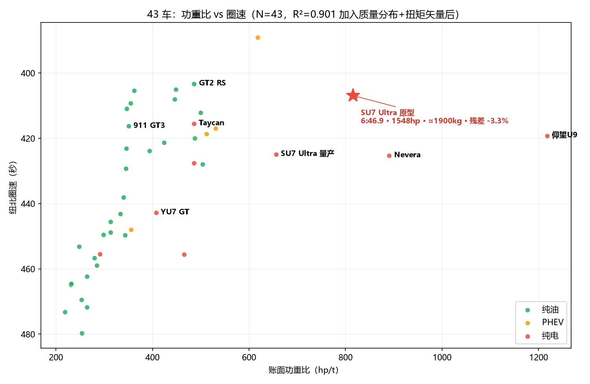
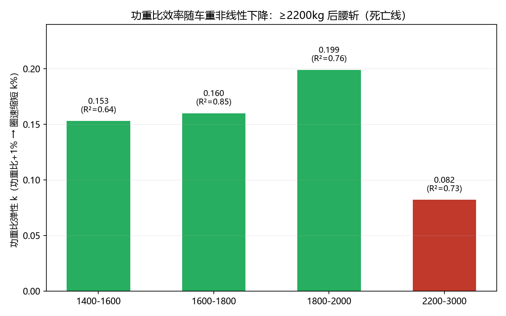
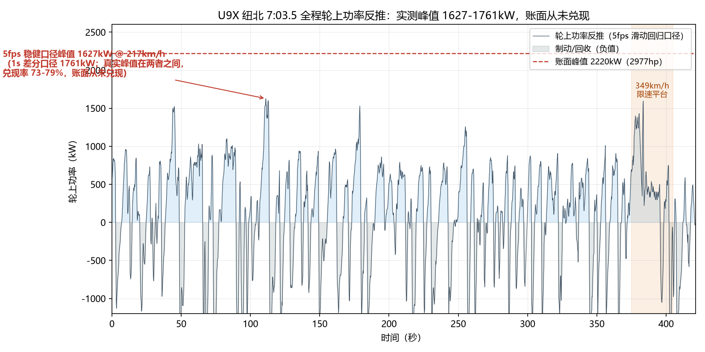
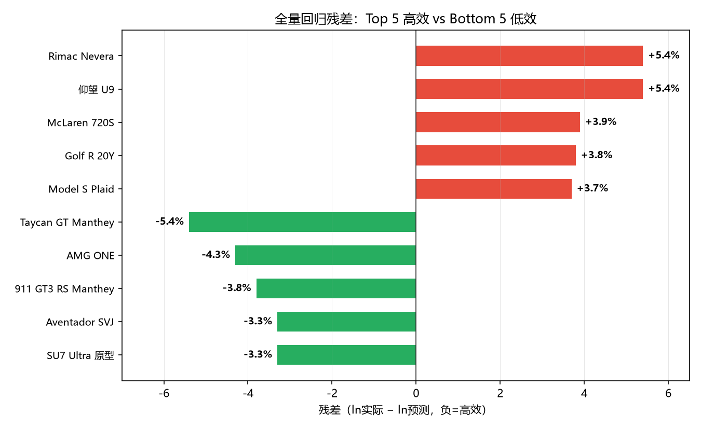

# 2977 马力的真相：纽北圈速回归与 U9X 实测功率反推

> 数据源：纽博格林官方认证圈速 + fastestlaps.com 独立测试；分析时间 2026 年 7-8 月。
> 本文是"圈速从哪来"系列的赛道篇。前一篇是越野篇（环塔的架构、重量与动力边界），下一篇是派克峰篇（4300 米上的爬坡功率税）。

---

## 一、一辆 3019 马力的车，为什么跑不过 700 马力

仰望 U9 Xtreme 的账面数据在纽北历史上是独一份：四电机峰值功率相加 **3019hp**（2220kW），车重 2480kg，账面功重比 **1217hp/t**。作为参照，保时捷 911 GT2 RS Manthey 是 700hp / 1440kg / 486hp/t——U9 的功重比是它的 **2.5 倍**。

圈速：U9 **6:59.2**，GT2 RS **6:43.3**。U9 慢了 16 秒。

在我们的 43 车回归模型里，U9 的残差是 **+5.4%**——它比"同马力同重量的平均水平"慢了 5.4%，全榜倒数第一，与 Rimac Nevera（+5.4%）并列。残差是实测圈速与回归预测圈速的对数差：负残差=高效（跑得比账面预期的快），正残差=低效。

2.5 倍的功重比优势，怎么就蒸发了？本文用两条独立路径追这个问题——统计回归和视频逐帧反推——它们最后收敛到同一个答案。

## 二、方法论：圈速为什么必须用对数

一个常见的直觉错误：马力大了 X hp，圈速快 Y 秒。这在数学上不成立——从 7:59 进步到 7:58（快 1 秒）和从 6:01 进步到 6:00（同样快 1 秒），物理难度天差地别。圈速越接近极限，每快一秒需要的能量呈指数增长。

两组实例：

| 对比 | 功重比 | 圈速 |
|---|---|---|
| GT2 RS vs GT3 RS | 486 vs 355（+37%） | 6:43 vs 6:49（快 6 秒） |
| Civic Type R vs Golf GTI | 231 vs 232（几乎相同） | 7:45 vs 7:44（快 1 秒） |

第一组里，"每 +1% 功重比 = 快 0.16 秒"的加法解释只在 7 分区碰巧成立；第二组里，功重比几乎相同的两车圈速也几乎相同——加法无法解释，乘法可以。**圈速与马力、重量是乘除关系，不是加减。** 所以全部分析用对数模型：

$$\ln(\text{圈速}) = \alpha + \beta_1 \ln(\text{马力}) + \beta_2 \ln(\text{重量}) + \cdots$$

弹性系数 β 的含义是"马力 +1% → 圈速缩短 β%"，这个比例在 6 分区、7 分区、8 分区是同一个常数，天然捕捉了"越接近极限越难突破"的物理。

## 三、43 辆车的回归：马力重量定律与纯电的"无罪判决"

全量回归（N=43，控制车体类型与动力架构）：

| 变量 | 系数 | p 值 | 物理含义 |
|---|---|---|---|
| ln(马力) | **-0.066** | 0.005 | 马力 +10% → 圈速缩短 0.66% |
| ln(重量) | **+0.114** | <0.001 | 重量 +10% → 圈速增加 1.14% |
| **纯电** | **-0.003** | 0.86 | **纯电无系统性劣势** |
| SUV | +0.059 | <0.001 | SUV 比超跑慢 6.1% |
| 四门 | +0.043 | 0.003 | 四门比超跑慢 4.4% |

三个核心发现：

**1. 重量惩罚比 ≈ 1.7。** 全量范围内，重量每 +1% 需要马力 +1.7% 来弥补。这个数字比坊间"100kg ≈ 200-300hp"的经验法则小得多——那个错觉来自跨组别、不控制变量的对比（把 2 吨 SUV 和 1.5 吨超跑的圈速差全归给重量，忽略了空力、重心、悬架的差异）。

**2. 纯电没有系统性圈速劣势——但它在重车区的竞争力来自电驱的低成本大马力。** 纯电 dummy 系数接近零且完全不显著（p=0.86）：**给定同样马力和重量，纯电车和燃油车圈速一样。** 纯电在圈速榜上的落后，100% 来自"电池让车更重"，不来自电驱技术本身。而纯电全落在 2100-2500kg 重车区，它在这个区间碾压同重量燃油 SUV 的优势，恰恰来自电驱的"马力平权"——电机马力比内燃机马力便宜得多。

**3. SUV 的隐藏税大于纯重量惩罚。** 控制马力重量后，SUV 仍慢 6.1%。微观机制是弯道 g 值的双重打击：同样的空力套件，下压力除以更大的质量被稀释；轮胎负载越大，摩擦系数 μ 本身越低（超跑胎 300kg 负载 μ≈1.2，900kg 时 μ≈1.05）。这解释了所有重车的困境——四电机矢量、主动悬架能优化力的分配，但横向加速度的天花板被重量锁死。

加入第 3 层（质量分布架构：前置/前中置/中置/后置/底盘电池）和第 4 层（扭矩矢量等级）后，全量 R² 从 0.766 提升到 **0.901**——43 辆车，用马力+重量+车体类型+质量分布+扭矩矢量，解释了 90% 的圈速方差。



## 四、超跑组：马力重量定律的失效与救回

把数据按车体拆分，出现了一个诡异的结果：两门超跑组（N=19）的回归 R² = **0.003**——马力重量对超跑圈速的解释力几乎为零。

当车重降到 1750kg 以下、马力超过 500hp，所有超跑都进了"物理甜点区"：大家的马力重量都够用，差异不再来自账面参数。但加入质量分布和扭矩矢量后，超跑组 R² 从 0.003 跃升到 **0.497**，其中质量分布一个维度贡献 0.445。

**超跑圈速差异的 44% 由"发动机放在哪"决定**——前置、前中置、中置、后置、底盘电池，五种分布在同等马力重量下的圈速效率完全不同。剩余约 50% 来自空力套件、轮胎、底盘调校，这些是目前模型无法量化的工程变量。

顺带一个反直觉的结果：**四驱在赛道上和后驱打平。** 全量回归中 AWD dummy 仅 +0.011（四驱慢 1%，几乎为零），超跑组内 -0.003（快 0.3%）。四驱额外 30-60kg 的重量和传动损耗，刚好被牵引力优势对冲。典型案例：911 Turbo S（四驱，394hp/t，7:04）跑不过 911 GT3（后驱，350hp/t，6:56）——后驱功重比更低却快了 7.6 秒。**赛道上四驱是保险，不是武器**：给普通驾驶者容错率，但高水平车手不需要付这笔重量税。这个结论在越野体系里正好反过来——环塔的实战结论是四驱即脱困生死线（见越野篇）。

## 五、功重比非线性：2200kg 的死亡线

按车重窗格计算局部功重比弹性 k（功重比 +1% 能换多少圈速缩短）：

| 重量区间 | N | k | R² |
|---|---|---|---|
| 1400-1600kg | 13 | 0.153 | 0.635 |
| 1600-1800kg | 11 | 0.160 | 0.846 |
| 1800-2000kg | 4 | 0.199 | 0.760 |
| **2200-3000kg** | 11 | **0.082** | 0.726 |

k 值呈倒 V 型：在 1800-2000kg 达到峰值（≈0.20），≥2200kg 后急剧跌到 0.08——**同样 +1% 功重比，重车区只能换到轻车区一半不到的圈速收益**。（2000-2200kg 区间数据稀疏，"死亡线"的精确位置可能在 2 吨附近，此处取保守估计 2.2 吨。）

回到 U9：它 2.5 倍于 GT2 RS 的功重比优势，被两重折扣吃光——功重比本身在重车区是"软通货"（k 从 0.15 跌到 0.08），再加上 U9 自身 +5.4% 的低效残差。账面 1217hp/t 的纸面优势，在物理上兑现不出来。



## 六、U9X 逐帧反推：账面 2977hp 实际兑现了多少

回归只能告诉我们"U9 慢了 4.8%"，说不出为什么。所以我们对 U9X 的纽北官方圈速视频做了逐帧采样（视频总长 7:03.5 含前后缓冲，有效认证圈速 6:59.2；25fps）：每秒取一点，共 **420 点**（时间戳 + 速度读数 + 手算 G 值，差分验证 419/420 吻合，差异 <0.02g）。

反推模型：

$$P_{\text{wheel}} = (m \cdot a + F_{\text{drag}} + F_{\text{rr}}) \cdot v$$

m=2555kg（2480+75 车手）、CdA=0.67（官方 Cd=0.30 × 投影面积）、Crr=0.012。峰值功率出现在 225km/h 中速段，该点阻力占比仅 6.8%——即使 CdA 假设错一倍，峰值功率误差 <7%。这是硬结论。

| 段 | 实测峰值功率 | 速度 | 加速度 |
|---|---|---|---|
| 起步暖胎 | 923 kW | 113km/h | 0.49g |
| 第一长直道 | 1537 kW | 251km/h | 0.91g |
| **中段加速** | **1761 kW** | 225km/h | **1.05g** |
| Döttinger 大直道 | 1462 kW | 247km/h | 0.76g |
| 账面 | 2220 kW | — | — |

**实测峰值 1761kW = 账面 2977hp（2220kW）的 79%。**

交叉验证（全圈 5fps 重采，滑动回归 ±0.5s 窗口）：峰值 **1627kW @ 217km/h**（账面 73%）。两个口径的偏差方向相反——1fps 单点差分峰值偏上（差分尖峰），5fps 回归窗口平滑偏下——**真实瞬时峰值在 1627-1761kW 之间，兑现率 73-79%**。无论取哪个口径，"账面 2977hp 从未兑现超过 1.8MW"都成立（见配图：5fps 口径全程曲线）。



两个自洽性验证：

**抓地力交叉验证。** 账面 2220kW 在 225km/h 折算的驱动力是 1.42g——但这个加速度需要"顶尖空力 + 轻车 μ"的组合才能落地，U9X 两个都不具备：2.48 吨重载下每轮负荷 620kg+，轮胎负载敏感性把实际 μ 压向 1.05 附近（工程数据：超跑胎 300kg 负载 μ≈1.2，900kg 时 μ≈1.05），1.42g 对它是纯理论值，账面功率在这里必然"放不下"。实测 1761kW 提供 1.11g、实测加速度 1.05g，两者吻合——但仅凭这个吻合**不能判定**瓶颈在电池还是轮胎，因为 1.05-1.11 恰好在重载胎的极限区间附近。

更干净的判别在**功率-速度结构**：若全程被轮胎钳制，轮上功率应随速度单调上升（P = μmg·v，抓地力恒定则功率与速度成正比）。实测功率峰值却出现在中速段（1761kW @ 225km/h），最高速段反而更低（1462kW @ 247km/h）——输出被功率约束，不是纯轮胎钳制（5fps 口径同样成立：1627kW @ 217km/h vs 1594kW @ 342km/h，高速段未随速度单调上升）。而最终的兜底是能量账本（见下文）：80kWh 电池决定全圈平均 634kW，这个数字与抓地力无关。

**放电率验证。** 实测峰值 1627-1761kW ÷ 80kWh = **20-22C** 实际放电，对比 BYD 标称 30C——实际只有标称的 68-73%，与账面功率兑现率 73-79% 自洽。这 27-32% 的折扣无法单独归因：SOC 下降（圈中段已消耗 20-30% 电量）、电池升温内阻上升、BMS 热管理限流，三者占比只有 BMS 数据能判定，视频反推只能确认净折扣。

**349km/h 硬限速实锤。** 385 秒时 345km/h 还在以 +1.39m/s² 加速，下一秒加速度撞墙式归零，此后 10 秒平台在 348-349km/h——电子限速的典型特征，不是渐进衰减。巡航维持 349km/h 仅需约 403kW，限速不是动力不够，而是电子保护逻辑。触发源无法从视频判定，候选有三个：电池功率限制、热管理、轮胎。

轮胎的嫌疑比另两个大，因为有一个真实前科：2024 年普通版 U9 在纽北三次包场刷圈——第一次大雨取消，第二次**约 300km/h 高速爆胎**（易四方逐轮扭矩控制救回，车手称"方向盘都没抖"，没有失控），第三次才跑出 7:17.9。到了 2025 年 Xtreme 再战纽北，论坛的主流推断是"怕再爆胎，收着跑，先把成绩拿到手"——毕竟一年之内若再失败，全年的成绩就是零。极速纪录（496km/h）用的佳通定制 GitiSport eGTR² Pro 半热熔胎官方口径可支撑该极速，但纽北圈速用车是否同款、349 的限速是不是轮胎触发的，没有公开确认；布加迪-Rimac CEO Mate Rimac 此前公开质疑 U9 极速时给的理由正是"轮胎才是高速的真正限制"。

**最直观的对照是小米。** SU7 Ultra 量产版在同一条 Döttinger 大直道的尾速是 **346km/h**，与 U9X 的 349 几乎打平——而小米账面马力（1548hp）只有 U9X（3019hp）的一半。尾速由阻力功率决定：346-349km/h 对应的轮上功率需求约 300-450kW，两车在直道上实际输出的功率处于同一量级。**账面 1.95 倍的马力差，在尾速上只兑现了 3km/h（0.9%）**——这是"账面马力 ≠ 直道表现"最直观的一组数据。轮胎的对比同样鲜明：小米用的是倍耐力 P ZERO Trofeo RS（纽北纪录车的常客），U9 两届用的都是佳通合作专属胎，2024 年约 300km/h 爆胎的那台正是佳通胎。小米没爆过胎，U9 爆过一次——供应商的工程积累差异是最直接的解释。

**但"换一家轮胎供应商"解决不了问题——这是最容易被误读的一层。** 佳通接的是全世界最难的一单：**2.48 吨重载 + 350km/h 速度 + 7 分钟持续复合工况**。同样的速度等级，给 1.4 吨的 GT3 或 1.65 吨的 Taycan 做胎是米其林和倍耐力的成熟生意；给 2.48 吨的车做，市场上几乎没有现成产品——布加迪 Chiron（约 2 吨）的定制米其林单套要 10 万美元，重量每上去一点，轮胎的难度和成本是指数级的。选佳通不是比亚迪的失误，是"重载高速胎"这个需求本身几乎没人敢接，佳通是唯一愿意陪着赌的。而 2024 年的 300km/h 爆胎与 2025 年的 349 限速，发生在同一个物理区间：**这套"2.48 吨 + 3000 账面马力"的组合，在真实圈速工况下的轮胎安全裕度从未被证明过。** 反过来看"纽北比极速测试伤轮胎"的说法——这句话成立，但它指向的结论恰恰相反：极速纪录是特化工况（一条直线、一次冲刺、专用胎），圈速才是 20.8 公里持续复合工况的真试金石。一辆车在直线冲刺里能活、在圈速里要收着跑，它的真实能力就是后者。**把锅甩给佳通，等于承认这套组合的真实工况边界，而那根边界线的坐标不是供应商写的，是 2480 公斤的车重写的。**

**这个背景也修正了我们对 1761kW 峰值的解读**：如果"收着跑"的推断成立，1761kW 可能包含策略成分，不全是电池的硬件天花板。但反推的硬结论不变——无论收放，账面 2977hp 在纽北实测中从未兑现超过 1.8MW，全圈平均只有 634kW（能量账本是独立的硬约束，80kWh 电池跑不完一圈满功率）。

**完整证据链：**

```
30C 标称 → 满电理想峰值 2400kW
     ↓ 赛道工况（SOC 降 + 电池升温 + 内阻升）
20-22C 实际 → 实测 1627-1761kW
     ↓ 能量约束（80kWh ÷ 62-74kWh 消耗）
全圈平均 634kW（Engineering Explained 推演 + 实测自洽）
```

三条独立路径收敛：EE 的能量推演（全圈平均 634kW）、我们的回归残差（+5.4%）、视频反推（峰值 1627-1761kW）。**U9X 的 2977hp 是四个电机峰值的算术和，电池系统在任何场景下从未输出超过 1.8MW。** 纽北 6:59 的圈速，本质上是一台 ≈1650-1760kW 峰值、≈634kW 平均的电动车跑出来的。

## 七、为什么纯电四门最高效、纯电超跑全军覆没

残差榜把纯电阵营劈成了两半：

| 组别 | 纯电平均残差 | 高效/低效 |
|---|---|---|
| 四门轿跑 | **-1.4%** | 4/2（全局最高效组） |
| 两门超跑 | **+5.4%** | 0/2（全军低效） |

四门纯电是全局最高效组，榜首是 **Taycan GT Manthey（-5.4%，全榜第一）**，SU7 Ultra 原型（-3.3%）也进了前五。而纯电超跑全军低效：U9 +5.4%、Rimac Nevera +5.4%。



问题不在"纯电技术"，在"超跑纯电的工程实现"。排除 U9/Rimac 两个异常值后，2100kg+ 区间纯电平均残差 **-1.3%**（比同重量纯油快），四门组内 -1.4%——**底盘电池架构在控制重量后是优势，不是劣势**：50:50 轴荷 + 极低重心，本来就是超跑的梦想布局。

U9 和 SU7 Ultra 的同门对照把分歧讲得更清楚：

| 路线 | 代表 | 策略 | 圈速 | 残差 |
|---|---|---|---|---|
| 马力压制 | 仰望 U9 | 3019hp 四电机 + 云辇-X | 6:59.2 | +5.4% |
| 均衡轻量 | SU7 Ultra | 1548hp 三电机 + 被动悬架 | 7:04.9 | -1.4% |
| 极致轻量 | SU7 Ultra 原型 | 1548hp 三电机 ≈1900kg | 6:46.9 | -3.3% |

两车圈速只差 5.7 秒，功重比却差一倍。对两车官方车载视频的逐帧拆解（每秒 1 点采样 + 全圈 5fps 重采 OCR 验证，38 个弯道配对）给出精确账本：**SU7 的弯心速度全面略优**（低速弯平均 +1.4km/h、高速弯 +0.5km/h、极高速弯 +4.1km/h，最突出的是 8.6km 处弯心 218 vs 202km/h），**但每个弯的净时间都是 U9 赚或打平**——U9 出弯加速的功率优势（实测轮上 0.71kW/kg vs SU7 0.44kW/kg）把弯心损失追平有余。按"松油点→弯心→松油点"的物理分段记账，5.7 秒 = 加速段约 5.2 秒（出弯+弯间一体，碾压）+ 减速段约 1.8 秒（**V 型走线：刹车点与 SU7 几乎相同，但入弯速度更高——过半减速段以 1.2-3.7 倍减速度猛减速**——减速功率峰值约 2.0MW，其中动能回收受电池充电上限（~400-800kW）限制仅占 1/4-2/5，其余靠碳陶刹车散热）+ 弯心速度 SU7 略优但不足以赢下任何一段净时间。**Döttinger 大直道本身只贡献约 0.6 秒**（低谷→刹车点：U9X 23.4s vs SU7 24.0s，5fps 距离积分 1876 vs 1859m 对齐验证）：U9 更早 13 秒达到极速，但 349 限速平台把大部分优势还了回去——"进入 Döttinger 后靠极速拉回 6 秒"的直觉说法被逐帧数据修正为 0.6 秒。

两个可证伪的解释：

**1. 电池放电天花板。** U9 的马力/电池比是 **37hp/kWh**（3019hp ÷ 80kWh）。竞品：Rimac 16、SU7 Ultra 15.3、Taycan GT 11.3。**用最小的电池驱动最大的账面马力**——即使 30C 标称成立，满功率也只能维持约 2 分钟，而纽北一圈 7 分钟。圈中后段电压平台下降，出弯时无法同时喂饱四个电机。账面 2977hp ≠ 全程可用马力。越野体系的 SOC 三状态在这里换了个时间尺度重演：越野是小时级亏电掉速，赛道是分钟级。

**2. 调校经验差距。** SU7 Ultra 的底盘由 Prodrive（WRC 九冠、阿斯顿·马丁 GT 赛车工程方）调校，U9 为比亚迪内部团队。在"每弯都是极限工况"的纽北，几十年赛车工程积累与首次入门的差距，可能比硬件差异更大。

再加一条平台化的代价：U9 的四电机是**对称布局**（前轴 2×555kW = 后轴 2×555kW），而 Rimac Nevera 是非对称（前 440kW / 后 960kW，比 0.46）。物理逻辑很简单——加速时重心后移，前轮抓地力远小于后轮，前轴不需要同等级电机。U9 的对称布局是易四方平台（U8 越野，要求四轮独立脱困）的架构遗产：前轴 1110kW 账面功率，纽北整圈实际最多兑现约 650kW，利用率不足 60%。**这不是比亚迪不懂超跑，是越野平台下放超跑的架构约束。**

## 八、轻量化不是神话，但有正确的数字

极限组（原型车）的回归给出了另一个端点的答案：β_hp=-0.072、β_kg=+0.311，**重量惩罚比 4.34**——量产组的 2.5 倍。在极端轻量下（650-1700kg），马力已经极其充裕，重量的边际伤害被放大。

最极端的注脚是 Radical SR8LM：**650kg / 460hp / 708hp/t，6:48.3**。用 Aventador SVJ（1525kg / 770hp）60% 的马力跑出 99.5% 的圈速；单位马力的圈速效率是 SVJ 的 1.7 倍、U9 的 6.4 倍。

控制变量后的正确数字是：**同等条件下，减重 10kg ≈ 马力增加 3-5hp**；重量 +5%（≈100kg@2000kg）需要马力 +5-8% 来弥补。轻量化是最高效的路径，但不是神话——跨组别"100kg≈200-300hp"的经验法则，是把空力/重心/悬架的差异全部错记到了重量头上。

## 九、边界声明

1. 回归数据 43 辆（含 SU7 Ultra 原型车，6:46.874，作为四门轿跑纯电组样本），其中纯电 9 辆、PHEV 4 辆——纯电相关结论方向可靠、精度有限；
2. U9X 反推基于视频逐帧采样（1 秒间隔，加速度噪声 ±0.3m/s²）、官方 Cd=0.30 假设、坡度未建模（影响 ±3%）——峰值功率 1761kW 对上述假设不敏感，是硬结论；5fps 全圈重采滑动回归口径给出 1627kW，真实峰值在 1627-1761kW 之间（兑现率 73-79%），"从未兑现超过 1.8MW"对口径不敏感；放电率归因（SOC/温度/BMS 各占多少）需 BMS 数据，本文只确认净折扣 27-32%；
3. U9 与 SU7 的直道/弯道对照基于两车官方车载视频逐帧采样（每秒 1 点 + 关键区段 5fps OCR 重采验证，帧号口径 + lap time 校准），38 个弯道在距离域对齐（积分一致性 0.07%）；减速段单段 ±0.5s 级差异受 1 秒采样限制，汇总账本可靠；
4. "调校经验差距"为可证伪假设，非定论；
5. 所有马力均为厂商账面值，未做轮上修正。

---

*系列导航：前篇《3400 公里之后，谁还在？——从 2026 环塔看越野车的架构、重量与动力边界》（越野篇）；后篇《4300 米上，马力是软通货——派克峰的爬坡功率税》（派克峰篇）。*
