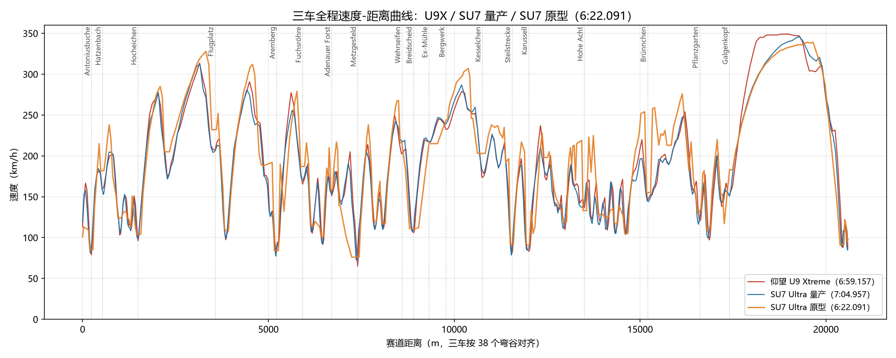
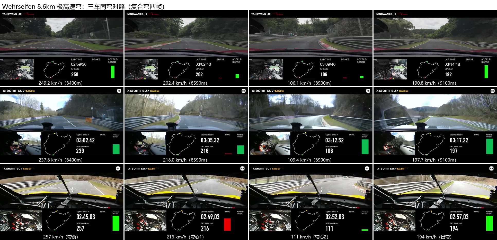

# 同一套 1548 马力，两个重量——小米 SU7 Ultra 与比亚迪 U9X 的纽北全圈账本

> 数据源：三车官方车载视频 **25fps 逐帧**（RapidOCR 本地识别速度数字；U9X=PotPlayer 逐帧 10352 张、量产=ffmpeg 抽帧 10933 张、原型 6:22=PotPlayer 9295 张）+ U9X 功率/减速度反推用 **5fps 滑动回归口径**（加速度类结论对显示刷新噪声不敏感）；分析时间 2026 年 8 月。
> 本文是《参数与激情：从技术祛魅到需求自知》系列的赛道对照篇，篇2《2977 马力的真相》的姊妹篇——篇2 的主线是"账面马力 ≠ 可用马力"（U9X 反推），本文的主线是"重量税与功率策略"（两车全圈对照）。篇2 §七以预告形式指向本文，这里是全部细节。

---

## 一、账面功重比差 1.86 倍，圈速差 5.7 秒：5.7 秒去了哪

先摆账本。仰望 U9 Xtreme 与小米 SU7 Ultra 量产版，账面功重比差近一倍：

| | 账面马力 | 车重 | 功重比 | 圈速 | 残差（44 车回归） |
|---|---|---|---|---|---|
| 比亚迪仰望 U9 Xtreme | 3019hp | 2480kg | 1217 hp/t | 6:59.157 | **+5.3%**（榜尾） |
| 小米 SU7 Ultra 量产 | 1548hp | 2360kg | 656 hp/t | 7:04.9 | **-1.5%**（四门纯电组最高效之一） |

功重比差 1.86 倍，圈速只差 5.7 秒。这 5.7 秒的每一秒，都能在两车官方车载视频的逐帧数据里找到去向。先给结论，两个口径互相印证：

**赛道位置账**（距离域分段，自洽闭合）：**5.7s = 直道前 4.4s + Döttinger 大直道 0.6s + 尾段 0.7s。**

**物理动作账**（按"松油点→弯心→松油点"分段）：加速段（39 段，出弯+弯间一体）U9X 净赚 **+5.24s**，减速段（38 段）净赚 **+1.76s**，毛账 7.0s——SU7 靠弯中与衔接的优势追回约 1.3s，净账回到 5.7s。

两个口径指向同一句话：**差距的大头在直道与出弯（功率的舞台），不在弯道（重量的舞台）。** 而"账面 2 倍功重比只兑现 5.7 秒"这件事，本身就是篇2 主题在另一辆车上的回响。

## 二、数据与方法：两段官方视频的逐帧对账

两辆车都有官方发布的无剪辑圈速车载视频，这是全部分析的原料：

- **U9X**：官方圈速视频（6:59.157），25fps 逐帧 10352 张（PotPlayer 抓帧 + RapidOCR，读出率 98.8%，与官方 5fps 管线交叉验证平均差 2.1km/h）；
- **SU7 量产**：官方无剪辑车载（7:04.9，末帧与官方圈速精确一致），25fps 抽帧 10933 张（读出率 96.6%，时间域交叉验证平均差 1.4km/h）；
- **SU7 原型（6:22.091）**：官方视频 25fps 逐帧 9295 张（读出率 100%，38 个人工弯谷锚全命中）；
- **对齐**：三车速度积分成累计距离（各 100.2-100.7%），按 38 个弯谷锚做分段距离校正，逐弯配对；
- **口径纪律**：位置/弯速/走线类用 25fps；**功率/减速度类（加速度）用 5fps 滑动回归**——25fps 逐帧的帧间速度含 GPS 显示刷新伪影（±10-15km/h/帧），直接差分会污染加速度，1 秒采样又会把减速窄峰拍低，5fps 滑动回归是两者之间的稳健折中。

一句话说明方法论的诚实面：我们拆的不是"谁更快"，是"同样 20.8 公里，每一米上谁做了什么"。

## 三、功率反推与兑现率：账面马力的两种命运

同样的反推模型（P = (ma + F_drag + F_rr)·v）套在两段视频上：

| 段 | SU7 峰值（滤波） | U9X 对照 |
|---|---|---|
| 起步暖胎 | 733 kW @ 159km/h | 923 kW |
| 第一长直道 | 1037 kW @ 226km/h | 1537 kW |
| 中段加速 | 988 kW @ 205km/h | 1761 kW |
| Döttinger 大直道 | 713 kW @ 274km/h | 1462 kW |
| **全圈峰值（5fps 稳健口径）** | **1049 kW** | **1627 kW** |

**兑现率：SU7 ≈ 92%（账面 1138kW），U9X ≈ 73-79%（账面 2220kW）。** 同一个反推模型下的两种命运：小米账面马力几乎全额兑现（峰值 1049kW 只比账面低 8%），比亚迪账面马力在纽北从未兑现超过 1.8MW。这不是品牌道德问题，是两套账本哲学的差异——一个把账面马力当工程目标管理，一个把账面马力当四个电机峰值的算术和发布。

一个细节值得记：SU7 在 340km/h 时仍在加速（+0.28~+0.83m/s²，轮上功率约 400kW），达峰即刹、没有限速平台；U9X 则顶着 349km/h 电子限速平台巡航 10 秒。**同样的极速区，一个还在踩油门，一个在等限速器松手。**

## 四、重量账：U9X 的 120kg 赤字从哪来

U9X 手里有两张减重王牌——碳纤维单体壳（理论省 100-150kg）和传闻的电机密度 16.4kW/kg（无权威出处，不采信）——总重却仍比 SU7 重 120kg（2480 vs 2360）。保守口径的闭合账：

```
+93kg     电池化学税（80kWh LFP≈717kg vs 93.7kWh NCM≈624kg：容量少 14% 反而更重）
+94kg     电机功率翻倍（2220 vs 1138kW，U9X 按小米同级 10kW/kg 保守计 ≈220kg，SU7 按官方电机重量 ≈126kg）
+15kg     电控多一套（四套 SiC vs 三套）
+50kg     云辇-X 液压（vs SU7 被动悬架）
−125kg    碳纤维单体壳省下的
─────────────
≈ +127kg ≈ +120kg ✓ 闭合
```

**碳壳是止损，不是盈利**——没有它 U9X 约 2605kg。两个减重王牌被电池化学税、功率成本、云辇液压吃光，仍有 120kg 赤字。这与赛道篇的"2200kg 死亡线"闭环：1217hp/t 的纸面优势，从重量账上就开始蒸发——120kg 超重叠加重车区功重比效率腰斩（k 从 0.15 跌到 0.08），是 U9X 残差 +5.3% 中"马力虚高之外"的最大嫌疑。

反过来的对照就是重量税最干净的直接证据：**同一套 1548hp 三电机，量产版 2360kg 残差 -1.5%，原型版轻 460kg（1900kg）残差 -3.4%**——电机没变，轻 460kg，残差改善 1.9%。这就是"减重 ≈ 加马力"的活样本。

## 五、走线风格：V 型 vs U 型，以及"闪充≠回收"

三个指标把两车的走线风格分得很清楚：

| 指标 | U9X | SU7 | 含义 |
|---|---|---|---|
| 加速段功率密度 | 0.71 kW/kg（峰值 a≈1.0g） | 0.44 kW/kg（峰值 a≈0.75g） | U9X 出弯更猛 |
| 减速段平均减速度 | **0.56g**（13/25 段达 1.2-3.7 倍） | 0.42g | U9X 减速更猛 |
| 弯心速度（低速弯） | 基准 | +1.4km/h | SU7 弯速略高 |

先看全程，再拆弯。三车全程速度-距离曲线（U9X/量产为 10m 网格距离域对齐；原型车 6:22 版以 38 个弯谷人工读数+OCR 轨道做弯谷序号对齐；竖线为公认弯道地标）：



曲线上三条规律一眼可见：**直道段 U9X 与量产几乎重合**（两车在直道上做的是同一件事——把功率兑现成速度），**差异全部集中在减速-弯心-加速段**——U9X 的速度谷更深、进出弯的坡度更陡（V 型），量产 SU7 的谷更浅、更平滑（U 型）；**原型车几乎在每个弯都把两条线压在下面**（弯心更快），尤其是中高速域——三条线在直道上挤在一起、在弯里散开，这就是"重量税"的全程形状。38 个弯的细节下面用截图拆一个典型。

三组典型弯道中，选最有代表性的 Wehrseifen（8.6km 极高速弯）做逐帧对比——它是复合弯，按四帧拆：刹车点 → 弯心1 → 弯心2 → 出弯（U9X 与量产按 5fps 距离域对齐，原型车帧来自 6:22 官方视频、人工读数锚定）：



四帧读出三件事：**同位置（8400m）弯前速度原型最高**（257 vs U9X 249 vs 量产 238——刹车点账单独说：三车弯前峰值位置不同，U9X 249@8400m、量产 242@8420m、原型 268@约8450m，**原型刹车点最晚、弯前速度最高**）；**弯心1 原型与量产打平、U9X 掉速最狠**（量产 217、原型 220 vs U9X 202）——但注意原型的弯心1 位置比两车**靠后约 100m**（≈8700m）：它在 8590m 处还挂着全油门跑 267，之后一脚刹车从 220 一路拖到弯心2 的 110，**第一个弯到第二个弯全程刹车、过了第二个弯心才开油**；量产/U9X 则是"谷1→微加速→再刹到谷2"的两段式。U9X 带着 249 冲进去、在弯里杀到 202，"深 V"全在弯中完成；**弯心2（Breidscheid）三车几乎打平**（106 / 109 / 111）——U9X 在复合弯的第二顶点追平，说明它的 V 型节奏在低速段反而稳；出弯处三车都在 190+ 加速中。

三车弯心速度的全景（弯心速度取人工逐帧读数，38 个弯谷全部覆盖，完整值见图）：

| 弯（弯心速度） | U9X（2480kg） | SU7 量产（2360kg） | SU7 原型（≈1860kg，6:22 版） |
|---|---|---|---|
| 0.53km 中高速弯 | 159 | 153 | **182（+19%）** |
| 7.4km 低速弯 | 65 | 72 | **76（+4%）** |
| 8.6km 极高速弯（Wehrseifen） | 202 | 217 | **220（+1%，弯心1 靠后约 100m）** |
| 9.3km 极高速弯（Ex-Mühle） | 217 | 217 | **215（-1%）** |

第三行原型车把对比升级成一张完整的重量账：**同一套 1548hp 三电机，减重 500kg+ + 全热熔胎之后，弯心收益随速度域分明**（38 个弯全量统计，三车 25fps 同源）：低速弯 +6%、中速弯 +10%、高速弯 +24%、**极高速弯 −4%（略慢）**。这个分布本身就是物理：低速段量产车不缺抓地，增益最小；中高速段轮胎机械抓地主导，轻车身的 μ 优势全额兑现；极高速段空力配平主导——原型车的高下压力套件在这里反而付了阻力税，弯速略输量产。结合 Döttinger 尾速（334-340 vs 346，−3%）：**这套空力在中高速弯赚 24%，在极高速弯亏 4%，在尾速亏 3%——下压力与阻力的交易，逐项对得上账。** 而 U9X 在这张表里的位置值得记一笔：Wehrseifen 弯心三车最低（202），空力部件一样不少——这个话题留到第七节。

**U9X 是典型 stop-and-go（V 型）走线**：加速更猛 + 减速更猛 + 弯心速度略低。但有一个反直觉的实测：**两车刹车点几乎相同**（松油点差 ±1m、刹车点→弯心距离差 ±7m，无系统性晚刹车）——U9X 的 V 型不是靠"更晚刹车"，而是靠**同样的刹车点带着更高速度冲进去、用更大的减速度刹回来**。这符合它的功率特性：直道上赚的时间远大于弯心亏的时间，值得为直道牺牲弯速。SU7 更接近流畅的 U 型：弯速高、加减速平缓。

减速段的机制曾被误判为"动能回收驱动"，定量后反转：两车减速功率峰值同级别（U9X 2009kW / SU7 2387kW），而**回收功率被电池充电接受能力锁死**（U9X 80kWh 按快充 6.25C 计也只有 500-800kW，SU7 电池侧 93.7kWh×5C≈470kW）——**回收只占减速功率的 1/4-2/5，机械刹车承担 60-75%**。U9X 减速更猛是 V 型走线的策略选择，靠碳陶刹车散热支撑；回收只是伴生收益。这里还有个概念要拆穿：**闪充 ≠ 回收**——U9 的双枪 500kW 超充是外部直流快充路径（充电桩 DC 直进电池），动能回收是车载路径（电机反拖 → 逆变器整流），两条电路不共享，**快充快不代表回收快**；回收的瓶颈是电池充电 C 率，所有电动车一视同仁。

分档规律自洽：低速弯 V 型收益小（前后直道短），U9X 不冒险，两车减速度相当（0.60 vs 0.58g）；中高速弯前后直道长，值得猛刹，U9X 碾压（0.56 vs 0.38g）。唯一 SU7 更猛的段是 Breidscheid（减速段 8.8km）——也正是它前面的 Wehrseifen（8.6km 处）弯心快 15km/h（217 vs 202km/h）、单弯追回 0.15 秒的段。**功率特性决定走线风格，走线风格决定每一米怎么花。**

走线风格的硬证据在油门/刹车条上。我们把三车全圈 BRAKE 红条与 ACCELERATOR 绿条高度逐帧量出来（纯像素分析，全圈 5fps 降采样统计），三个维度把三种风格分得干干净净：

| 全圈指标 | 比亚迪 U9X | 小米 SU7 Ultra 量产 | 小米 SU7 Ultra 原型 |
|---|---|---|---|
| 刹车帧占比 | 29.5% | 33.9% | **19.2%（最少）** |
| 刹车油门并存帧（trail-braking） | 3.1% | **3.6%（最多）** | **0.6%（几乎从不）** |
| 切换频率（次/10s） | 8 | **10（最频繁）** | **6（最少）** |
| 给油时平均开度 | **57%（最低）** | 73% | **80%（最高）** |

**小米 SU7 Ultra 原型是纯正 stop-and-go**：并存帧仅 0.6%——刹车时绝不踩油、踩油时绝不刹车，一脚刹到底、一脚油给足（给油开度 80% 三车最高、切换最少）。**小米 SU7 Ultra 量产是细腻 trail-braking**：并存帧 3.6% 三车最高、切换 10 次/10s 最频繁——弯前弯中刹车油门并存、来回交替，带刹入弯、线性给油。**比亚迪 U9X 是想玩 stop-and-go 但玩不转**：并存 3.1%（它也有带刹入弯），给油开度却只有 57%（比小米原型少 23 个百分点）——账面推重比 1217hp/t 三车最大让它"想"全刹全油，2.48t 重载 + 轮胎抓地力不足让它"出弯不敢全油"。

这三行条高数据指向同一句话：**stop-and-go 是高推重比 + 好空力才玩得起的走线**。小米原型 832hp/t + 2145kg 级下压力玩得起（纯正）、小米量产 656hp/t 玩不起所以走细腻流、比亚迪 U9X 账面 1217hp/t 想玩但重+轮胎让它给油打折到 57%。比亚迪 U9X 的"给油怂"不是驾驶习惯，是重量、轮胎、空力三项短板叠加的必然结果——这把"功率特性决定走线风格"从速度曲线一路推到了油门踏板。

Döttinger 末端还有一笔油门账：**原型全油门到收油点前 2 秒**（收油前 accel 仍 96%），量产提前点刹（11.5→26%）、U9X 低开度滑行（30-48%）。原型敢更晚收油，正是高下压力 + 轻车身的底气——"更轻 + 更多下压力 = 更晚刹车"，与它中高速弯 +24% 是同一件事的两面。

顺带一条推论链：V 型的重刹（0.8g 级）+ 猛加速（1.0g 级）纵向滑移能量远大于 U 型节奏，叠加 2.48t 重载（每轮 620kg+），轮胎纵向负载循环更极端——与 2024 年 300km/h 爆胎前科、349 限速保守策略构成完整证据链：**U9X 的"收着跑"不只是马力策略，也是轮胎生存策略。**

## 六、残差敏感性：马力虚高只背 1/3 的锅

一个自然的质疑：U9X 的 +5.3% 残差，是不是账面马力虚高造成的假象？用 44 车回归系数做敏感性：

| 马力口径 | 残差 |
|---|---|
| 账面 2220kW（3019hp） | +5.3%（回归基准） |
| 前轮功率减半 1665kW（2264hp） | +3.4% |
| 实测 1761kW（1s 口径） | +3.7% |
| 实测 1627kW（5fps 稳健口径） | +3.2% |
| **残差归零所需** | **1010kW（1373hp）——比实测峰值还低 38%** |

**即使按实测峰值口径，残差仍有 +3.2-3.7%；要落在回归线上，U9X 得按 1373hp 算——物理上说不通。** 马力虚高只解释残差的约 1/3。剩下的呢？把 +5.3% 拆成一张预算表：

| 归因 | 残差贡献 | 证据强度 |
|---|---|---|
| 账面马力虚高（2220kW 从未兑现） | 约 1.6-2.1%（修到实测口径后 +3.2~3.7%） | 硬（视频反推，双口径） |
| 349 电子限速 | 约 0.3%（直道早 13 秒达极速、约 10 秒被限速平台吃掉；若无限速，直道差距从 0.6s 扩到约 2s，全圈 +1.4s 级） | 硬（逐帧实测） |
| 重载轮胎 μ 下降 + 线性模型未捕捉的重载非线性 | 约 2-2.5%（2480kg、每轮负荷 620kg+：负载敏感性把 μ 从 1.2 压向 1.05；2200kg 以上功重比效率 k 腰斩到 0.08，而全量回归用的是统一弹性） | 半硬（工程曲线 + 残差结构） |
| V 型走线保守 + 调校经验 | 约 0.5-1%（"收着跑"的策略选择：轮胎前科、成绩优先；对照 Prodrive 原型工程 + 莲花工程量产标定的 SU7） | 软（策略推断，可证伪） |

只有第一行是"参数祛魅"的对象——后三行是物理、策略和工程。它们合起来才是 U9X 残差的完整故事：**账面马力是数字问题，重载是物理问题，收着跑是选择问题。** 一个 +5.3% 的残差里，1/3 是参数说谎，1/2 是物理收税，剩下的是策略留白。

## 七、三层架构论：SU7 原型的真正意义

SU7 Ultra 原型（6:46.874，2024-10 官方认证，当天赛道 20% 湿地、仅一圈有效窗口——成绩是下限；2025-04 升级版原型再刷 6:22.091 官方认证、纽北总榜第三，但该版参数未完整公开，本文回归口径用 6:46.874）放哪一组都是关键样本。它的归类逻辑是双维的：**架构维度**它是四门大型车（量产白车身强化版），作为"四门轿跑纯电组"样本留在 44 车全量回归；**改装维度**它非公路合法、赛道空力 + 460kg 减重，是货真价实的原型车，因此与 4 辆极限组原型同台对照。

把三层摆在一起：

```
量产车层：SU7 量产 7:04.9（残差 -1.5%，四门纯电组最高效）——量产规则下的优等生
强化层：  SU7 原型 6:46.9（2024，湿地日，极限组回归 +0.8%）——量产架构的极限形态
再强化层：SU7 原型 6:22.091（2025，官方认证、总榜第三）——空力与减重的第二笔投入
赛车层：  919 Hybrid Evo 5:19.5 / Evija X 6:24.0——纯赛车架构
```

**2024 版 SU7 原型几乎正好落在极限组回归线上（+0.8%）——那一版空力在原型车里是入场券，不是优势。** 它在全量回归里 -3.4% 的"高效"，完全来自"比量产版轻 460kg + 赛道空力套件"；放进每台都空力拉满的原型车堆，它就是一台 1548hp/1900kg 极限车"应该跑出"的成绩，不占便宜也不吃亏。与 Evija X 对照（马力 +29%、轻 200kg、快 22.9 秒）的差额里，极限组弹性只解释 1.6%，**剩下 4.4%（≈17 秒）是纯赛车架构对量产架构的税**（碳纤维单体壳+赛道底盘 vs 量产白车身强化版）。

**把第五节的截图账本按车重排开，轻量化 + 空力优化的收益就有了逐弯标价：**

| 弯（弯心速度） | U9X（2480kg） | SU7 量产（2360kg） | SU7 原型（≈1860kg，6:22 版） |
|---|---|---|---|
| 0.53km 高速弯 | 159 | 153 | **182（+19%）** |
| 7.4km 低速弯 | 65 | 72 | **76（+4%）** |
| 8.6km Wehrseifen | 202 | 217 | **220（+1%，弯心靠后约 100m）** |
| Döttinger 尾速 | 349（电子限速） | 346 | **334-340（空力阻力税）** |

两个方向都值得记。**正向**：同样的 1548hp，减重 500kg + 空力升级，低速弯 +6%、中速弯 +10%、高速弯 +24%、极高速弯 −4%——而代价是尾速从 346 掉到 334-340：2025 版空力的优化方向是下压力，不是阻力。**高速弯 +24% 换极高速弯 −4% + 尾速 −3%，这是小米自己选的交易，账目逐项闭合**；而且阻力税不只收在 Döttinger——Breidscheid 出弯后的 400m 短直道上，量产/U9X 能冲到 219-221km/h，原型被高下压力按住只加到 179（低 40km/h），到了下一段短直道峰值仍低 11km/h，直到 Bergwerk 低速弯才靠轻车身 μ 反超（242 vs 236/239）。**高下压力空力在每一段直道交阻力税、在每一个中高速弯赚 μ 红利，低速弯两清**。顺带一句，6:46 那版原型车当天是 20% 湿地，尾速（视频读数约 323km/h）受湿地影响，不参与这组干地对比。

**反向**（U9X 的位置，一个可证伪的假设）：U9X 是货真价实的超跑架构——碳纤维单体壳、天鹅颈大尾翼、云辇-X，空力部件一样不少，弯心却是三车最低：Wehrseifen 202（vs 量产 217、原型 216），中高速弯 159 也只和量产 153 打平、远低于原型的 182。重量解释大头——2480kg 每轮 620kg+ 的负载把 μ 压向 1.05，光负载敏感就能吃掉与原型差距的大半；但中速域的 159 vs 182 里空力几乎不参与，U9X 的超跑架构没有给出超跑级的机械抓地。**空力部件的"有"不等于下压力的"强"**：U9X 的时间线很说明问题——2025 年 8 月 22 日跑出纽北 6:59.157 的同时，另一队人马在 ATP 测试场刷极速（工程车 391.94、9 月 14 日量产认证 496.22），而极速版的设定是**取消天鹅颈大尾翼、低阻优先**。同一台车、同一时期两线作战，一套空力服务两个完全相反的目标；而 U9X 官方从未公布过下压力数值——对比之下，小米给量产版都标了 285kg、原型车标过 2145kg。部件都有、优化深度不够，与 Prodrive（原型）、莲花工程（量产）这种几十年赛车工程团队的开发深度相比，首战纽北的比亚迪内部团队还有账要还。这是工程假设，不是定论——但它与残差预算表里那 0.5-1% 的"调校经验"条目互为正反面。

三层架构论给这个系列的收官命题补了最后一块拼图：**同一套 1548hp 三电机，放在量产规则里是优等生（-1.5%）；2024 版原型在原型堆里"平庸"（+0.8%，湿地日）——"平庸"恰恰说明没偷工；2025 版原型再投入空力与减重，刷出 6:22.091（总榜第三），把它放回极限组回归线，按官方"减重超 500kg"口径（约 1860kg）估算残差约 -4.8%（按更激进的减重口径也有约 -2%）——不再平庸，是原型堆里的高效生。** 从 +0.8% 到约 -5%，两年两版的差额大头是空力优化与干地条件（6:46 当天 20% 湿地、仅一圈有效窗口），小头是继续减重——空力优化是一笔持续投入才兑现的账。SU7 原型的意义是证明了量产三电系统的潜力上限：用真赛车架构重装这套动力，还能再快十几秒。

把三篇账并成一句话，就是本文想说的话：**比亚迪 U9X 输在"重、虚、生"三个字——"重"：2480kg 太重，每轮 620kg+ 的负载把轮胎抓地力压进低档；"虚"：2220kW 账面功率在纽北从未兑现超过 1.8MW；"生"：赛车工程与调校生疏——空力下压力效率不足 + 重载轮胎压力，让账面功率和加速能力在出弯时根本使不出来（全圈给油时平均开度仅 57%，比小米 SU7 Ultra 原型车的 80% 低 23 个百分点）。** 小米 SU7 Ultra 量产版（2360kg）和小米 SU7 Ultra 原型车（≈1860kg）赢在"轻、实、熟"——更轻的车身、把 1548hp 几乎全额兑现、交给 Prodrive（原型）与莲花工程（量产）这类老牌赛车工程团队调校。赛车的第一性原理从来不是账面马力，是"重量 × 效率"：同样的马力，轻 500kg 比多 700hp 更值钱。这不是比亚迪不懂造车——是它在超跑这件事上，还在用易四方四轮均分的对称布局（分布式起步的最简方案，不为脱困而设）和极速纪录的思路解题，而小米在用赛道的思路解题。

## 八、特斯拉对照：更轻为什么更慢

三电机四门纯电这条路上，最早站上纽北的是特斯拉。Model S Plaid 两版成绩都在 44 车回归里，给"同门对照"补了第三个样本：

| | Model S Plaid 基础 | Model S Plaid + Track Pkg | SU7 Ultra 量产 |
|---|---|---|---|
| 账面功率 | 1020hp | 1020hp | 1548hp（+52%） |
| 车重 | 2190kg | 2190kg | 2360kg（重 170kg） |
| 圈速 | 7:35.6 | 7:25.2 | 7:04.9 |
| 残差 | **+3.5%** | **+1.2%** | **-1.5%** |

三个观察：

**1. 更轻 + 低 52% 账面功率 = 慢 20 秒，但账面只解释 9 秒。** Plaid TP 功重比 466hp/t vs SU7 656hp/t。按 44 车弹性算：马力 +52% 应快 2.8%、重量 +7.7% 应慢 0.9%，账面净差约 1.9% ≈ 9 秒——实际圈速差 20.3 秒，**多出的约 11 秒是残差差（+1.2% vs -1.5%），账面差距解释四成出头，效率差距解释近六成**。方向符合物理，账目却不全在账面。

**2. 但残差一正一负，是效率差距。** Plaid 基础版 +3.5% 是四门纯电组里的低效生（只比 U9/Rimac 好），SU7 量产 -1.5% 是高效生——同样被"电池+三电机"的重量惩罚，小米把功率兑换成了圈速，特斯拉没有。原因是特例性的：Plaid 的短板不在功率，在**功率用不出**——无下压力套件（186mph 以上车尾发飘的公开报道）、普通悬架、热管理保守锁功率。这正是"参数祛魅"的另一面：**账面功率是真的，但它是"直线功率"，不是"赛道功率"。**

**3. Track Package 的 10.3 秒 = 刹车和轮胎的账。** 1.5 万美元的赛道包（碳陶刹车 + 赛道胎 + 200mph 解锁）把圈速从 7:35.6 提到 7:25.2、残差从 +3.5% 救回到 +1.2%——**2.3 个百分点的改善全部来自"让已有功率多工作一点"**，没有一匹新马力。这个数字本身就是"功率用不出"的定量证据：基础版的 1020hp 里有大约两成的账面值被刹车热衰减和轮胎闲置在纽北的 70 个弯里。

特斯拉对照补上了三电机纯电路的第三种结局：**Taycan 用工程套件换效率（-5.6%）、SU7 用功率密度换圈速（-1.5%）、特斯拉用最便宜的功率但兑换率最低（+1.2%~+3.5%）**。功率平权的时代里，谁把功率兑换成圈速，谁才是赢家。

## 边界声明

1. 速度/位置/走线类结论基于三车 25fps 逐帧（RapidOCR）；功率/减速度（加速度类）用 1s 采样 + 5fps 重采口径——25fps 帧间速度含 GPS 显示刷新伪影（±10-15km/h），不用于加速度差分；
2. 44 车全量回归含 SU7 原型与 Model S Plaid Track Package 样本（惩罚比 1.72 为该口径）；该数字对纯电极端样本的去留敏感：42 车口径为 1.0、43 车口径为 1.73（差异主要来自 SU7 原型的加入），敏感性区间约 0.52-1.73（依次移除 U9/Rimac/SU7 原型），引用时按口径标注、不当精确常数；
3. U9X 的 120kg 重量账为保守口径推算（电机密度取小米同级 10kW/kg），各单项有 ±20kg 级误差，闭合结论（碳壳是止损）对单项误差不敏感；
4. 两车走线风格是"功率特性→策略选择"的推断（刹车点实测支持），车手个体差异未完全排除；
5. 所有马力均为账面值；SU7 原型成绩 6:46.874 为 2024-10 口径（当天 20% 湿地、仅一圈有效窗口），2025-04 升级版原型 6:22.091（官方认证）参数未完整公开、未纳入回归；
6. 三车弯心速度与油门/刹车条高为逐帧数据：原型车 6:22.091 视频为 YouTube 官方原版（PotPlayer 逐帧 9295 张，RapidOCR 识别，38 个人工弯谷锚全命中）；油门/刹车条高为右下角纯色条像素分析；6:46 版尾速 323km/h 为湿地日视频读数，仅作参考、不参与干地对比；
7. U9X 空力时间线（2025-08-22 纽北 6:59.157；8 月 ATP 工程车极速 391.94；9-14 极速 496.22，极速版按公开报道取消天鹅颈尾翼、低阻设定）来自公开报道；"官方未公布下压力数值"以公开资料为准；U9X 弯速归因中的"空力优化深度"为可证伪假设，非定论。

---

*系列导航（《参数与激情：从技术祛魅到需求自知》）：本文是篇2《2977 马力的真相》的姊妹篇（下集）；主线见篇2 §一-§六，本文承接篇2 §七的预告、展开全部对照细节。研究内核线其余各篇：《3400 公里之后，谁还在？》（越野篇）、《4300 米上，马力是软通货》（派克峰篇）、《不存在一种架构统治所有场景》（收官篇）。*
