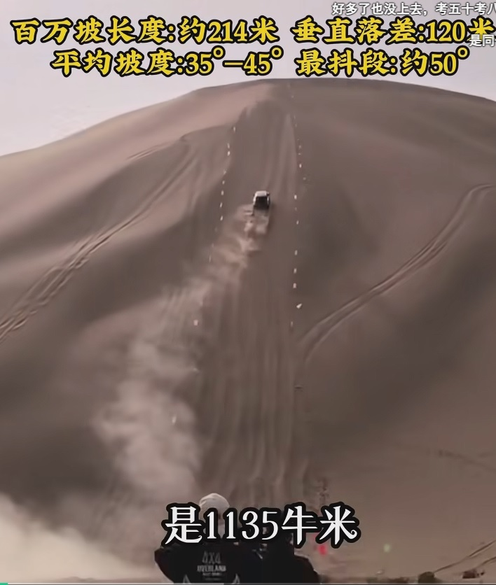
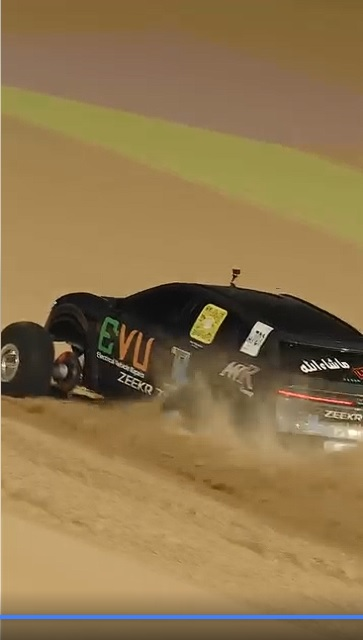
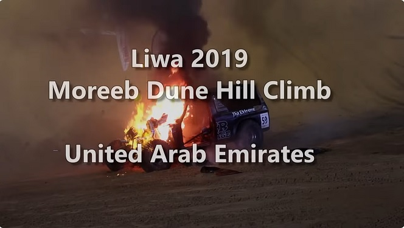
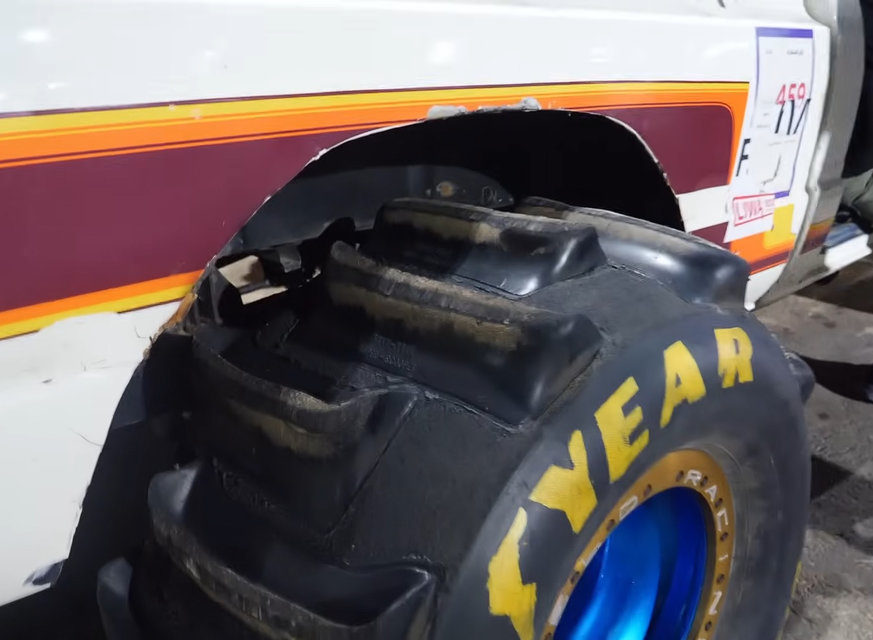
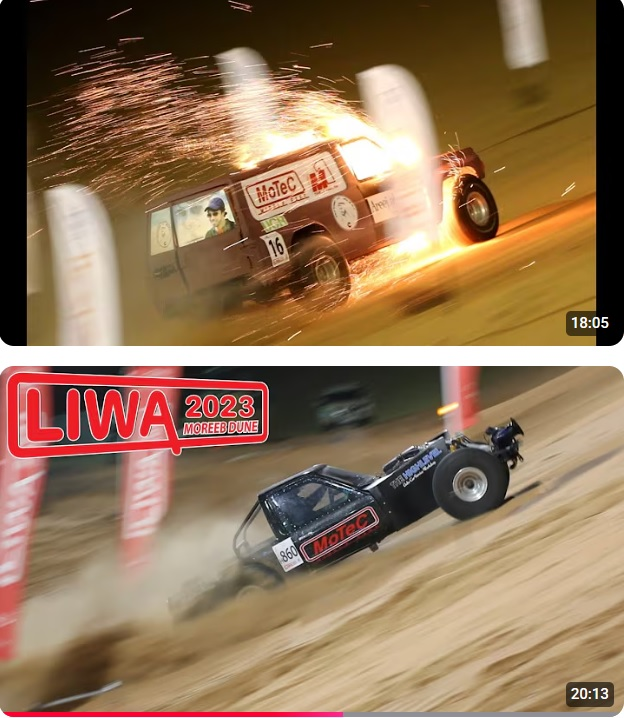
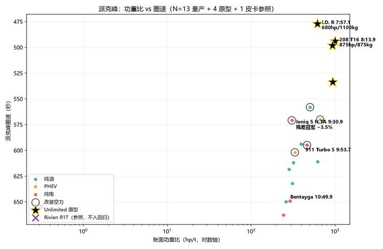
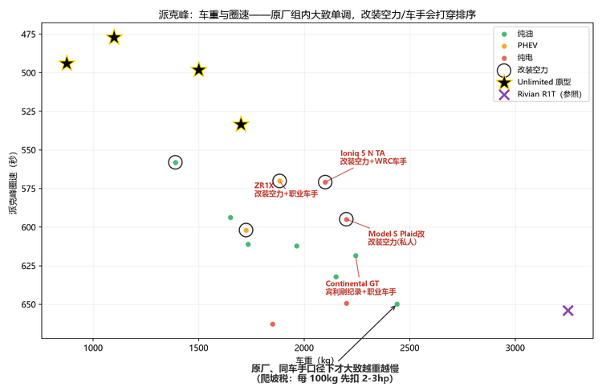
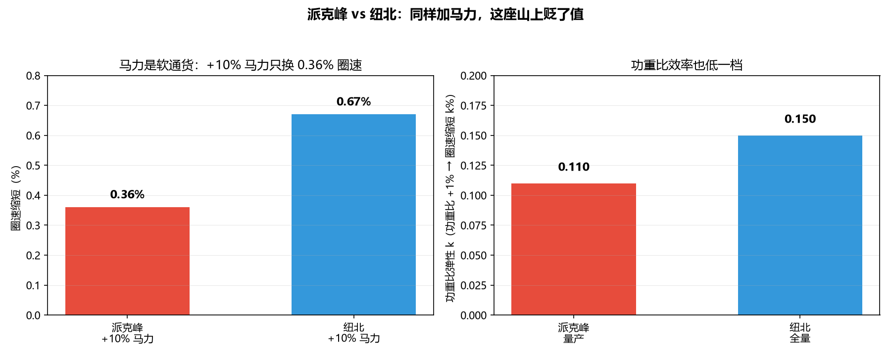
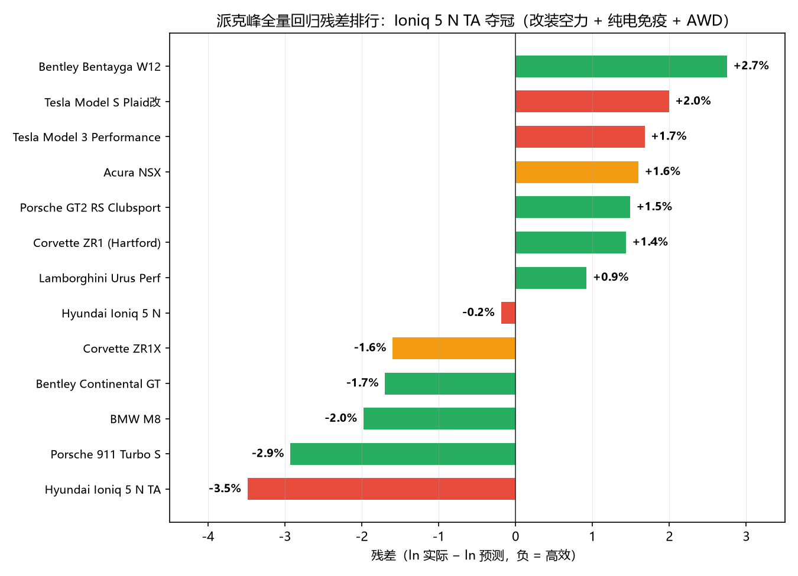

# 爬坡的两副面孔：沙地陡坡与派克峰

> 原标题《4300 米上，马力是软通货——派克峰的爬坡功率税》。2026-08 一轮重构：沙地冲坡前置为主角，派克峰分析精简后置为对照组；2026-08 二轮重构：开篇改为"百万坡营销钩子 + 沙漠登顶营销时间线"，收束章扩为"两座山、三种营销"（中国/中东/美国）。
> 数据源：PPIHC 官方成绩（2011 全线铺装后至 2026）+ Wikipedia + Moreeb/百万坡公开视频与报道 + 新疆旅游/环塔/阿拉善公开数据（政府网/人民网/新华网/同程报告）；分析时间 2026 年 7-8 月。
> 本文是《参数与激情：从技术祛魅到需求自知》系列的派克峰篇。方法与前两篇同一套：对数回归 + 残差 + 分组弹性。数据边界见文末。
> 优化版：按成稿自查清单清理元叙事与金句节拍，内容、数据、排版未动。
> 优化版 v3：按最新 DNA 补四处——对称收尾拆解、无关参数删除、提示腔去除、列举段收紧；内容、数据、排版未动。
> 优化版 v4：按最新 DNA 更新第一、二节——设问破题（3000hp 憋熄火）、同意-反转开篇、绝对断言降级、着火图随论点、比喻去文艺（三笔账→三项阻力、货币→比的是）；其余未动。

---

## 开篇：一个坡的传说，一场营销竞赛

"听说这个坡，全网仅此一车能登顶！就是纵横 G700！"——这是一条沙漠冲坡视频的标题。坡长 214 米、落差 120 米、最陡处约 50°（视频宣传口径），视频发布后三个多月，全网找不出第二辆车登顶。听起来像一辆车的封神时刻。但在把它读成"G700 天下第一"之前，先看另一组事实：阿联酋的 Moreeb 沙丘上，3000hp 级的改装油车，常见爬一半憋熄火。

是的，沙坡很难，这不需要怀疑。但"仅此一车能登顶"吗？G700（系统综合 665kW），而账面 500-665kW 级的三台电四驱（豹8 550kW、豹5 505kW、G700 665kW，官方参数口径）物理上都具备能力。"全网仅此一车"更可能来自场地准入、尝试机会和驾驶员，而不是车辆本身能力差距。这句话最准确的理解可能不是"G700 最强"，而是"这是一次成功的营销"：把一次登顶包装成了"全网唯一"。

（原视频：[听说这个坡，全网仅此一车能登顶！就是纵横 G700！](https://www.bilibili.com/video/BV1KtL161E9k)）

而这个句式不是孤例。过去三年，中国厂商在沙坡上打了一场"登顶竞赛"：

| 时间 | 厂商/车型 | 动作 |
|---|---|---|
| 2023-09 | 比亚迪豹5 | 直拔尼三锅（库木塔格沙漠），"原地直拔"玩法的开创者，上市前两月预热 |
| 2024-09 | 极氪7X | 挑战必鲁图峰（巴丹吉林"沙漠珠峰"），上市前三天预热 |
| 2024-09 | 极氪001 | 40 层楼深的沙锅原地直拔，一镜到底 |
| 2025-08 | 哈弗猛龙 | 登顶必鲁图峰——Hi4 版"为 Hi4 正名"，2026 款（2.0T+P2）再次挑战 |
| 2026-01 | 极氪7X | Moreeb 7.34 秒，首个纯电官方登顶 |
| 2026-08 | 吉利战舰700 | 约 6000m 级海拔爬坡纪录 + 预告挑战沙漠珠峰 |
| 2026-08 | 长城 | 必鲁图峰 8 轮不间断拔坡——别人玩单次登顶，长城强调连续 8 轮 |

（时间线为厂商官方宣传口径，逐一来源见文末边界声明。）

而这类视频恰好是短视频平台的流量密码："这车能爬 XX 坡、那车不能"的对比切片到处可见，普通观众很难分辨背后的真相，只能在评论区里咬饵。

**为什么是爬沙漠？** 因为沙漠是中国汽车营销最贵的广告位——它站在三条热度的交叉点上。

**第一，新疆是大盘。** 2025 年新疆接待游客 3.23 亿人次、旅游花费 3700 亿元，创历史新高；2026 暑期县域租车热度同比增长超 75%——自驾游正在从"打卡"转向"奔县"深度游，沙漠是辨识度最高的景观之一。

**第二，环塔在新疆。** 中国顶级越野拉力赛环塔 2026 年为期 17 天，从乌鲁木齐出发穿越天山南北，全程约 7500 公里、赛段约 3400 公里——越野篇的整个考场就在这片沙漠里。官方连旅游口号都有了："跟着环塔游新疆"。

**第三，民间越野的另一个圣地是阿拉善。** 每年十月的阿拉善英雄会在腾格里沙漠腹地举办（2025 年 28 项活动：腾格里拉力赛/UTV 挑战赛/大众训练营）；巴丹吉林沙漠的必鲁图峰是世界最高固定沙丘，相对高度 589 米，人称"沙漠珠峰"——吉利预告要挑战的就是它。

于是沙漠成了天然营销舞台：尼三锅在新疆库木塔格，必鲁图峰在内蒙巴丹吉林，加上阿联酋的 Moreeb——谁能"登顶"，谁就拿到一段几十秒、自带流量的短视频。只是可惜的是阿联酋太远，且极氪的改装太夸张，他们自己也不想宣传吧。

*极氪 7X 改装*

而沙漠这种传统越野/穿越地区可能是油车老登们最后几块自留地，并且也充满了对电车的**环境恶意**：没有充电桩、沙地持续高负荷、保电和散热双重压力——环塔 SS9 纯沙漠赛段，账面 665kW 级的电驱车只跑出 42-49km/h 的蠕行（见越野篇）。但"沙坡冲顶"这个具体工况考的偏偏是电驱的长板——满态扭矩、毫秒级响应、轮端逐轮控制。**冲突与甜点并存**——这正是营销竞赛能成立的原因：厂商要证明的，恰恰是"电车能在新能源的禁区赢一次"。

但这条时间线的起点是比亚迪——而不是大家心中那个爹味和小仙女并存的长城——2023 年 9 月，豹5 上市前两个月直拔尼三锅，第一个发现"沙坡登顶"是最好的广告位。

## 一、沙漠爬陡坡的技术账：难点、甜点与各家拿手戏

**沙坡的三项阻力。** 冲坡的阻力来自三处：**重力分量**——50° 坡的重力分量接近 0.77 倍车重，近乎翻倍；**沉陷**——沙地承载靠剪切强度，车轮会压出坑；**剪切/挠沙**——推进力来自轮胎把沙向后排出的反作用力。更关键的是沙的行为随速度变化：**高速挠沙**——轮胎把沙快速向后排出，沙表现出类流体行为；**低速刨坑**——轮胎沉陷、越刨越深，把自己埋进坡里（"快走沙"为经验法则口径）。

**挠沙是动量交换，不是滚动摩擦。** 挠沙的做功是"把沙子加速抛出+抬升"，跟滚动阻力完全是两码事——所以任何"理论滚动功率账"在沙坡上都不成立。**3000hp 级改装油车爬 Moreeb 照样半坡憋熄火**——为什么？机制是：转速掉出扭矩平台 → 挠不动 → 沉陷 → 越刨越深。沙坡要的不是峰值数字，是"低转速大扭矩 + 转速不跌落"。

*Moreeb 冲坡失败（着火）*

**轮胎的两条路线。** 冲坡特化用**桨叶胎**——胎面像明轮船桨叶，在沙里"划水"式抛沙，靠剪切不靠滚动。极氪 7X 的 Moreeb 登顶车即此路线：登顶那台并非视频配音所称的"基本原装"，轮眉装不下夸张的桨叶胎，改装者用延长传动轴让四个大轮胎突出车体。穿越路线是**低胎压浮力**——加大接地面积防沉陷（详见收官篇轮胎小节）。**冲坡用剪切，穿越用浮力，两件事不能混。**

*桨胎*

**悬架要的是行程和全独立。** 沙坡表面不是平滑斜面——高速冲坡时车轮在起伏沙面上高频跳动，悬架行程决定车轮贴沙的时间；全独立悬架（G700 前后双叉臂、极氪 7X 全独立+空悬）在这个工况优于整体桥，配合大离地间隙（230mm 级）吃掉坡面起伏。这和派克峰正相反：铺装路面考侧倾控制和转向精度，沙坡只看行程和贴地。

悬架形式与登顶名单的对照比纸面参数更直接：G700 前后双叉臂、极氪 7X 全独立+空悬，直拔开创者豹5 的高配还带云辇-P 液压悬架，**连前麦弗逊/后多连杆悬架的哈弗猛龙都能登顶必鲁图**；而民间尼三锅对比视频里爬得挣扎的坦克 400/500 Hi4-T，恰是前双叉臂+后整体桥（多连杆非独立）。后整体桥的价值在耐久与改装空间——给玩家留升级余地（换簧换避震升高都简单），不在沙坡的贴地时间；独立悬架上限受半轴角度限制、改装复杂，但贴地占优。同一根轴在两个场景给出相反的答案——这和越野篇的"贴地/强度兑换"、悬架姊妹篇的"规则×强度×故障容忍度"是同一个结论。（对比为民间测试口径、样本有限，仅作观察性对照。）

**电驱为什么擅长。** 内燃机在这个工况受扭矩曲线和液力变矩器热衰减的双重限制——峰值马力在高转速区，而沙坡恰恰要低转速大扭矩，转速一掉就憋熄火。电驱的满态扭矩从零转速就有、毫秒级响应、还能逐轮独立控制扭矩（DTC-4S 一类系统）。沙坡冲顶还有第三分支——**原地直拔**：不靠冲坡动量，靠低速大扭矩+轮端逐轮控制把车从锅底"拧"出来，这是电驱的特化优势（2023 比亚迪豹5 直拔尼三锅开创，2024 极氪001 沙锅直拔跟进）。

各家在同一个沙坡上卖的是不同的技术故事：比亚迪卖"原地直拔"玩法本身，极氪卖桨叶胎改装下的首个官方登顶，奇瑞 G700 卖"最接近原厂"，吉利把高原纪录和沙漠珠峰预告捆在一起，长城最特别——哈弗猛龙用 Hi4/P2 混动证明登顶不只是纯电的专利。别人卖单次登顶，长城卖"连续 8 轮"。（全部为厂商官方宣传口径，详见文末。）

*Moreeb 冲坡改装车*

沙坡是**几秒钟的爆发**考场：3000hp 憋熄火证明它难，电驱登顶证明瞬时扭矩+轮端控制值钱。但"爬坡"这个词还有另一种含义——8 到 11 分钟的持续，和一百年的营销传统。

## 二、另一座山：派克峰

沙漠爬坡考的是几秒钟的爆发加一段登顶叙事，这没错。但铺装长坡考的是另一套账：派克峰国际爬山赛一百多年历史里，出现过一组最反直觉的账目。

| 车 | 动力 | 马力 | 重量 | 功重比 | 圈速 |
|---|---|---|---|---|---|
| Peugeot 208 T16（2013，Loeb） | 3.2T V6 双涡轮 | 875hp | 875kg | **1000 hp/t** | 8:13.9 |
| VW I.D. R（2018，Dumas） | 双电机纯电 | 680hp | 1100kg | 618 hp/t | **7:57.1** |

208 T16 的账面功重比是 I.D. R 的 1.62 倍，圈速反而慢了 16.7 秒。为什么？答案在终点线的海拔上：4302 米，空气密度只有海平面的 60%。自然吸气在这里掉 35-40% 功率，涡轮补偿有上限（4300 米仍有 10-20% 损失）；I.D. R 的 680hp 从山脚到山顶**全程满额**——电动机不在乎空气密度。

把与赛道篇同一套对数回归搬上这座山（方法详见赛道篇），看两件事：马力、重量、空力各自还能兑换多少圈速；"全程上坡会让重量惩罚翻倍"的直觉在数据里站不站得住。

派克峰与纽北的物理差异只有三条：全程上坡（平均 7.2%，重力分量持续做功，没有下坡"回本"）；高海拔衰减（NA 掉 35-40%、涡轮掉 10-20%、纯电免疫，本分析不修正马力，交给残差解释）；民用山路 156 弯无缓冲区。N=13（1390-2440kg，450-1250hp），R²=0.85（调整后 0.64）：

| 变量 | 系数 | p 值 | 物理含义 |
|---|---|---|---|
| ln(马力) | **-0.036** | 0.46 | 马力 +10% → 圈速缩短 0.36%（**不显著**） |
| ln(重量) | +0.062 | 0.18 | 重量 +10% → 圈速增加 0.62%（不显著） |
| **改装空力** | **-0.093** | **0.018** | **改装空力快 8.9%（全模型唯一显著）** |

（纯电 +0.035/p=0.24、SUV +0.008、四门 +0.009，均不显著。）

三个发现，一个是否定性的：

**1. 重量惩罚比 1.75 ≈ 纽北 1.72——"上坡放大惩罚"的直觉被数据否定了。** 点估计 1.75（+0.062 ÷ -0.036）vs 纽北 44 车的 1.72（+0.116 ÷ -0.067）。机制：爬坡税是**常数项减法**，近似不改变功重比排序；且对数回归的 ln(重量) 项已隐式吸收爬坡惩罚（重车自动降速 → 均速低 → 爬坡扣除跟着变小，负反馈）。诚实补充：1.75 是两个不显著系数的比值，置信区间极宽；1.72 也不是可以当常数引用的精确值——三个纯电极端样本的去留让它在 0.52-1.73 之间摆动（敏感性见赛道姊妹篇）。

**2. 真正的差异在马力：弹性从 -0.067 腰斩到 -0.036，且完全不显著（p=0.46）。** 纽北 +10% 马力换 0.67% 圈速（p=0.004），派克峰 +10% 只换 0.36%，统计上与零无异。**马力在这里是"软通货"**——发得出来是一回事，兑换成圈速是另一回事。

**3. 车重与圈速几乎单调递增，无一反例。** 13 辆量产车越重越慢，没有一个反例——爬坡税是重量的直接一阶函数，没有起伏赛道"下坡回本"的抵消。这是"爬坡税真实存在"的最直接证据。

**爬坡税与稀薄空力。** 把爬坡消耗从账面马力里扣掉，剩下的才是加速和过弯的可用功率：**净功重比 =（账面马力 − P爬坡）÷ 车重，P爬坡 = m·g·sinθ·v**。以均速 110-120km/h 计，**每吨车重约扣 25-30hp**。这笔税是**常数项减法，不是比例**：它几乎不改变功重比排序，只压缩绝对购买力——800hp 的车上山先变 720hp，400hp 的变 350hp。这正解释了马力的弹性腰斩：回归里的马力是账面马力，圈速是被扣税后的马力跑出来的。

空力是唯一例外：4300 米下压力打六折，但**改装空力仍是最有效杠杆（-8.9%，p=0.018，全模型唯一显著）**——下压力和阻力等比例随密度下降，拖累同步消失；弯中下压力的边际收益不是线性的，156 个低速弯里弯速每快一点都直接进总账。（轻量组 k≈0 是空力混淆而非物理规律，引用时不得脱离标注。）

派克峰组别松散（TA1 允许大尾翼+扩散器，13 辆中仅 8 辆真原厂），**天然不适合做"量产架构效率"的精确对比，但适合上限探索**——改装空力对民用山路的实际贡献、纯电 SUV 与燃油超跑在 4300 米同场，这些组合在纽北看不到。残差冠军 Hyundai Ioniq 5 N TA（-3.5%）= 改装空力 + 纯电免疫 + AWD 的最优组合；纯电与纯油在派克峰**打平**（残差 0.0% vs 0.0%），机制是两股力量的精确对冲：海拔免疫 ≈ 放大的重量账单。

## 三、收束：两座山，三种营销

把两座山摆在一起：

| | 沙地陡坡（Moreeb/百万坡） | 派克峰 |
|---|---|---|
| 路面与时长 | 沙、直坡、300m 级、几秒-1.5 分钟 | 铺装、156 弯、19.99km、8-11 分钟 |
| 变量排序 | 峰值响应 > 悬架行程 > 轮胎/限滑 | 持续功率 > 空力 > 弯道抓地 |
| 电驱赢在哪 | 满态扭矩 + 轮端控制 | 海拔免疫 |
| 燃油的命门 | 低速憋熄火、限滑扭曲 | NA 掉 35-40%、涡轮补偿有上限 |

**同样是"上山"，两座山的物理让同一台车在不同山上值不同的钱**——沙坡是爆发力的考场，派克峰是持续性与空力的考场；电驱在两座山上各有一个甜点，但两个甜点的机制完全不同。

而围绕这两座山，长出了**三种营销**：

**中国式：短视频的登顶竞赛。** 比的是"登顶数"——尼三锅、百万坡、必鲁图、Moreeb，一次登顶换一段几十秒的短视频。同一个 G700，账面 665kW 在百万坡登顶，同样 600kW 级的电驱对手在环塔 SS9 纯沙漠赛段只跑出 42-49km/h 的蠕行——登顶视频只拍满态那几秒。

**中东式：Moreeb 的大马力崇拜。** Moreeb 沙丘节是阿联酋 Liwa 的本土文化——石油国家的沙丘爬坡节，3000hp 级改装车是主角，憋熄火也是文化的一部分。极氪 7X 2026 年 1 月在那里拿下"首个纯电官方登顶"，本质是**中国电车插进中东叙事**：在中东的赛场上，刷了一个属于中国营销线的纪录。

**美国式：派克峰的百年纪录簿。** "Race to the Clouds"一百多年，厂商刷纪录是传统——宾利 2018 年官方拿 Bentayga 刷生产 SUV 纪录（10:49.9），就是一次纯粹的营销行为（职业车手+官方宣传），2019 年又刷了量产车纪录。纪录簿本身就是营销基础设施：每一条新纪录，都是一条官方新闻稿。

三种营销卖的东西不同——**中国卖登顶数，中东卖轰鸣，美国卖纪录**——但干的同一件事：把峰值包装成能力。沙坡登顶证明的是上限（满态爆发的那几秒），环塔证明的是下限（持续功率+散热+可靠性）。厂商不会主动告诉你上限和下限的差——这正是"技术祛魅"要拆的东西：**看见登顶视频，先问它对应的是上限还是下限。**

对付营销的最好办法不是拒绝参数，而是换一套读法：知道自己面对的是哪种场景、哪种用法，就知道哪段参数与自己有关。下一篇《买车之前，先问自己五个问题》接着回答这个——其中一问叫"问信息环境"：口碑与销量为什么背离、为什么你看到的都是幸存者、商单如何重构了测评，专门对付这篇文章里讲过的这些营销手法。

## 边界声明

1. 数据源：PPIHC 官方成绩（2011-2026）+ Wikipedia；新疆旅游数据（2025 年 3.23 亿人次/3700 亿元，新疆政府网）、环塔赛程（人民网）、阿拉善英雄会（人民网）、必鲁图峰参数（百科）、县域租车热度（同程报告经中国日报报道）均为官方/权威公开口径；
2. 营销时间线（开篇、§三）全部为厂商官方宣传口径（比亚迪/极氪/吉利/长城/宾利），只作"厂商行为"证据，不作第三方能力证明；"比亚迪营销没得说"等评价性表述为用户观察口径；
3. 沙地冲坡信源：Moreeb 坡参数（高 300m/坡面 1600m/约 50°）来自 Carscoops/The Drive 报道与 Liwa 官方赛事介绍；极氪 7X 7.34 秒登顶来自 EV Report 报道 + B 站视频（视频配音称"基本原装"与画面不符——登顶车改装桨叶胎 + 延长传动轴 + 四轮突出车体，改装状态以视频画面为准）；百万坡参数为单一民间视频 + 用户目测口径（登顶电量/冲坡速度仍待证，"仅一车登顶"不排除场地准入/尝试机会等场外因素）；哈弗猛龙登顶必鲁图为太平洋汽车网/易车视频口径；悬架形式×沙坡表现对照（坦克400/500 尼三锅挣扎）为民间对比测试口径，样本有限；"G700 整车更接近原厂"为用户目测口径；"快走沙 vs 低速刨坑"为经验法则，非实验室结论；"3000hp 改装车 Moreeb 憋熄火"为公开视频报道口径；
4. N=13 样本小，所有系数不确定性大：马力弹性不显著（p=0.46）可能只是样本不足，不是物理上的真实无效；重量惩罚比 1.75 为两个不显著系数的比值，仅作点估计，与纽北 1.72（44 车显著估计）的"几乎相同"同样是精度有限下的结论；
5. 全部纯油样本均为涡轮机，**无 NA 样本**——"NA 掉 35-40% vs 涡轮部分补偿"的定量对比需要真正的 NA 跑车（如 911 GT3）的派克峰成绩，目前缺位；
6. 回归使用账面马力、不修正海拔衰减——衰减被留给残差解释，这也是马力弹性被低估的原因之一；
7. 轻量组 k=0.008 是空力混淆，非物理规律，引用时不得脱离此标注；
8. 悬架数据缺失（无悬架类型/路面耦合量化指标），民用山路对悬架的要求目前只能靠残差间接推断；
9. "两座山、三种营销"为定性观察，不构成对营销效果的严格因果分析；数据截止 2026 年 PPIHC 官方成绩；四张沙坡配图为网络素材。

---

*系列导航（《参数与激情：从技术祛魅到需求自知》）：前篇《2977 马力的真相：纽北圈速回归与 U9X 实测功率反推》（赛道篇）；再前《3400 公里之后，谁还在？——从 2026 环塔看越野车的架构、重量与动力边界》（越野篇）；后篇《不存在一种架构统治所有场景》（收官篇）。*
