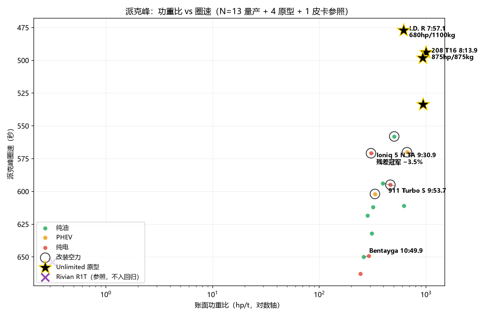
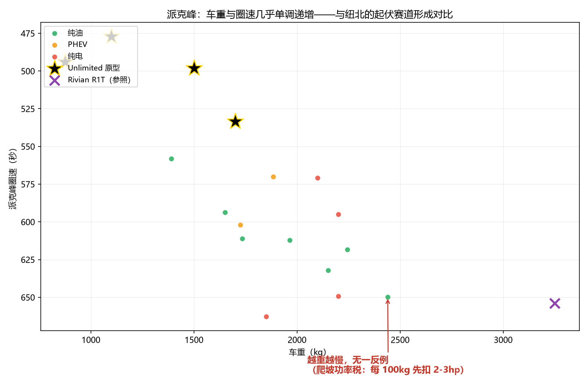
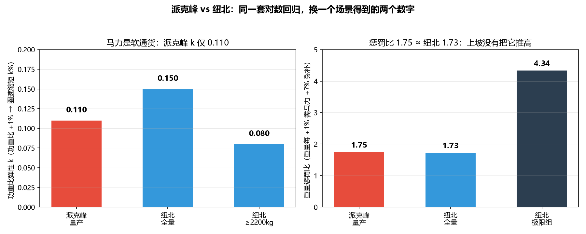

# 4300 米上，马力是软通货——派克峰的爬坡功率税

> 数据源：PPIHC 官方成绩（2011 全线铺装后至 2026）+ Wikipedia 历史记录；分析时间 2026 年 7-8 月。
> 本文是《参数与激情：从技术祛魅到需求自知》系列的派克峰篇。前一篇是赛道篇（纽北回归与 U9X 功率反推），下一篇是收官篇（不存在一种架构统治所有场景）。
> 方法与前两篇同一套：多元对数回归 + 残差 + 分组弹性。数据边界见文末。

---

## 一、1000 hp/t 为什么输给 618 hp/t

派克峰国际爬山赛（PPIHC）一百多年的历史里，出现过一组最反直觉的账目：

| 车 | 动力 | 马力 | 重量 | 功重比 | 圈速 |
|---|---|---|---|---|---|
| Peugeot 208 T16（2013，Loeb） | 3.2T V6 双涡轮 | 875hp | 875kg | **1000 hp/t** | 8:13.9 |
| VW I.D. R（2018，Dumas） | 双电机纯电 | 680hp | 1100kg | 618 hp/t | **7:57.1** |

208 T16 的账面功重比是 I.D. R 的 **1.62 倍**，圈速却慢了 16.7 秒。用纽北的直觉读这组数字完全读不通——在纽北，功重比 1.62 倍的差距足以拉开一整分钟。

答案在终点线的海拔上：派克峰终点 **4302 米**，空气密度只有海平面的 **60%**。自然吸气发动机在这里掉 35-40% 功率，涡轮靠压缩进气补偿，但补偿有上限（涡轮转速、进气温度限制），4300 米处通常仍有 10-20% 损失。208 T16 的 875hp 是账面值，山顶实际输出要打折；I.D. R 的 680hp 则是从山脚到山顶**全程满额**——电动机不在乎空气密度。

这一篇要回答的问题：把同一套对数回归搬上这座山，马力、重量、空力各自还能兑换出多少圈速？以及一个更尖锐的问题——**"全程上坡会让重量惩罚翻倍"的直觉，在数据里站不站得住。**

## 二、同一个对数回归，换一个场景

派克峰与纽北的物理差异只有三条，但每一条都动摇了回归的根基：

1. **全程上坡（平均 7.2%）。** 19.99km 赛道从 Mile 7（2862m）爬到山顶（4302m），重力分量持续做功——每一公斤车重，每一秒都在向爬坡缴税。纽北的起伏赛道上下坡互相抵消，重量只在弯道里产生二阶惩罚；派克峰没有下坡可以"回本"。
2. **高海拔衰减。** 账面马力在这里不是可用马力：NA 掉 35-40%，涡轮掉 10-20%，纯电免疫。本分析**不修正马力**——海拔衰减是动力架构的固有特性，交给残差去解释。
3. **民用山路 + 156 弯 + 无缓冲区。** 冻融循环让路面比专业赛道颠簸得多，弯中机械抓地力要求更高；失误即撞山，容错率为零。

数据：13 辆量产基础车（1390-2440kg，450-1250hp）+ 4 辆 Unlimited 原型 + 1 辆皮卡参照（Rivian R1T，不参与回归）。与纽北同方法：

$$\ln(\text{圈速}) = \alpha + \beta_1 \ln(\text{马力}) + \beta_2 \ln(\text{重量}) + \gamma_1\text{EV} + \gamma_2\text{PHEV} + \gamma_3\text{SUV} + \gamma_4\text{Sedan} + \gamma_5\text{AeroMod}$$

## 三、全量回归：重量惩罚比没有放大，马力却失效了

**N=13，R²=0.85**（调整后 0.64）：

| 变量 | 系数 | p 值 | 物理含义 |
|---|---|---|---|
| ln(马力) | **-0.036** | 0.46 | 马力 +10% → 圈速缩短 0.36%（**不显著**） |
| ln(重量) | +0.062 | 0.18 | 重量 +10% → 圈速增加 0.62%（不显著） |
| 纯电 | +0.035 | 0.24 | 纯电比预测慢 3.6%（不显著） |
| PHEV | +0.054 | 0.18 | 不显著 |
| SUV | +0.008 | 0.82 | SUV 惩罚几乎为零 |
| 四门 | +0.009 | 0.81 | 四门惩罚几乎为零 |
| **改装空力** | **-0.093** | **0.018** | **改装空力快 8.9%（全模型唯一显著）** |

三个发现，其中一个是否定性的——它推翻的是我们自己的直觉：

**1. 重量惩罚比 1.75，和纽北的 1.73 几乎相同——"上坡放大惩罚"的直觉被数据否定了。**

进山之前的预期是：全程上坡让每公斤重量的代价翻倍，惩罚比应该明显高于纽北。数据给出的点估计是 1.75（+0.062 ÷ -0.036）vs 纽北 43 车的 1.73（+0.114 ÷ -0.066）——**几乎相同**。为什么？

先看物理：爬坡税 $P = m \cdot g \cdot \sin\theta \cdot v$ 是重量的**一阶函数**，每多 100kg 先扣 2-3hp。纽北的重量惩罚是二阶的（弯道离心力），派克峰明明多了一笔一阶税，惩罚比却一样——矛盾只在表面。机制在第四节展开：爬坡税是**常数项减法**，近似不改变功重比排序；而且对数回归里的 ln(重量) 项**已经隐式吸收了爬坡惩罚**（重车跑得慢 → 均速低 → 爬坡扣除跟着变小，形成负反馈）。爬到山顶的净效果是：账面上派克峰比纽北多收的那笔税，被"重车自动降速"打折抵消了。

还有一个统计学的诚实补充：1.75 是**两个都不显著**的系数的比值（p=0.46 和 p=0.18），置信区间极宽。纽北的 1.73 虽是双显著（p=0.005 / <0.001），但它对样本同样敏感——43 车相对 42 车的系数变化都来自 SU7 Ultra 原型这一辆新加入的样本（拿掉它，42 车口径精确回到 β_hp=-0.042 / β_kg=+0.042、惩罚比 1.0，马力弹性仅边际显著 p=0.081）；同数据集里仰望 U9 的影响力更大（账面马力从未兑现，Cook 距离约为 SU7 原型的 4 倍）。两个数字数值相同，成色确实不同，但 1.73 也不是可以当常数引用的精确值。

**2. 真正的差异在马力：弹性从 -0.066 腰斩到 -0.036，且完全不显著。**

纽北的 β_hp=-0.066（p=0.005）是一条干净的定律；派克峰的 β_hp=-0.036（p=0.46）统计上**与零无异**。功重比弹性 k 只有 0.110，低于纽北的 0.15——**同样的 +1% 功重比，在派克峰只能换到纽北七成的圈速收益**。

机制有两层。账面层：4300 米让账面马力先打折（NA 掉 35-40%，涡轮掉 10-20%），回归用的是未修正的账面值，噪声直接进弹性估计。物理层：爬坡税先扣走一笔常数项功率（每吨 25-30hp），剩余马力还要和 7.2% 的重力抢速度。**马力在这里是"软通货"**——发得出来是一回事，兑换成圈速是另一回事。

**3. 车重与圈速几乎单调递增，无一反例——派克峰独有的干净规律。**

在纽北，车重与圈速的散点被空力、底盘、调校搅成一团（轻车区尤其混乱）。在派克峰，13 辆量产车**越重越慢，没有一个反例**——爬坡功率税是重量的直接一阶函数，没有起伏赛道"下坡回本"的抵消，重量惩罚第一次以这么干净的面目出现。这是"爬坡税真实存在"的最直接证据，尽管它没有把回归弹性推高（原因同上：负反馈）。

## 四、爬坡功率税：一笔常数项的税

把爬坡消耗从账面马力里扣掉，剩下的才是加速和过弯的可用功率。这就是派克峰独有的**净功重比**：

$$\text{净功重比} = \frac{\text{账面马力} - P_{\text{爬坡}}}{\text{车重}},\quad P_{\text{爬坡}} = m \cdot g \cdot \sin\theta \cdot v$$

以均速 110-120km/h 计，**每吨车重约扣 25-30hp**。关键的性质：这笔税是**常数项减法，不是比例**。两辆均速相近的车，扣税比例几乎相同——它几乎不改变功重比排序，只压缩差距。

Bentayga W12（2440kg，账面功重比 0.260 hp/t）与 Model 3 Performance（1850kg，0.243）的对照把这笔税算得很清楚：爬坡税分别扣 71hp 与 53hp，但摊到每公斤几乎相同（0.029 vs 0.029 hp/kg），净功重比排序不变（0.231 vs 0.215），实际圈速也仍是 Bentayga 更快（10:49.9 vs 11:02.8）。净功重比放进回归也不提升 R²（0.446 vs 账面 0.452）——实证支持"常数项"判断。

**这笔税的真实杀伤力在绝对功率口径，不在弹性口径。** 爬山之前，每辆车先被无条件扣掉一大笔马力：800hp 的车上山先变成 720hp，400hp 的车先变成 350hp。账面功重比的排序没变，但**账面功重比的绝对购买力变了**——这正好解释了第三节的马力弹性腰斩：回归里的马力是账面马力，而圈速是被扣税后的马力跑出来的，两者之间隔着一层与重量挂钩的常数项损耗。派克峰上重量惩罚通过**双重路径**生效：直接的爬坡功率税（物理层）+ 弯道惯性（赛道层），ln(重量) 项合并了这两条路径——所以惩罚比没有比纽北更高，但重量的账单无处可逃。

## 五、空力稀薄化：下压力打六折，改装空力却仍然是最有效杠杆

4300 米处空气密度只有海平面的 60%：海平面 100kg 的下压力，到山顶只剩约 60kg。按理说空力杠杆应该同步失效——数据却说相反：**AeroMod 是派克峰全模型最显著的变量（-8.9%，p=0.018）**，改装空力（TA1/Exhibition 组的大尾翼+扩散器）比原厂空力快近 9%。这是全模型唯一显著的结果，比马力、重量、动力架构都硬。

为什么打折后的空力仍然有效？下压力和阻力**等比例**随密度下降——阻力的拖累也同步消失了，下压力的净收益变化比直觉小。更重要的机制在弯中：下压力的边际收益（额外的轮胎抓地力）不是线性的，在民用山路的颠簸路面上，即使打折后的下压力，也可能是轮胎接地性的关键保障——156 个低速弯里，弯速每快一点都直接进总账。

两条告诫。其一，改装空力组的组内 R² 只有 0.293——这 5 辆车（GT2 RS Clubsport、ZR1X、NSX 等）的空力水平差异比马力重量差异还大，AeroMod 一个布尔值掩盖了从"小尾翼"到"全底盘扩散器"的天差地别。其二，轻量组（<1800kg）的功重比弹性 k=0.008（几乎无效）**不是物理规律，是空力混淆**：那 4 辆车恰好是改装水平差异最大的 4 辆，圈速由空力决定而非功重比。若把它当物理规律引用，会得出"派克峰轻车功重比无用"的荒唐结论。

## 六、规则体系：为什么派克峰不适合做架构效率的精确对比

把前两篇的量尺拿到派克峰，数据干净度先打折：

| | 纽北 | 派克峰 |
|---|---|---|
| 量产规范 | "官方认证量产圈速"，整车须与市售一致 | 无统一量产认证体系 |
| 空力改装 | 基本不允许（Manthey 套件已是灰色极限） | Time Attack 1 允许大尾翼+扩散器，Exhibition 更松 |
| GT2 RS Clubsport | 不算量产，是赛车 | 算 Time Attack 1，"production based" |
| 组别边界 | 超跑/四门/SUV，空力天然按车体分层 | Unlimited / TA1 / PPO / Exhibition，边界模糊 |
| 对回归的影响 | 空力差异被车体类型隐式吸收 | 空力与车体**解耦**，被迫引入 AeroMod，但一个布尔值不够 |

纽北的"量产"定义等价于原厂组标准（只能换胎、换刹车皮、加防滚架），空力差异天然按车体分层，回归不需要单独的空力变量。派克峰的 TA1 允许量产车加装赛事级空力套件，把"空力"和"车体"解耦了：一辆 Civic Type R 装了尾翼能跑出超跑级弯速，一辆 ZR1X 号称"几乎原厂"却带着 1250hp 混动 + ZTK 空力套件——两者在回归里被同一个 AeroMod dummy 覆盖，实际空力水平天差地别。

**这意味着派克峰天然不适合做"量产车架构效率"的精确对比**——严格限定原厂组只剩 N=8，样本太少。派克峰更适合做**上限探索**（Unlimited 原型能跑多快），而不是架构效率（纯电 vs 纯油在公平规则下谁更高效）。这本身就是一个有价值的结论：**不同赛事的规则体系决定了你能从数据里回答什么问题。**

再往上一层，这是两条赛事文化的分界线：

| | 欧洲/国际体系 | 美国体系 |
|---|---|---|
| 赛道 | 纽北：量产认证严谨，规则精细，43 辆干净数据 | 派克峰：组别松散，奔放改装，13 辆中仅 8 辆真原厂 |
| 越野 | 达喀尔：万公里综合耐力 | 巴哈 1000：极端沙漠冲刺，要么赢要么碎 |
| 技术哲学 | 工程师思维：先定义"量产"，再在框内公平竞争 | 牛仔思维：先放开规则，谁能上山谁赢，规则是后补的 |
| 典型代表 | 919 Evo、卫士 OCTA | I.D. R（纯电一击脱离）、SuperTruck（1600hp 野蛮暴力） |

我们试图用纽北那套"严格分类 + 对数回归"去量化美国式极端赛事，本质上是在给一个不鼓励公平对比的赛场做公平对比。所以同一年你看到 I.D. R（7:57）和 Bentley Bentayga（10:49）同场竞技——这在纽北不可想象。**但反向价值也在这里**：派克峰的数据包含纽北永远看不到的组合——纯电 SUV 和燃油超跑在 4300 米同场、改装空力对民用山路圈速的实际贡献、皮卡在山路上比 SUV 慢多少。这些不是噪声，是上限探索的价值。两种文化各回答了不同的问题。

## 七、尾声：残差冠军的最优组合

残差榜的冠军是 **Hyundai Ioniq 5 N TA（-3.5%）**：WRC 车手 Dani Sordo 驾驶的这台改装 Ioniq 5 N 找到了派克峰的最优组合——**改装空力 + 纯电免疫 + AWD**。电动驱动免疫高海拔衰减，改装空力补上 SUV 的先天空力劣势，AWD 在 156 个弯里提供牵引力冗余。第二名 Porsche 911 Turbo S（-2.9%）是传统配方的能力证明：650hp 涡轮 + 1650kg + AWD，无需改装空力也能高效转换资源。

纯电与纯油在派克峰**打平**（残差 0.0% vs 0.0%），但原因和纽北完全不同——纽北是"控制重量后电驱不差"，派克峰是**两股力量的精确对冲**：纯电的高海拔免疫（优势）恰好被它更大的车重撞上被放大的重量账单（劣势）。把三个场景的纯电结局摆在一起：

| 维度 | 派克峰 | 纽北 | 越野（环塔/高原） |
|---|---|---|---|
| 核心约束 | 爬坡重力 + 高海拔衰减 | 重量 + 空力 | 保电持续 + 散热 |
| 重量惩罚比 | 1.75（不显著估计） | 1.73（显著） | N/A（非圈速场景） |
| 功重比弹性 k | 0.110 | 0.15 | N/A |
| 马力显著性 | 不显著（p=0.46） | 显著（p=0.005） | N/A |
| 纯电结局 | 打平（免疫≈重量税） | 打平（重量税为唯一原因） | 短冲优胜 / 长耐力溃败 |
| 最有效杠杆 | 改装空力（-8.9%） | 减重（惩罚比 1.73） | 散热防护 + 机械直驱 |

**派克峰是独立物理场景**——不是"加了高原的纽北"，也不是"缩短了的越野"。它给这个系列的收官命题补上了最后一块拼图：纯电在三个场景三种结局，每一个的机制都不同；架构没有绝对优劣，只有场景匹配。这留给下一篇（收官篇）去收束。

最后给一个负责任的注脚：Bentayga W12 在原厂组残差垫底（+2.7%），但它是 2018 年宾利官方刷纪录的营销行为（量产规格 + 职业车手 Rhys Millen），本就不以圈速效率为目标——把它当"最糟糕的性能车组合"批判不公平，它的价值仅在于给 SUV 组提供一个豪华重车的数据锚点。

## 边界声明

1. N=13 样本小，所有系数不确定性大：马力弹性不显著（p=0.46）可能只是样本不足，不是物理上的真实无效；重量惩罚比 1.75 为两个不显著系数的比值，仅作点估计，与纽北 1.73（43 车显著估计）的"几乎相同"同样是精度有限下的结论；
2. 全部纯油样本均为涡轮机，**无 NA 样本**——"NA 掉 35-40% vs 涡轮部分补偿"的定量对比需要真正的 NA 跑车（如 911 GT3）的派克峰成绩，目前缺位；
3. 回归使用账面马力、不修正海拔衰减——衰减被留给残差解释，这也是马力弹性被低估的原因之一；
4. 轻量组 k=0.008 是空力混淆，非物理规律，引用时不得脱离此标注；
5. 悬架数据缺失（无悬架类型/路面耦合量化指标），民用山路对悬架的要求目前只能靠残差间接推断；
6. 数据截止 2026 年 PPIHC 官方成绩。

---

*系列导航（《参数与激情：从技术祛魅到需求自知》）：前篇《2977 马力的真相：纽北圈速回归与 U9X 实测功率反推》（赛道篇）；再前《3400 公里之后，谁还在？——从 2026 环塔看越野车的架构、重量与动力边界》（越野篇）；后篇《不存在一种架构统治所有场景》（收官篇）。*
