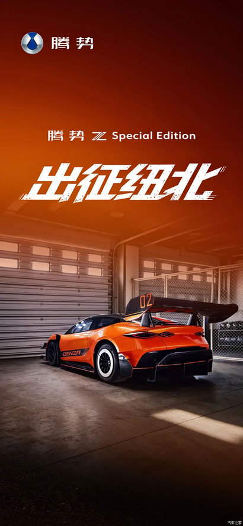
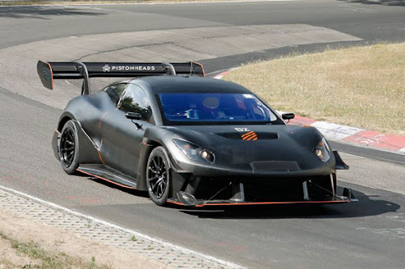
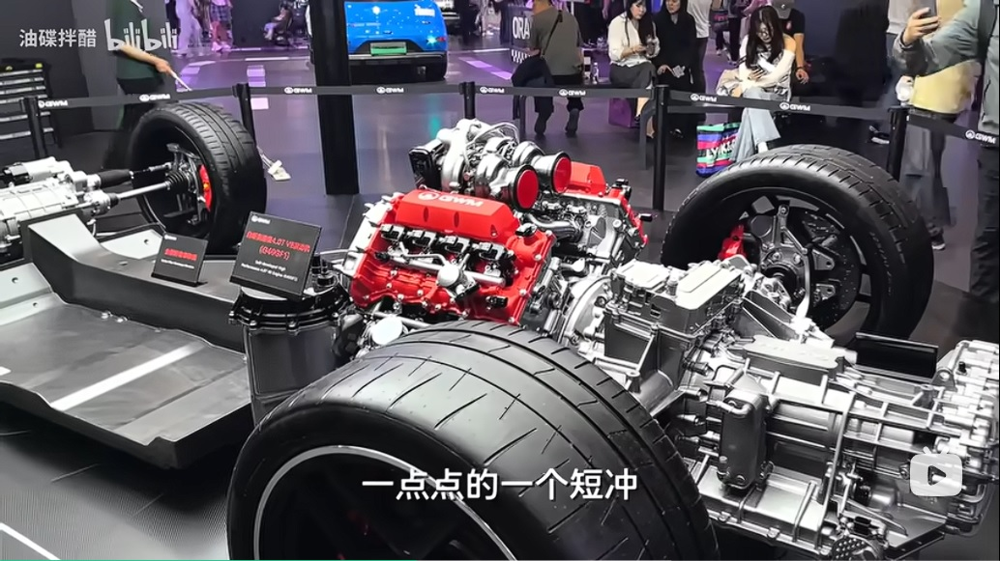
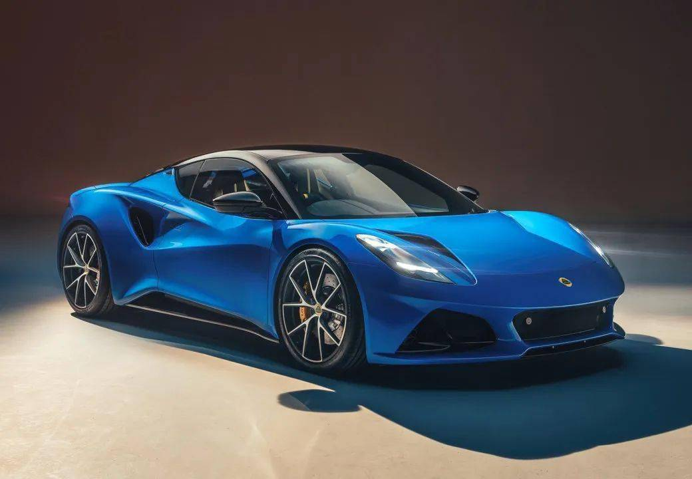

# 布局与重量：腾势Z你嘛时候纽北量产车第一啊

> 数据源：纽北 44 车对数回归（track 体系，β_hp=-0.067 / β_kg=+0.116）+ 腾势 Z 公开参数（工信部整备、官方发布会口径）；预测为账面推演，待特别版实测成绩对标。

## 引子

（[新闻链接](https://www.autohome.com.cn/news/202607/1315654.html)）

纽北量产车第一？这是比亚迪的说法，我看行。两门硬顶GT、1945匹、易三方、后轮转向、云辇-M、二代刀片，这一连串的参数和名词，想想就兴奋。但这……够班吗？

## 一、腾势 Z

六个维度先记一笔：

| 架构维度 | 腾势 Z 的选择 | 赛道上的得失 |
|---|---|---|
| 车体形态 | 两门 GT（非四门、非硬核超跑） | 两门基准（无四门税），GT 定位堆配置 |
| 质量分布 | 底盘电池分布式 ≈50:50 | 重心加分，重量扣分 |
| 前后功率配比 | 前 1 后 2（前小后大） | 对——后轴拿主要动力，前轴转向 |
| 电池化学 | 76kWh 第二代刀片（7.68 kg/kWh） | 密度追近 NCM，584kg |
| 先进底盘 | 云辇-M 半主动 + 后轮转向 | 前者轻，后者是死重 |
| 整备质量 | 2290kg（工信部） | 非电池 1706kg ≈ SU7 Ultra 四门 1722kg |

白车身 258kg 全场最轻，整车却 2290kg——比四门 SU7 Ultra 只轻 70kg，其中 54kg 还是电池容量差白捡的，车身本身只省了 16kg。后轮转向、敞篷骨架、四座、云辇-M、Nappa，把两门该省的重量全吃回去了。

预测之前，先把方法讲清（这套工具详见 [篇2](https://bbs.nga.cn/read.php?pid=879470945&opt=128)），正好在这里用一遍：

1. **对数回归**：圈速与马力、重量是乘除不是加减。从 7:59 到 7:58，和从 6:01 到 6:00，物理难度天差地别；对数把"越接近极限越难"变成常数弹性，6 分和 8 分的车才能放一张表里比。
2. **残差**：回归线是账面参数的平均水平，残差是这台车比预期快/慢多少。U9 的 +5.3% 残差比它的 3019hp 账面值有信息量得多——它指向"马力虚高"，最终被视频反推证实（兑现率 73-79%）。先算"该跑多快"，再看"实际跑多快"，差值才是故事。
3. **敏感性**：惩罚比 1.72，移除 U9 变 1.11、移除 Rimac 变 1.57、同删两辆变 0.79——一个"定律常数"实际是样本的函数。引用任何回归数字前，先问它对谁敏感。

44 车对数回归（β_hp=-0.067、β_kg=+0.116，两门基准），量产版 1605hp/2290kg：

> ln(圈速) = 5.602 − 0.067·ln(1605) + 0.116·ln(2290) ≈ 6.003 → e^6.003 ≈ 404.6 秒 ≈ 6:45

再叠加两门纯电超跑的历史残差（U9、Rimac 均 +5.3%，源头是放电天花板 + 死重 + 调校）。腾势 Z 三电机少一个死重、马力/电池比 21-25 hp/kWh 优于 U9 的 37.7，残差取 +3~5%。

官方对特别版的说法是"赛用级双层复合结构"——前舱盖、侧裙、扩散器、尾翼等覆盖件换碳纤维，再配主动减阻系统（主动式扩散器 + 后扰流板翼片，官方口径）。覆盖件换碳纤维减的是簧上重量，减重是真的，也就到此为止。

所以特别版的重量账还是那句：碳纤维覆盖件换一圈，能减个 80-100kg，但纽北实测那套固定大尾翼、扩散器又加回来几十公斤——大尾翼不是白送的，净减重没那么好看。所以分两个口径。小米 SU7 Ultra 那个 6:46.874，挂着"四门量产车最速"的名，其实是拆了后排座椅的准量产车（pre-production）刷的。腾势 Z 特别版照这个打法拆两份：**量产车**（保留座椅、内饰、空调，只做碳纤维覆盖件 + 空力件，约 2200kg）和**准量产车**（拆后排座椅内饰，约 2100kg）：

| 版本 | 账面 | 重量 | 回归基准 | 残差修正 | 预测 |
|---|---|---|---|---|---|
| 量产硬顶 | 1605hp | 2290kg | 6:45 | +4~5% | **7:01 – 7:07** |
| 特别版（量产车） | 1945hp | ~2200kg | 6:37 | +3~5% | **6:49 – 6:57** |
| 特别版（准量产车） | 1945hp | ~2100kg | 6:35 | +3~5% | **6:47 – 6:55** |

量产车口径下，这个区间压 U9（6:59.2）、SU7 Ultra 量产（7:04.9）、Rimac（7:05.3）都压得住——纯电量产第一，定语之下我看是可以的。

但是，量产车第一，没那么好当。前面还排着 AMG ONE 6:35.2、GT2 RS Manthey 6:43.3、GT3 RS 6:49.3、GT3 6:55。这几台都是燃油/混动，都是两门，重量 1.4-1.7 吨。腾势 Z 特别版减重减到 2100-2200kg，还是比人家重了半吨。1945 匹填不平这半吨，回归模型算得清清楚楚。

更有意思的是两门对四门：SU7 Ultra 四门、轴距 3000mm、电池 93.7kWh，腾势 Z 两门、轴距 2780mm、电池 76kWh。按常理两门同动力该轻 150-250kg，结果只轻 70kg，其中 54kg 还是电池容量差白捡的。两门车，凭什么比四门车还重？——哦，它要后轮转向、要敞篷骨架、要四座 Nappa，每一项都在往秤上加砝码。想要纽北第一，这个秤数还没够班。

◆ 结论：

- 特别版量产车（~2200kg）预测 **6:49–6:57**，准量产车（~2100kg）**6:47–6:55**，量产硬顶（2290kg）**7:01–7:07**；
- 纯电量产第一，理论上够得着（压 U9、SU7 Ultra 量产、Rimac）；
- 量产车绝对第一，够不着（AMG ONE、GT2 RS、GT3 RS 在前面，都是两门、1.4-1.7 吨）；
- 根子不在马力（1945 匹够了），在重量——两门车只比四门轻 70kg，车身自己只省 16kg；
- 变数：空力套件超预期、功率兑现率比 U9 好（U9 的老底是 73-79%）、轮胎半热熔大跃进——这三样任意一样超预期，预测往上修；反过来掉到 U9 水平，往下修。

## 二、前双电机 + 后混动：更强的赛道机器？

腾势 Z 可能仍然栽在重量上，但布局光谱还有另一支。超跑圈速差异的 44% 由"发动机放哪"决定（篇2 回归），而这一支把同一个四驱目标做成了相反结局：**中置发动机 + 前轴电驱 + 后轴机械混动**。这条线不是新探索——保时捷 918 Spyder 2013 年就把三件事一次做对，欧洲超跑一路量产到今天：

| 车型 | 年份 | 前轴 | 后轴 |
|---|---|---|---|
| 保时捷 918 Spyder | 2013 | 双电机（轮级矢量） | 中置 V8 + 后电机（PDK 内） |
| 法拉利 SF90 | 2019 | 双电机（独立） | 中置 V8 + 后电机 |
| AMG ONE | 2022 | 双电机 | 中置 V6（F1 衍生）+ MGU-K |
| 兰博基尼 Revuelto | 2023 | 双电机 | 中置 V12 + 后电机 |
| 兰博基尼 Temerario | 2024 | 双电机 | 中置 V8 + P2 |
| 长城 V8 超跑（目标 1.8-1.9t） | — | 前轴单 P4（镁合金） | 中置 V8 + 9 速 + P2 |
| 吉利（莲花）超跑 | 待定 | ？ | ？ |

918 起就对的三件事：**前轴纯电驱**（前轮与后轮无传动轴，双电机轮级矢量，靠 ePTM 软件调配前后）、**前小后大配比**（前轴辅助、后轴大头）、**中置重心偏后**（出弯牵引的甜点）。结果是重量守住了：AMG ONE 1695kg、残差 -4.2%（全榜第二高效），SF90、918 都是 1.6 吨级。

多说一句中置 + 变速箱后置的布局。发动机在后轴前，变速箱（含差速器）甩到后轴之后，中间一根传动轴连起来——这是长城 V8、SF90 都在用的 transaxle 结构。好处就一条：最重的两个部件（发动机、变速箱）分居后轴两侧，重量全压在驱动轮附近，出弯时后轴抓地足、前轴彻底解放只负责转向。腾势 Z 的底盘电池 50:50 看着均衡，但电池平铺在座舱底下，重量压在前轴和后轴之间，出弯重心后移时，前轴那 50% 抓地力用不上——这是布局的差别，不是账面数字的差别。

两条路并排：

| 路线 | 质量分布 | 四驱实现 | 重量 | 圈速结局 |
|---|---|---|---|---|
| 中置混动四驱 | 中置偏后（≈45:55） | 前电 + 后机解耦 | 1.6-1.8t | 高效（AMG ONE -4.2%） |
| 底盘电池纯电四驱 | ≈50:50 | 前 1 后 2 / 四电机 | 2.2-2.5t | 低效（U9 +5.3%） |

那么，"前双电机 + 后混动"是不是更强的赛道机器？数据说是——AMG ONE 高效榜第二，SF90、918 全在 6:3x-6:5x。但要分清：强的是"中置偏后 + 前小后大"这套布局，不是"混动"本身。AMG ONE 是 F1 动力单元下放，SF90 是法拉利几十年中置四驱的调校，都离民用可复制很远。

（出处：B站作者"油碟拌醋"·[原版太拉只能再开一版](https://www.bilibili.com/video/BV1qF9CBDE2h)）

长城 V8 超跑是这条谱系第一个国产跟随者，目标车重 1.8-1.9 吨（项目负责人口径）、前轴单 P4 + 中置 V8 + 后 9 速 + P2（技术总监口径），理论上限对齐 SF90。这台车的技术总监是前迈凯伦 GT 首席工程师，他的原话是"纯电技术目前不足以支撑这类产品的性能"——这话正好接上腾势 Z 那一章。但 V8 单机 560hp + 系统集成 + 调校能否兑现，待量产验证——账面同构不等于圈速同构，这正是残差那件工具要盯的地方。

顺带看后置后驱的 911。严格后置（发动机在后轴之后），历代却一直在把发动机往前挪：早期约 38:62 的极端后置，甩尾出名；前移后约 39:61，稳了不少，还腾出车尾装扩散器（气动收益）。但它从未变成中置——因为"偏后"正是出弯牵引的甜点（后轴沉 + 后轮驱动 = 出弯抓地好）。保时捷自己在 918 上用了中置，证明他们知道中置才是圈速最优；911 坚持后置是产品定位（2+2 座、日常实用、经典传承），不是物理最优。所以"发动机放哪"从来不是一道有标准答案的题：918 图圈速，911 图传承，腾势 Z 图重心——各有所图，各付各的价。

所以答案不是"混动四驱更好"，是"重量守得住的四驱更好"：中置混动靠机械放对位置守住重量，底盘电池靠电池堆马力背上重量。布局和配比选对，6:3x；布局换一种再加豪华 GT 定位，7:0x。

长城超跑怎么样我不知道，但莲花 + 吉利就不好说了。

也许到时候，"只会技术不会营销"的厂家才能意识到车辆是系统工程，无论是40万以上的豪华车型还是赛道性能车，不是车尾贴个4.9s，发明一堆名词，然后指望着 1945 匹马力的风就行的。

## 三、下集预告

研究内核线回答的是"参数是什么"：账面马力不等于可用马力（赛道篇），满态功率不等于弱态功率（越野篇），马力是软通货（派克峰篇），布局和重量决定圈速（本篇）。

但系列的名字还有后半句——"需求自知"。接下来的应用延伸线回答"你需要什么"：

- **篇5 完美电驱**：如果我来造一台终极越野车？把"上限与下限的兑换"反着用——从纯增程到功率分流的电四驱纸上推演（已定稿）。越野侧整车架构（非承载/承载式、通过角、轮胎贴地）也在这里展开。
- **篇6 家用选车**：买车之前，先问自己五个问题——不推荐具体车型，只把"买什么架构"翻译成五个问题（使用半径 / 时间与钱 / 信息环境 / 情绪预算 / 总账）。

技术祛魅不是为了否定参数，而是为了把"参数焦虑"变成"需求自知"：**知道自己面对的是哪种场景，就知道自己该买哪种架构。**

## 边界声明

1. 本文数字出自纽北 44 车回归（track 体系）与腾势 Z 公开参数（工信部整备、官方发布会口径）；预测为账面推演，非实测；
2. 腾势 Z 特别版整备质量与电池容量未公布，按"量产车 ~2200kg / 准量产车 ~2100kg"两口径估算；预测待特别版实测成绩对标后收紧；
3. 圈速对标严格按量产车口径，原型车成绩（SU7 Ultra 原型 6:46.9、升级原型 6:22.1）不进入对标表；
4. 越野侧整车架构（非承载/承载式、通过性几何、轮胎贴地货币）不在本文范围，详见越野篇与篇5。

---

*系列导航（《参数与激情：从技术祛魅到需求自知》）：研究内核线前三篇——《3400 公里之后，谁还在？》（越野篇）、《2977 马力的真相》（赛道篇）、《爬坡的两副面孔：沙地陡坡与派克峰》（派克峰篇）；应用延伸线——《如果我来造一台终极越野车》（完美电驱篇）、《买车之前，先问自己五个问题》（家用篇）。*
