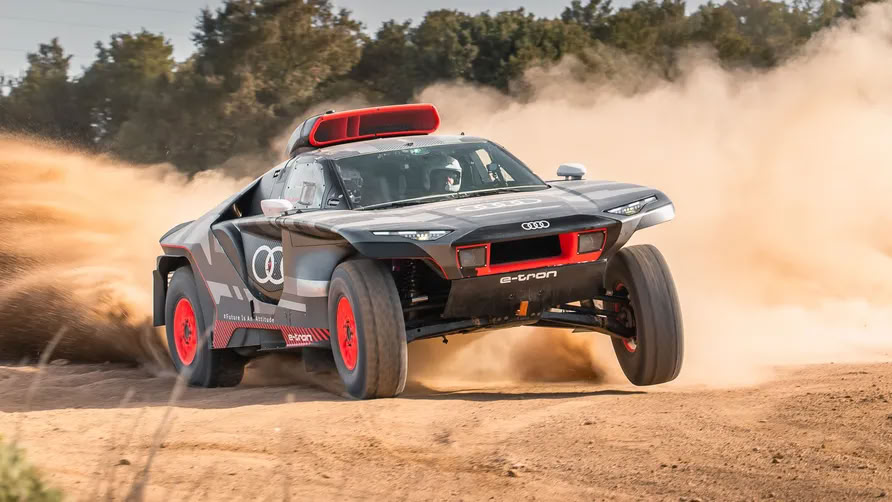
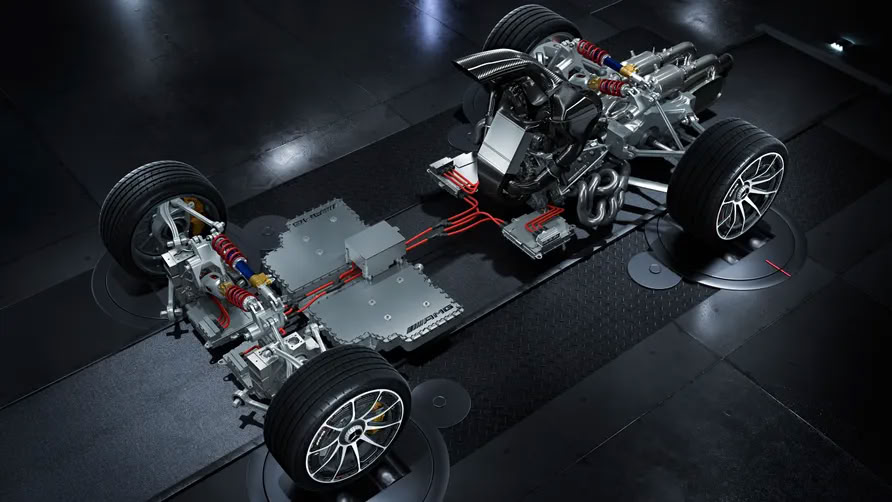
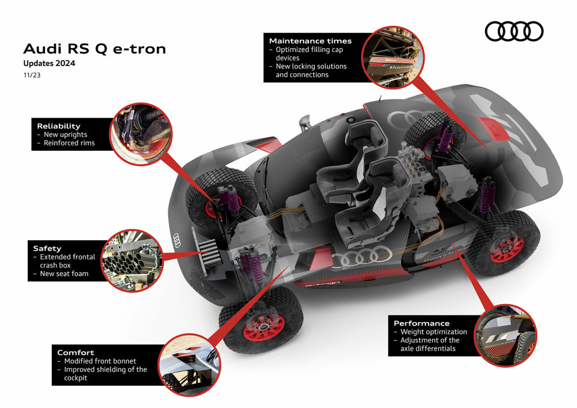
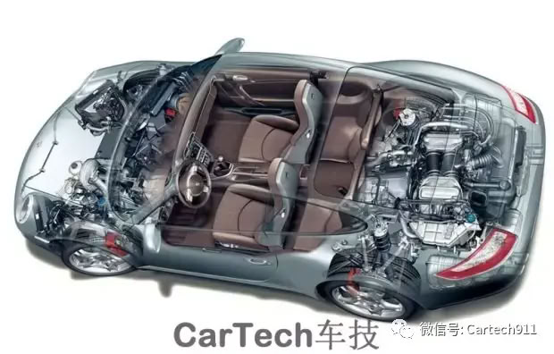
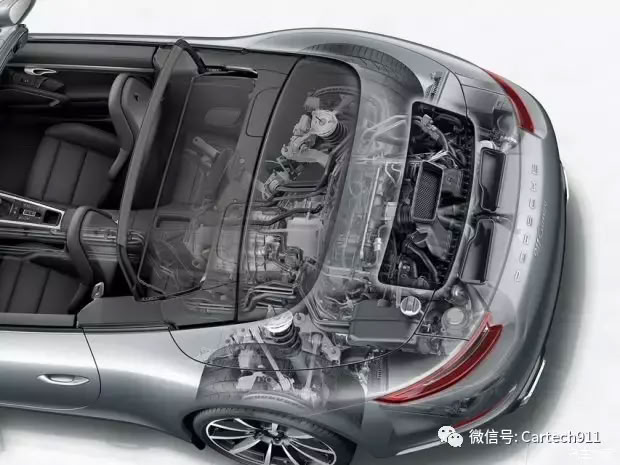
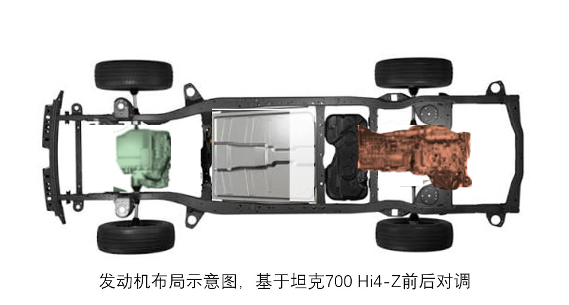

# 如果我来造一台终极越野车——从纯增程到功率分流的电四驱纸上推演（v5 重构草稿）

> **声明先行：本文是纸上推演，不是实测，也不是量产预告。** 全部数字基于环塔实战数据、量产车拆装清单和达喀尔冠军车的工程验证，逐项标注口径。
> 本文是《参数与激情：从技术祛魅到需求自知》系列的应用延伸篇第一篇（完美电驱篇）。本版结构：需求 → 两版方案被否 → 灵机一动 → 正文（立题 → 动力架构 → 物理架构 → 悬架 → 四驱 → 重量 → 纸面数据）。

---

先从我自己的用车说起。城市为主，偶尔长途——坦克 500 Hi4-T 这样的 P2 车，本来处处合适：长途不怕没电，说走就走；城市里的油耗，也不是出不起。但 P2 的电机夹在变速箱里，功率做不大，开起来和大电机电四驱的车一比，总差一口气——爽，是要花架构钱的。谁不想既要、又要、还要呢？

**需求翻译成工程语言就是一句话：保下限，提上限。** 下限是亏电后的持续能力（长途无焦虑），上限是满电的爆发力（电驱的爽）。现有架构保下限的（P2）提不了上限，提上限的（电四驱）保不住下限——所以我推了两版方案，都没走通。但怎么没走通的，值得照实写。

**第一版：纯增程 + 赛车级电机。** 思路是先把下限焊死：砍掉全部机械路径，把省下的 160kg 全押在发电机上，190kW 持续发电——环塔 SS9 已经证明，持续发电功率就是电驱越野的速度天花板（同一赛段 700 HEV 58.9、电驱 42-49 km/h）。上限则靠大电机：对标奥迪 MGU05（35kg 含逆变器、250kW 峰值、200kW 持续、跑完 14 天达喀尔），三台电机合计 102kg，比民用电机密度省 133kg；30kWh 电池把"电池是发电功率的补丁"用到极致。推出来的数字一度很漂亮：标准版 2635kg 双杀坦克 400，激进版满电功重比 163 全场最高，拓扑和达喀尔冠军奥迪 RS Q e-tron 一模一样：

**然后它死了**——死于零件墙：MGU05 是 Formula E 的货，190kW 持续发电机无量产民用产品，百万级 OCTA 档都买不起。**漂亮和可行是两件事，这一版死在"漂亮"。**

**第二版：发动机中置 + 行星齿轮动力分流。** 第一版死后我意识到纯发电路线离不开赛车零件，那就把直驱找回来、把发动机挪个位置：奥迪 RS Q e-tron 增程架构零传动约束，发动机放哪都行，工程师仍选前中置——传动路径完全自由时，位置选择只剩重量平衡一个理由；丰田 T1+ 中置后驱、BRX 前中置四驱，"发动机贴重心"是高速拉力越野车的共性（官方口径）。于是发动机挪到驾驶舱后、行星齿轮分流箱后置直驱后轮——这个布局更接近 AMG One 的发动机中置，直驱保下限、分流发电供前桥、重心居中，理论闭环：

两张剖面图里就是死因本身：**中置吃掉乘员舱，量产承载式做不出来**——T1+ 敢中置，是因为钢管车架随便摆、没有后排需求；AMG One 敢中置，是因为它后排根本不坐人。**中置布局的民用化，第一步就塌。**

前置占满、中置吃座舱——还剩哪个位置？只剩一个，而且它被一辆量产车验证了半个世纪：

**后置。** 风冷 993 是原始形态——发动机悬在车尾、变速箱贴着后轴；水冷 991 是量产证明——年产几万台，尾部冷却跑了十几年。保时捷用 40:60 的配重证明了后置布局可行（那是跑车贴地工况，越野车的配重修正见 §三）。灵机一动，答案在车尾。

## 一、立题：无限接近 T1+/T1E 的 T2

先钉边界。环塔 13 个赛段是现成的证据：短冲刺电驱夺冠、纯沙漠 HEV 反超、戈壁耐力 P2 碾压、魔鬼赛段散热先出局——同一场比赛四个冠军，各赢各的赛段。所以"越野车最需要什么"必须先问"在什么规则下、跑什么场景"：

- **T1+/T1E（达喀尔原型组）**：钢管车架、37 英寸胎、350mm 行程、中置发动机——规则全开，厂商的答案是"轻量 + 大轴距 + 大轮距 + 大行程 + 马力"五件套（篇1 收官结论）；
- **T2（量产组）**：必须在量产车骨架上做文章——环塔的答案是把量产车的每一克冗余都换成可靠性（坦克 700 环塔赛车改装清单全是加固和防护）；
- **民用**：法规、耐久、舒适三座大山压着。

本文的目标是第三档里最贪心的那一种：**一台民用量产车，在 T2 的骨架约束下，尽可能多地带上 T1+ 的物理**——不是造 T1+（不需要推演，照着达喀尔抄），不是打补丁的 T2（坦克 700 已经在做），是"无限接近 T1+/T1E 的 T2"。每一节的取舍都挂在这条界线上：哪些赛用物理能民用化，哪些不能，代价是什么。

## 二、动力架构：保下限提上限，几乎唯有这一个方案

这是全文的核心，放最前面讲。四角缺一块的老问题先摆上台（环塔体检报告）：

| 架构 | 上限（满电爆发） | 下限（亏电持续） | 缺的那一角 |
|---|---|---|---|
| P2 并联（Hi4-T） | 中——电机夹在变速箱里做不大 | **高**——V6 直驱兜底 | 爆发不足；P2 电机径向被锁死，发电耦合转速、效率低 |
| DMO 单档（豹5） | **高**——独立大电机 | 低——P1 持续仅 91kW（汽车之家问答口径） | 沙漠长耐力断崖掉速 |
| 多档 DHT（Hi4-Z） | 高——P2 215+P4 240 双电机 | 中——有直驱档但**直驱在前桥** | 换挡不适竞技；起步抓地受限，635kW 标称落地率只有四成（§七细算）；类似的还有纵横 G700（未查具体实测数据） |
| 纯增程（奥迪 RS Q e-tron） | 高 | **高**——220kW 持续发电 | 达喀尔冠军，但赛车零件成本不在民用坐标系 |

保下限需要**机械直驱**（发动机直接到车轮），提上限需要**大功率电驱**（独立大电机），两者都不缺的民用零件，恰好躺在环塔体检报告里：**Hi4-Z 的 3 档 DHT——行星排功率分流 + 串并联，P2 215kW 集成在箱内，电驱功率是民用 DHT 里最大的那一档**。它唯一的错位是位置：直驱在前桥（起步抓地受限）、电驱在后桥（主驱动桥反而靠电）。

于是方案只剩一个动作：**Hi4-Z 前后轴对调，电池 59.05 度降到 45 度，发动机后置。**

- **后桥**：发动机 180kW + 3 档 DHT（行星排功率分流 + P2 215kW 双角色，全部 Hi4-Z 现件）→ 直驱后轮，机械兜底；扭矩容量官方自证——系统综合扭矩 1195Nm 减 P4 的 415Nm = 780Nm，正是发动机+P2 的合计，长城敢标 1195 就证明 DHT 撑得住 780；
- **前桥**：P4 电机 240kW 独立电驱，交叉轴、攀爬辅助时毫秒级响应；
- 无传动轴、无分动箱，前后解耦。

行星齿轮+动力分流是这个方案的心脏：发动机动力经行星排一分为二——机械路径直驱后轮（下限），电功率路径供前桥（上限）；发电转速与车速解耦、长期待在高效区，保电效率高于 P2 直连发电。**保下限靠后置直驱，提上限靠电驱，两个诉求在同一个箱体里同时兑现——这是四条现役路线里没有的组合。**

## 三、整车物理架构：卫士式承载式 + 内嵌大梁

**1. 车身：卫士 D7x 已经给了答案——全铝承载式 + 内嵌加强梁。**

新卫士的 D7x 平台是全铝承载车身，通过全车高强度铝合金 + **内嵌大量加强梁**的结构设计把抗扭刚度做到传统大梁车的水平（知乎拆解口径；全车铝合金占比 70-80%，媒体判断口径）——所谓"承载式 vs 非承载"的二选一在 D7x 这里已经被解掉了：**用承载式的三维受力，内嵌加强梁补刚性，把大梁的"独立车架"和承载式的"一体受力"合成一个**。达喀尔冠军卫士 OCTA 用这套底子跑了两周高强度，本身就是验证。本文推演车的车身就按这条路线走，不做第二选择。

**全铝车身有没有意义**，值得单独说一句：轻（铝密度是钢的三分之一）、抗扭（一体压铸+铆接结构刚性高）、防腐（越野涉水泥沙环境的天然优势）——三个好处都是真的；代价是钣金修复难（铝件撞了基本整换）、成本高。对一台"高端运动越野档"的车（§八定位），单价吸收得了成本、碰撞修复的开销由保险接——**全铝在走量车上要掂量，在这一档是顺理成章**。

一个口径必须明说：捷豹路虎官方未单独公布卫士 130 若用传统钢制车身会重多少，但参考同门车型（发现5、揽胜）全铝车身比上代钢制架构**减重 300-400kg 以上**的经验，全铝技术是卫士 130 能把体重控制在现有水平的绝对功臣（经验口径）。本文整备推算（§七 的 3161kg）基于坦克 700 Hi4-Z 钢车身基准，**没有计入全铝车身的减重**——3161kg 是保守口径，按同门经验全铝化的真实整备有数百公斤级下行空间。

**2. 通过角与轴距：一笔互相让的兑换。**

轴距的三十年答案，达喀尔已经交卷：2010 年代两驱后置 buggy 统治（标致 3008 DKR 三连冠），转折在 T1+ 规则——厂商集体转投四驱长轴大车（丰田 T1+ 约 3.14m、BRX 约 3.13m）。环塔 T2 组复现了一遍：212 T01（2.62m 轴距）在 SS2 戈壁慢火炮（2.745m）26%，在最短的冲刺段只慢 1 分钟——**轴距是"速度上限"问题，不是"能不能完赛"问题。** 但长轴距不是白拉的：达喀尔冠军卫士 OCTA 的工程采访里就承认**卫士自己也有通过性问题，尤其通过角**；而它的长轴距+全独立悬架在高速赛段建立的优势，比丰田大得多（工程采访口径）。所以这不是排序题，是一笔互相让的兑换：**通过角是下限约束，轴距是上限杠杆。** 本文推演车轴距压在 2850-3000mm 区间，通过角底线按打分标准里的攀爬场景及格线定。

后置布局在这里白赚一刀：**车头没有发动机，前悬可以砍到极短（接近角白赚）；发动机紧贴后轴布置、不往车尾延伸，后悬也控得住（离去角白赚）**——电动车的短前悬短后悬经验，顺便缓解后置发动机对车内空间的侵占。

**3. 配重：911 的 40:60 不能照抄。**

911 用 40:60 跑了半个世纪，但那是跑车贴地工况；越野车要飞坡，重尾是负资产。修正手段是配重设计：45kWh 电池（约 300kg）前移到车底中部偏前，把分配调回 45:55 级。奖杯卡车把两个大备胎挂在后轮后方，是同一个道理——**配重是可以主动设计的，不是布局的宿命。**

**4. 散热：后置散热是一笔带代价的交易。**

环塔第一死因是散热：坦克 700 两次水箱事故都是物理损伤（SS5 飞跳撞击、SS9 前杠撞地），豹 5 勘路退赛是电池冷却风道沙尘板结。**散热器放在哪、暴露面多大、撞了会不会死，是整车布置问题。** 后置布局不能假装轻松：水冷 911 的散热水箱在车头两侧、冷却液管道从车尾一路延伸到车头——复杂管道增加了故障率，冷却系统问题导致的自燃事故时有发生。

但越野圈有一手成熟的缓解方案：**车顶进气**。奥迪 RS Q e-tron 达喀尔赛车的（辅助）进气口在车顶，环塔 T2 量产组的后置散热改装进气口也在车顶（改装实践口径）——车顶进气一次解决两个痛点：**进气口不在撞击暴露面**（水箱撞毁的事故直接免疫），**吸的是低空扬尘带之上的相对干净空气**（沙尘板结风道的病根缓解）。所以后置散热的正确表述是：有量产答案，答案自带长管路这笔交易，**但车顶进气是越野车现成的折扣券——中等风险，写进 §七。**

## 四、大车轮 + 大悬架行程：为什么是液压 6D

**轮胎就是贴地本身。** 车轮要大——胎越大，同一个石块在轮胎眼里越小，接地面积越大，胎压可以放得越低。卫士 OCTA 给出了三级对照：**民用版 33 英寸**（路虎官方口径，"卫士史上最大标配轮胎"，20 寸轮毂 AT 胎或 22 寸全季胎）、**达喀尔改装版 35 英寸**（BFGoodrich 越野胎约 889mm 外径，轮距加宽 60mm、主减速比调低适配，项目素材口径）、**T1+ 原型 37 英寸**——同一副底盘的三个车轮规格，就是"民用法规 → T2 改装 → 原型组"三级约束的直接刻度。本文方案民用版取 33 英寸级（OCTA 同款路线），竞技改装预留 35 英寸空间（沙地冲坡的登顶名单里改装桨叶胎 + 延长传动轴是标配——极氪 7X 登顶 Moreeb 那台车，视频配音说"基本原装"，画面里明明是桨叶胎 + 四轮突出车体，信源口径的坑再踩一遍）。**行程要长**：高速冲坡时车轮在起伏沙面上高频跳动，行程决定车轮贴沙的时间，贴地时间就是速度上限。

悬架形式选型走铁三角（篇1s：规则 × 场景强度 × 故障容忍度）：环塔验证过的分工是——前后双叉臂独立贴地性最好（坦克 700 冠军车）、后整体桥强度最高但高速非铺装贴地是天花板（丰田跑达喀尔的 T1+ 赛车用双叉臂独立，量产陆巡的后硬桥是另一台车）。后置发动机与后桥双叉臂不冲突：发动机在后轴上方/后方，摆臂布置在轴两侧——注意坦克 700 Hi4-Z 的后悬架是迪翁五连杆（爱卡口径：左右轮粗壮圆钢管连接、类似五连杆整体桥），**方案后桥换成双叉臂独立，先例在卫士 OCTA（前后独立悬架的达喀尔冠军），换型要扣约 25kg 重量差（§七 整备已计入）**。

**为什么悬架答案是液压 6D，而不是电动主动悬架或电动可断开防倾杆——比的不是耐久，是承载：**

- **对电动主动悬架**（800V 电液/直线电机等）：全部是厂商宣传口径、未经长距离越野验证；800V 电液约 3kW 持续功耗对着几十度电池是纯负担，直线电机大电流散热恰好撞上环塔第一死因——**力量够，但电养不起**；
- **对电动可断开防倾杆**（享界 G9 800V 120ms、莲花 ForMe 48V 10ms，同 1400Nm）："公路连接/越野断开"是二分法，180km/h 戈壁高速段的切换策略是未验证的算法风险——**而且它们只管侧倾一个自由度，越野要的交叉轴大载荷传递给不了，power 不够**；
- **6D 液压互联自己**：四轮减震器液压全联通，交叉轴时压缩侧液压传至对角拉伸侧、模拟整体桥扭曲——**液压在越野里真正的不可替代性就是承载**：交叉轴对角大载荷、连续冲击下的支撑力，是液压介质能扛而电动执行器扛不动或扛不起的；加上被动原理、几乎零功耗、无电子决策链路，卫士 OCTA 量产版用了好几年。

耐久性反而不是 6D 的独有卖点：民用场景下，其他电动悬架的耐久性未必比向来娇贵的路虎液压系统差。**6D 赢在承载和零功耗，电动路线输在要么耗电（800V）要么力量不够（48V/防倾杆）——这是选 6D 的核心理由。**

达喀尔冠军版还补了另一半答案：把 6D 全部拆除换 Bilstein 被动位敏 + 机械锁——两周连续高强度冲击下，"全能"让位于"不死"。所以本文两套：**民用默认 6D，竞技方案金属弹簧 + 氮气减震 + 机械锁。**

## 五、四驱与限滑/差速锁

环塔的答案：**机械四驱零故障完赛，电四驱过热罚时。** 但电驱输的是"持续"、赢的是"响应"——两台电机分别控制前后桥，虚拟中央差速器软件分配扭矩。

**电子限滑的"毫秒级"到底来自哪里**：对标 iTAC 的响应速度，核心是**电机旋变传感器**——传统轮速传感器的信号量是 32/48 字节级，电机旋变传感器是 4096 字节级，采样密度差两个数量级，再加上电机本身的毫秒级扭矩响应，这就是电子限滑快的原因。**快在传感，不在执行。**

差速锁谱系：Mlock（机械牙嵌，硬连接最强）→ 电控多片（可调，会过热）→ 机械 LSD（扭矩偏置，零延迟不发热）→ 电子制动限滑（毫秒级，持续过热）。**机械锁不能省**：豹5 三把锁里后轴机械锁是实打实的卖点——本文前后桥都配机械锁/机械 LSD，后桥主驱动桥的机械兜底是底线。

分层限滑是接力：电子限滑管瞬时打滑（攀爬、泥泞、小白友好），全地形控制器监测制动盘温度/介入频率，超热阈值关电子通道，机械 LSD 无缝接管。**标定层对标路虎的全地形反馈适应系统**——多维传感器输入（摄像头、坡度、轮速、悬架行程、油门深度）实时识别地形，自动调前后扭矩分配、电机输出曲线、限滑阈值、回收强度；目标是标定成熟度尽可能接近路虎（路虎的全地形是几十年标定积累，这是国产车和它的真实差距所在）。

参考视频（B站）：

- [手搓二代全地形系统，搭载自动地形识别算法？把现实中的电控搬到游戏里来！](https://www.bilibili.com/video/BV11KD5BGEBT)（Justin-Gatlin）
- [【越野】硬核越野！四驱SUV极限评测，翻车还是封神？](https://www.bilibili.com/video/BV1diAQz8Ebu?t=3852.0)（policeman0077）
- [谁说全独立悬架没有大行程](https://www.bilibili.com/video/BV1d3JJ6NEdU)（Justin-Gatlin）
- [顶级电子限滑表现](https://www.bilibili.com/video/BV1SVET6HESv)（Justin-Gatlin）

## 六、重量与能量纪律

先拆一个坊间直觉。常有人说电四驱比机械四驱轻——砍掉变速箱、分动箱、传动轴，省出一大截。实测不是这样：**坦克 500 Hi4-T（机械四驱）vs 坦克 500 Hi4-Z（解耦电四驱），同车体，两套传动系统的总重差只有 4kg。** 砍掉传动链省下的 160kg 级重量，刚好被大电机和控制器吃回去。**"电四驱轻"是个伪命题——重量优势只能靠电机本身的功率密度挖出来。**

同车体之外，跨车型对照一组：豹5（DMO 电四驱）对坦克 400 Hi4-T（P2 机械四驱），内饰豪华程度接近。整备质量豹5 2890kg（官方参数口径，普通悬架版；云辇版 2920kg 带液压悬架，不参与对比）、坦克 400 2770kg，豹5 重 120kg；而豹5 电池还小 5.3kWh，LFP 刀片反而更重 38kg——**排除电池后，豹5 非电池重量仍高出约 80kg。**

这 80kg 的归因要谨慎（此处仅工程估算口径，拆解级验证待易车"抄你老底"式拆车数据）：豹5 三台电机按民用密度反推约 235kg（P1 70 + P3 70 + P4 95，工程估算；电机功率为工信部备案口径——前 TZ220XYAB 最大功率 200kW、后 TZ200XYA 最大功率 285kW；型号命名规则：T=同步、Z=正弦波、220/200=定子外径 mm、X=旋变传感器、Y=油冷），坦克 400 的 P2 约 45kg——电机侧 +190kg；机械传动侧豹5 砍掉 9HAT+分动箱+传动轴省 140-160kg——**电机与传动系统净差约 +30-50kg，剩余差额的结构归因（CTB 壳体、车架）不做无据断言**。归因纪律：算得清的部分用数字，算不清的明说算不清。

电池不展开具体参数——放电倍率的公开口径本就搜不齐，各家标法不一。只记两条定性结论：其一，现役电芯的持续放电能力有官方验证背书（蜂巢能源：40℃ 高温连续沙漠刷锅工况放电功率不降低）；其二，**本文方案对放电倍率的要求反而比原车低**——原车刷锅时后桥 P4 240kW 是主驱动、电池要持续高倍率放电；对调后越野持续工况的电驱负荷大头由后桥机械直驱扛走，前桥 P4 辅助仅 30-50kW、发电 170kW 覆盖后还有富余，**电池的持续放电需求几乎为零，高倍率只在 0-100 级短时爆发出现**。

于是 45 度的定位变得干净：**短时爆发够用（峰值缺口由电池短时放电与发电共同覆盖），持续工况不靠电池**——59 度是原车"电驱当主力"的刚需，45 度是本方案"直驱当主力"的合理配置，重量少背约 90kg。

升级空间只笼统说：第二代骁遥超级增混电池官方口径是满电瞬时功率 1.5 兆瓦、20% SOC 亏电下仍稳定输出 1.2 兆瓦（电池容量未公开，无倍率口径），铁锂版能量密度 230Wh/kg——**455kW 的电驱峰值需求在下一代增混电池面前不是约束，升级电池后性能或重量都还有优化空间。**

## 七、纸面数据与性能模拟

**整备**（工程估算，单项 ±20kg 级）：3260（坦克 700 Hi4-Z 申报，轴距 3000mm 与方案匹配） - 94（电池 59.05→45kWh × 6.66） - 25（迪翁五连杆后桥换双叉臂独立，工程估算） + 20（后置散热/进排气路径） ≈ **3161kg**；电池与白车身升级均有下行空间（§六、§三），不另设升级口径数字。

**功重比**（口径：系统综合功率/整备，与素材一致）：

| | 满电功重比 | 亏电功重比 |
|---|---|---|
| 坦克 500 Hi4-T | ≈107（300kW/约2810kg，整备待核官源） | ≈54（180kW×0.85/2810） |
| 坦克 700 Hi4-T | 124 | **71.1** |
| 火炮 V6（环塔短轴纯油） | **≈100**（260kW×0.85/约2200kg） | ≈100（纯油无电池，亏电列同值仅为对比） |
| 纵横 G700（环塔电驱） | ≈209（665kW 四电机/3180kg，官网口径） | ≈28（100kW 额定发电×0.9/3180，估算） |
| 猛士 M817（环塔电驱） | **≈241**（715kW/2965kg） | ≈33（110kW 持续发电×0.9/2965，估算） |
| 豹5 | 175 | ≈28（DMO 沙漠工况直驱档锁不进，91kW 额定发电×0.9/2890，估算） |
| 豹8 | ≈166（550kW/3305kg） | ≈30（估算，同上发电链口径） |
| 坦克 700 Hi4-Z（原车） | ≈195（账面口径，含水分——见下） | ≈48（亏电四驱需二次转换：直驱前桥 + 发电→电驱后桥，综合 ≈158kW/3260kg） |
| **后置对调方案** | **≈201** | **≈51**（后桥单次直驱 162kW/3161kg） |

- 满电 201 是 Hi4-T（107-124）的 1.6-1.9 倍：电驱占比高的基因 + 电池砍 14 度减重 94kg、迪翁桥换双叉臂减重 25kg；原厂账面高于 201 的只有两台环塔电驱车——M817 241、G700 209——但它们的落地率是四成级（M817 4.2s 反推 272kW/715kW = 38%、G700 4.6s 反推 267kW/665kW = 40%）：**账面高、落地低，方案恰好反过来——账面不占优，落地率机制占优**；
- **满电列的账面水分要统一声明**：表中满电功重比全是"标称功率/整备"的账面口径——原车 700 Hi4-Z 的 635kW 标称里，前轴直驱抓地受限（起步落地率低）+ 后桥电驱含二次转换损耗（电池→逆变→电机或 P2 发电→电驱），实际兑现率仅四成（0-100 反推有效 225kW/635kW = 35%）；方案 201 同样含前桥电驱链损耗，但后桥直驱的落地率机制占优（48-52%）。**满电列回答"标称多少"，落地率回答"兑现多少"，两个问题不能混着读**；
- 亏电 51 是短板但已收窄：对调不改变"180kW 机械功率"的总预算（亏电轮端 = 180kW × DHT 效率 ≈162kW，能量守恒——前桥 P4 的亏电能量也来自这台发动机，总轮端上限不变），**3260kg 级车配 2.0T，亏电功重比 51 与坦克 500 Hi4-T（54）只差 5%，对比坦克 700 Hi4-T 的 V6 直驱 71.1 仍落后三成；"3 吨以上 P2 最优"的元结论在 700 尺寸下再次验证**。缓冲项：行星排分流发电转速解耦、保电效率更高，静态 51 在实际工况有上行空间，但追不上 V6 是结构性的；
- 顺带白赚一笔效率：原车亏电四驱必须把功率一分为二——前桥直驱 + 发电→电驱后桥（两次转换，综合轮端 ≈158kW、功重比 ≈48）；**对调后亏电只需后桥单次直驱，前桥电驱是可选辅助而非必开**——162 vs 158kW 的差，就是对调省下的二次转换损耗（0.95×0.95 链的折损）；
- 效率口径说明：P2/9AT 系按 0.85（素材反推：V6 260×0.85=221、2.0T 180×0.85=153），DHT 系按 0.90（行星排+齿轮直驱、无液力变矩器，工程估算）；
- **火炮是亏电短板的解药提示**：纯油车没有满电/亏电之分，260kW 直驱 + 约 2200kg 短轴车重，常态功重比 ≈100 全场第一——火炮环塔三赛段最快（篇1 口径）的功重比解释就在这里；**亏电功重比的解药是减重（2200 vs 3161kg 的分母差距），不是加大发动机**——方案的 3000mm 轴距定位与亏电短板是一体两面，写进 §八 定位的取舍；
- 亏电轮端构成：发动机 180kW × DHT 效率 0.90 ≈ 162kW。**2.0T 就是 2.0T，尺寸越大，这句话越硬。**

**扭矩容量**：官方自证——1195 - 415 = 780Nm = 发动机+P2 合计扭矩，DHT 标定内撑得住（官方出处待补）。

**0-100 推演**（对数外推）。先摆数据点：

| 车 | 系统功率 | 功重比 | 0-100 |
|---|---|---|---|
| 坦克 500 Hi4-T | 300kW | ≈107 | 6.9s（官方） |
| 豹5 | 505kW | 175 | 4.8s（官方） |
| 纵横 G700 | 三电机（系统功率待核） | —— | 4.6s（3180kg/34.13kWh，配置表口径） |
| 猛士 M817 | 715kW（2026 款） | ≈241 | 4.2s（2965kg） |
| 坦克 500 Hi4-Z | 635kW | 213 | 4.6s（官方）/4.3s（实测） |
| 坦克 700 Hi4-Z | 635kW | ≈195（3260kg） | 5.6s（官方） |
| 卫士 OCTA | 626hp（4.4T V8） | ≈150（3260kg 级） | 4.0s（路虎官网） |
| 奥迪 RS Q e-tron（达喀尔赛车） | 288kW 级 | ≈150（2100kg 级） | 4.5s（媒体解读口径，松软路面，限速 170） |

**Hi4-Z 的落地率是实锤**（以 500 版数据计）：功重比 213 只比豹5 的 175 快 0.2s（官方口径）——功重比高 22%，加速只快 4%，有效功率反推只有四成落地（实测 4.3s 对应约 267kW，标称 635kW）。病灶就是直驱在前桥：起步重心后移、前轴变轻，前桥直驱打不进地面。

用豹5 把落地率拆到轴（分析推断口径）：豹5 是前后双电驱（前 200/后 285kW，工信部备案），4.8s 反推总有效 232kW、总落地率约 48%——电驱落地率的轴级基准就按 48% 计。Hi4-Z 后轴 P4 240kW × 48% ≈ 115kW 有效；总有效 267kW 减去后轴贡献，**前轴直驱（标称 395kW）实际贡献约 152kW——落地率仅 38.5%**（500 版口径）。对照 Hi4-T 机械四驱（6.9s 反推 155kW/300kW = 52% 落地）：前轴直驱的抓地损失约 10-14 个百分点，起步时打不进前轴地面的功率就是实锤的量化。

700 版把这个病灶放得更大：**同为 635kW，700 Hi4-Z 官方 0-100 5.6s**——功重比只比 500 版低 8.5%（213→195），时间却慢 21.7%；反推有效功率 225kW、落地率 35.4%。**车越重，起步荷重转移的绝对量越大，前轴直驱的落地率越低**——5.6s 就是对调方案的纸面对照上界。**对调方案把这 395kW 挪到后桥，落地率从 38.5% 向 48-52% 区间靠拢——这是 0-100 推演的机制基础。**

（反推口径说明：有效功率按动能反算——0-100 增加的动能 m·v²/2 除以用时，得到等效恒定轮端功率，忽略风阻滚阻与功率曲线形状；"落地率"是等效恒定功率 ÷ 标称峰值的比值，非瞬时功率比值。）

用 Hi4-T→豹5 两个落地率正常的点定幂律斜率（k ≈ -0.75），从豹5 外推方案（201 W/kg）：4.8 × (175/201)^0.75 ≈ **4.3s**，斜率敏感性区间 4.2-4.5s。纸面对照：500 版官方 4.6s、700 版官方 5.6s——对调在模型内部的收益是 0.3-1.3s 级。**推演值 4.3s，对照 4.6s / 5.6s，以上全部是纸面数字，模型内部自洽即可，不预设任何现实验证。**

**P2 持续发电**：纪律雷区被架构化解——后桥直驱兜底后前桥只是辅助桥：公路巡航 P4 断开归零、沙地巡航前桥分担 30-50kW、攀爬低速大扭矩功率需求极小，P2 持续发电需求 30-60kW 级；215kW 峰值电机保守持续 86kW 绰绰有余。对照纯增程：全域靠发电、要 190kW 持续、FE 技术——**架构本身让需求低于民用件保底，不用等厂商标什么"持续"。**

**风险清单**（按等级）：后置散热长管路（中风险——车顶进气缓解撞击暴露面与扬尘，§三.4）；后轴荷重与飞跳姿态（中风险，45:55 后高速戈壁重尾动态无越野验证）；换挡定位（定位上限——民用 3 档够用，上环塔换挡逻辑仍是雷区）；DHT 后置冲击耐久（低风险，扭矩官方自证 + 相信车厂）。

数字摆到这里，坦白说有点让人失望：满电 201 对原车 195、亏电 51 对 48——纸面上，对调方案和原车几乎重合，收益个位数。但这恰好是本文最后一件反常识的事：**对调的收益本来就不在纸面。** 同一套零件、同一组标称参数（635kW、1195Nm，一个不变），只挪了位置，换来的是：落地率从四成到五成（0-100 差出 0.3-1.3 秒）、越野工况的直驱从打滑的前桥换到抓地的后桥、亏电四驱省掉二次转换、外加前备箱和接近角。这些全是参数表看不见的东西——**参数表能描述一台车的全部，除了它把功率放在哪个轴上。**

## 八、落地清单：定位、诚实清单与边界声明

**定位**：高端运动越野档，不是走量车——零件全是 Hi4-Z 量产件（便宜），后置平台是全新车架+尾部结构+散热风道，平台投资靠单价吸收才稳。这一档的叙事还是市场空白：**RR 布局的量产越野车几乎没有先例**，911 式运动基因 + 越野能力 + 前备箱，记忆点自带。与"OCTA 档买不起 FE 技术"不冲突——**高端档吸收得起平台钱，吸收不起零件钱**，这正是本方案与第一版的本质区别。

**诚实清单**（可能塌的假设）：

1. "发动机+P2 合计 780Nm"官方出处待补；
2. 行星排分流发电效率的官方/实测数据缺失（"效率更高"为媒体口径）；
3. 电池放电倍率公开口径不齐，45 度按"短时爆发 + 直驱主力"定性定位，未按具体倍率展开；
4. 0-100 推演基于两个样本点的对数外推——斜率对样本极敏感，±0.2s 是模型区间不是置信区间；
5. 豹5 电机重量 235kg 为工程估算（拆解级数据待补），对应归因结论不做无据断言；
6. 全篇重量为工程估算，单项 ±20kg 级。

**边界声明**：

1. 全文为纸上推演，标题与开头已明示"非实测"；所有整备质量、功重比均为工程估算（数据源：环塔 2026 实战 + 量产车拆装清单 + 奥迪/卫士达喀尔工程验证）；
2. 重量推算从量产车基准逐项拆装（坦克系），排除初代平台基准（豹5/猛士 M817），避免乐观偏差；
3. 后置对调方案基于坦克 700 Hi4-Z 实测件（3260kg/59.05kWh/635kW/1195Nm，官方申报口径；迪翁桥换双叉臂的重量差为工程估算）；
4. "3 吨以上 P2 最优"的结论基于当前电机/电池技术水平的持续功重比对比，固态电池等高能量密度技术突破后需重新评估。

## 结论清单

◆ 需求翻译成工程语言就是"保下限、提上限"——P2 保了下限提不了上限，电四驱提了上限保不住下限。

◆ 两版方案都没走通：纯增程死于零件墙（FE 技术民用买不起），前中置死于布局墙（中置吃座舱）——**前置占满、中置吃座舱，只剩后置**，911 用半个世纪做了验证。

◆ 目标立题：一台民用量产车，在 T2 骨架约束下无限接近 T1+/T1E 的物理。

◆ 动力架构是核心且几乎唯一：Hi4-Z 前后轴对调 + 45 度电池 + 发动机后置——行星齿轮动力分流一个箱体同时兑现直驱（下限）与电驱（上限），扭矩容量官方自证（1195-415=780）。

◆ 整车架构走卫士路线：全铝承载式 + 内嵌加强梁；通过角与轴距是互相让的兑换；配重从 40:60 调回 45:55（电池前移）；散热带长管路代价（中风险）。

◆ 悬架选液压 6D 不选电动主动：液压赢在承载（交叉轴大载荷）和零功耗，电动路线要么耗电（800V）要么力量不够（48V/防倾杆）；竞技方案金属弹簧 + 机械锁。

◆ 电子限滑的毫秒级来自电机旋变传感器（4096 字节 vs 轮速 32/48 字节）；标定层对标路虎全地形反馈适应系统。

◆ 纸面数据：满电功重比 201（原厂账面仅低于环塔电驱的 M817 241/G700 209，但后两者落地率四成级），亏电 51 与坦克 500 Hi4-T（54）差 5%、落后 V6 直驱（71.1）三成（700 尺寸配 2.0T——"3 吨以上 P2 最优"元结论再次验证）；**0-100 推演值 4.3s（纸面对照 4.6s/5.6s）**（Hi4-Z 原车落地率四成是实锤）。

◆ 定位高端运动越野档：平台钱可吸收、零件钱不用花；风险清单两个中风险（散热长管路、后轴荷重飞跳姿态）。

---

*系列导航（《参数与激情：从技术祛魅到需求自知》）：本文是应用延伸线第一篇（完美电驱篇），与研究内核线收官篇《布局、重量和"其他"——腾势Z你嘛时候纽北纯电量产车第一啊》互为表里——收官篇说"没有架构统治所有场景"，本文演示"按场景约束设计架构"。应用延伸线第二篇是家用篇《买车之前，先问自己五个问题——家用选车的需求自知》。*
