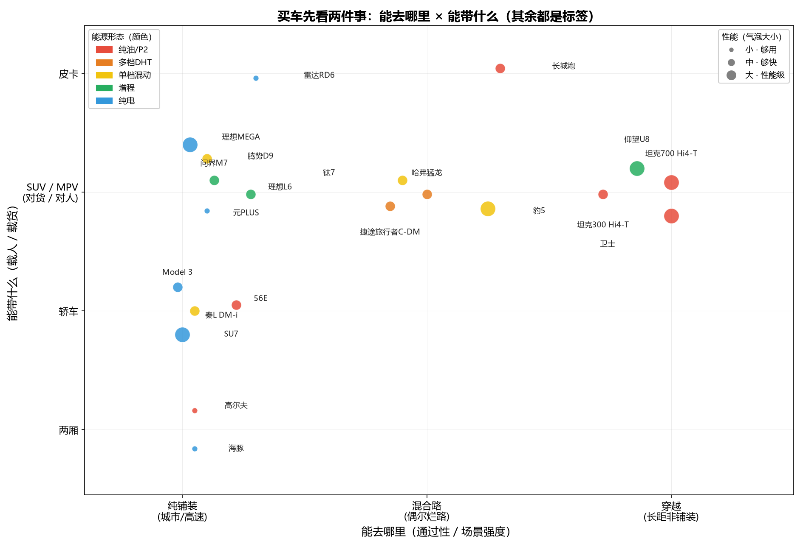

# 买车之前，先问自己五个问题——家用选车的需求自知

> （开头：我的买车经历——从需求到情绪、没抓住需求但最终有了情绪的过程。待补。）

> 本文是《参数与激情：从技术祛魅到需求自知》系列的应用延伸篇第二篇（家用篇），应用延伸线的收官、全系列的最后一篇。
> 与前几篇不同，本文**不推荐具体车型**——具体车型的个体差异远比架构差异大，那份功课属于你自己试驾之后的决策（§三 定位图里的车型是"定位锚点"，地图上的地标，不是购物清单）。本文做两件事：先祛两重魅（信息环境、需求半径），再把"买什么车"收敛到两根最基础的轴——**你装什么 × 你去哪里**。

---

## 一、你听到的世界是被重构过的

选车之前，先认清一件事：你接收到的"口碑""热度""推荐"，大部分是花钱买的，不是市场本身。

一份 2026 年 7 月的微博声量统计（[@轰鸣的小跑SVM 原帖](https://weibo.com/7008866503/RaCvqF3cc)）样本很纯粹：微博**官方榜单博主**约 1200 人，每人爬取 500 条微博，共约 60 万条。注意样本性质——官方榜单博主本身就是 KOL 生态的核心，也就是商单投放的终端，所以这份榜大概率是一份"**充值榜**"：比亚迪被提及 53,933 条，是特斯拉（7,442 条）的 **7.2 倍**；传统车企只有大众进前十，丰田、BBA 未上榜。

充值榜有财报背书——上市车企的营销费用是公开数字：

- 上汽集团 2023 年广告宣传推广费 **114.18 亿元**（2022 年 131.74 亿），传统车企最高（[中青报](https://auto.youth.cn/xw/202404/t20240408_15181420.htm)）；
- 比亚迪 2024 年前 9 个月销售费用 **239.2 亿元**，同比 +38.85%，官方解释增长主因是"广告展览费增加"（[爱咖号](http://aikahao.xcar.com.cn/item/2321454.html)）；
- 单车口径更直观：比亚迪每辆车营销费用约 **5600 元**，特斯拉约 **2800 元**（[雪球](https://xueqiu.com/1293470367/336102462)）——声量第一的车企，单车营销是声量第九的特斯拉的两倍。

传统车企不是"没有声量"，是营销预算没走 KOL 商单这条路（4S 店、电视、体育赞助各有渠道）。你刷到的汽车内容，是一个被商单重构过的世界。

榜单还藏着一层反讽：舆论印象里比亚迪"只会技术、不会营销"，但若这份榜≈投放强度榜，它恰好是样本内投放最猛的厂商——铺天盖地的 KOL 讨论本身，就是它"会营销"的证据。唯一的破圈例外是 U8 的"第一个"们（原地掉头、下水、百万）——破圈靠"第一个"的新鲜感，不是技术参数本身。

还有两个偏差：

**沉默的大多数与幸存者偏差。** 网上发声的永远是两端：出问题的人（投诉、维权）和狂热粉（吹捧、对线）。中间的大多数在用脚投票，只出现在销量数字里。用网络口碑判断一辆车，等于只统计了医院里的病人和健身房里的人，看不见街上的所有人。

**商单重构与独立内容的稀缺。** 不依赖商单的独立车评人蒋波（16 年环塔经验）的[《多电机新能源越野车的弱点及使用注意事项》](https://www.bilibili.com/video/BV1idMS64E2D)——评论区 290+ 条里少见唱反调，一边倒认同他对"多电机解耦电四驱在越野极限场景弱点"的批评（与环塔实战结论同向）。但它的传播数据不高：**认同率高、流量低**——没有商单、没有情绪对线、没有参数爽点的内容，算法不给流量。

这一章对选车只有一个含义：**别让 KOL 替你在后面那两根轴上打分。** 账面功率被 KOL 当"厂商诚意"，但赛道篇证明过 3019hp 的兑现率只有 73%；"补能焦虑"被 KOL 当"选车第一课"，但那是下一章要祛的魅。KOL 讨论的是话题，你要买的是约束。

---

## 二、不要担心 2 小时和 8 公里以外的事情

认清信息环境后，再认清自己的真实需求。选车最常犯的错误，是满脑子装着例外场景：阿里中线、丙察察、无人区、一年一次的长途回老家。而真实的用车账是另一回事：**你 90% 的里程在通勤半径里——2 小时、8 公里，日复一日；一年两次的长途是例外，不是常态。**

方法很简单：给现在的车记一周账（或者回忆一个月），把里程按场景分堆：

| 你的分布 | 续航三角里的真实权重 |
|---|---|
| 通勤主导（日均 <100km，每周城际 ≤1 次） | 续航厚度权重 ≈ 0，补能便利性权重低，亏电衰减几乎无关 |
| 城际主导（每周跨市 400-600km） | 续航厚度 = 硬约束，补能便利性 = 硬约束 |
| 含长途穿越（一年几次非铺装、要"开回来"） | 亏电后体验衰减 = 硬约束，可靠性 > 一切 |

三种分布对应三个完全不同的架构答案——**为一年两次的长途买"跑得远"的架构，等于为 2% 的用车付 50% 的架构溢价**。反过来，为每天 50 公里的通勤背 3 吨车重和 13L 油耗，是同一笔账的另一面。

一个反直觉的推论：**通勤主导的人，纯电/增程的"续航焦虑"是伪焦虑**——你 90% 的日子根本不会触发它。焦虑谱系里的"里程焦虑"，只在"使用半径大 + 补能不便利"同时成立时才真实存在。先把自己的半径量出来，再谈焦虑，顺序不能反。

这里把人先粗分成四种典型（形象化锚点，**不是四选一**，你的位置可以落在中间）：

| 画像 | 半径 | 对应横轴位置 |
|---|---|---|
| 城市游牧民 | 90% 通勤 + 偶尔长途 | 最左（公司-家） |
| 城际候鸟 | 每周跨市 400-600km | 左中（老家） |
| 周末探索家 | 通勤 + 周末钻山沟 | 中右（远郊） |
| 荒野行者 | 一年几次真穿越 | 最右（远方） |

这是四种典型，不是四类人——下一章的两根轴会把它连续化，你能落在任意位置，不必强行归入四档之一。

---

## 三、两个问题，一张图

祛完两重魅，答案收敛到车作为交通工具最基础的两件事——跨油车电车时代都不变的两件事：

**你装什么 × 你去哪里。**

车就是把人和物从 A 移到 B。"装什么"决定这台车的核心使命，"去哪里"决定通过性。其余一切——能源形态、动力强弱、补能快慢——都是这两件事定下之后的**技术选型**，是点上的标签，不是坐标。

**纵轴：你装什么**（这台车的核心使命）——货（皮卡）→ 人+货（SUV）→ 人（MPV）→ 驾驶者（轿车）→ 车位（两厢）。注意最后两档：轿车不是"载人少"，是"为开车的人造的车"；两厢的第一性不是装什么，是"**占多小的地方**"——城市停车位是真实稀缺资源。

**横轴：你去哪里**——公司-家 → 老家 → 远郊 → 远方，就是上一章四种画像摊开成的一条连续谱。

你的答案，就是图上的一个位置。位置定了，再看点上的两个标签。

**标签一：颜色 = 能源形态。** 这才是前几篇反复论证的"动力架构"——它不决定"能不能去、带多少"，只决定"怎么补给、焦虑什么"，所以它是标签，不是轴。颜色从红（油/P2 机械直驱）到蓝（纯电），中间橙黄绿。图上的分布自己会说话：**越往右越红、越往左越蓝**——"越野要机械直驱、城市能纯电"这条系列结论，成了颜色梯度，不必再论证一遍。

这里补本文最想说的那层祛魅：**"补能焦虑"是新能源的阶段性伪焦虑，不是车的本质。** 油车时代没有补能焦虑——加油站遍地、3 分钟加满，用户最多纠结油耗（一个月多几百块），从不焦虑"能不能到"。补能今天被抬成选车的核心议题，是因为电池密度和桩密度还没追上，这是技术演进中的临时问题，会随固态电池和超充铺开而消失。焦虑谱系因此放回它该在的位置——它是**颜色的说明文字**，不是定义"你要什么车"的轴：

| 颜色 | 能源形态 | 亏电后发生什么 | 你焦虑什么 |
|---|---|---|---|
| 红 | 纯油 / P2 混动 | 发动机直驱，照常跑 | 无（油钱最贵） |
| 橙 | 多档 DHT | 直驱为主，发动机小一号 | 很少 |
| 黄 | 单档混动 | 高速主要增程工况；低速/亏电限功率 | 钱（轻而均匀） |
| 绿 | 增程 | 市区≈纯电，长途永远发电→电驱 | 钱（重而集中） |
| 蓝 | 纯电 | 纯放电 | 路（能不能到） |

**标签二：气泡大小 = 性能（多快多强）。** 家用场景这一项被"够用"主导——没人纠结能不能上 200。它权重最低，也是标签，不是轴。

位置 + 颜色 + 气泡，已经定下"用途 + 能源 + 性能"三件事。最后只剩第三层：**同一格子里，你在意什么。** 性能 / 面子 / 舒适 / 时间 / 成本 / 情绪——六项里通常只能优先两三个。厂商不会造"又好看又便宜又省油电"的车：好看是溢价项，便宜和省油电是让利项，三者不可兼得。选车的第一课不是"我要什么"，是"我愿意放弃哪个角"。

**位置会一路推导出细分车型。** 比如"装人+货"的 SUV 这一档，横轴从左到右，就是一条越野强度递进的谱系：**城市 SUV（理想L6、问界M7 这类）→ 风味越野（捷途旅行者 C-DM、钛7 这类方盒子）→ 泛越野（长城语境：哈弗猛龙这类承载式 + 真四驱）→ 强越野（长城语境：坦克300/500/700 这类非承载 + 机械锁）**。别为"看起来能越野"买真硬派（3 吨车重 + 13L 油 + 每天颠），也别为它买纯电（钻山的地方没有桩）——这是 SUV 这一档最大的陷阱区，也是最大的市场。

三个对号入座的例子（车型是图上的锚点，不是推荐）：只有通勤 → 图左下（DMI 轿车如秦L，或纯电轿车如 SU7）；周末钻山沟 → 图中（风味越野如捷途旅行者 C-DM、钛7）；一年几次真穿越 → 图右上（真硬派如卫士、陆巡、坦克 Hi4-T）——为 2% 的用车付 50% 的架构溢价，是图右上最贵的那一笔。

---

## 四、其余都是附属：提一下，不展开

前面三章是主干，其余的内容前几篇都详细论证过，这里只点一下它们在两轴图里的位置，不再展开。

**时间与钱**（对应"在意什么"里的时间、成本）：成本滑杆（纯电 0.05-0.15 元/km、油 0.6-1.0）与时间滑杆（加油 3 分钟、快充 20-40 分钟、家充 0 分钟）。一个补能频率悖论：没家充时，小电池混动/增程（3-5 天一充）对公共桩的依赖，反而高于大电池纯电（2-3 周一充）。这是"能源标签"的成本面，账目详见越野篇、赛道篇。

**情绪**（对应"在意什么"里的面子、情绪）：工具预算和情绪预算分开记账。U9 的 3019hp 账面里，有相当一部分卖的是"世界第一"的情绪，实测兑现率 73% 已经把账摊开。情绪预算花在每天看得见摸得着的地方（外观、座舱、品牌）性价比最高，花在账面参数上最低。

**总账**（对应"在意什么"里的成本）：五项账（购车/能源/保险税/保养/残值），只给结构不给数字。网上"贵回来"说法（纯电日常省但车价保险贵回来）由溢价幅度 × 年里程 × 充电条件三者决定——历史高溢价时代几乎总是成立，溢价收窄后变成条件句；长持有（5 年+）能源账主导，短持有（3 年内）购车账主导。

如果上面的答案互相打架（比如想要穿越又要每天通勤省钱），回顾收官篇的第一性结论：**不存在一种架构统治所有场景——打架时，给权重更高的场景让路。**

---

## 边界声明

1. 本文不推荐具体车型（家用线"决策辅助非评测背书"纪律；§三 定位图中的车型为定位锚点，非推荐）；
2. 车企营销费用为上市公司财报公开口径（上汽广告宣传推广费、比亚迪销售费用、单车营销估算），仅作"信息环境"讨论的样本，不作市场结构结论；其中"销售费用"（宽口径，含渠道/售后）与"广告宣传推广费"（窄口径）不可直接比大小；
3. KOL 声量数据为微博圈层口径（约 1200 名官方榜单博主、60 万条微博，2026-07-27；[原帖](https://weibo.com/7008866503/RaCvqF3cc)，后续[正负面统计帖](https://weibo.com/7008866503/RbxDYyFSb)），仅作"信息环境"讨论的样本；
4. 焦虑谱系与续航三角为本系列前文既有术语，本文沿用其定义；§三 配图当前为草样，轴刻度（装什么/去哪里）待与正文同步。

---

*系列导航（《参数与激情：从技术祛魅到需求自知》）：研究内核线四篇——《3400 公里之后，谁还在？》（越野篇）、《2977 马力的真相》（赛道篇）、《爬坡的两副面孔：沙地陡坡与派克峰》（派克峰篇）、《布局、重量和"其他"——腾势Z你嘛时候纽北纯电量产车第一啊》（收官篇）；应用延伸线第一篇——《如果我来造一台终极越野车》（完美电驱篇）。本文为应用延伸线收官、系列最后一篇。*
